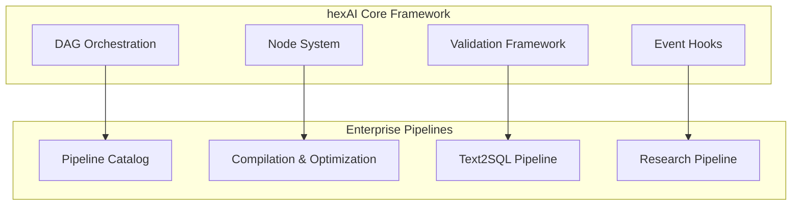

# 🗺️ hexDAG - Lightweight DAG Orchestration Framework

[](https://www.python.org/downloads/)
[](https://python-poetry.org/)
[](https://github.com/psf/black)
[](https://github.com/pre-commit/pre-commit)
[](https://opensource.org/licenses/MIT)

> **Enterprise-ready pipeline orchestration with hexagonal architecture**

## 🎯 Overview

hexDAG is a lightweight, focused DAG orchestration framework designed for building robust, scalable data processing pipelines. It combines the simplicity of modern Python with enterprise-grade capabilities.

### Core Features

- **🏗️ Hexagonal Architecture**: Clean separation of concerns with ports & adapters
- **⚡ Async-First**: Built for modern async/await workflows
- **🔧 Type-Safe**: Full Pydantic integration with runtime validation
- **🎪 Event-Driven**: Comprehensive event system for monitoring and debugging
- **🔌 Extensible**: Plugin architecture for custom nodes and adapters
- **📊 Enterprise Pipelines**: Production-ready text2sql, ontology, and research pipelines
- **🛠️ Development Ready**: Pre-commit hooks, testing, and CI/CD configurations

## 🚀 Quick Start

### Installation

```bash
# From PyPI (when available)
pip install hexdag

# From source
git clone https://github.com/yourusername/hexdag.git
cd hexdag
poetry install
```

### Basic Usage

```python
from hexai import DirectedGraph, Orchestrator
from hexai.core.application.nodes import LLMNode, FunctionNode

# Create nodes
llm_node = LLMNode()
process_node = FunctionNode()

# Build pipeline
graph = DirectedGraph()
graph.add_node(llm_node("analyze", prompt="Analyze: {{input}}"))
graph.add_node(process_node("process", fn=process_data, deps=["analyze"]))

# Execute
orchestrator = Orchestrator()
result = await orchestrator.run(graph, {"input": "data"})
```

### Command Line Interface

```bash
# Compile pipelines
hexdag compile pipelines/text2sql/pipeline.yaml

# List available pipelines
hexdag list

# Run a pipeline
hexdag run text2sql --input "Show me all customers"
```

## 🏗️ Architecture



## 📚 Documentation

- [Framework Guide](docs/HEXAI_FRAMEWORK.md) - Core hexAI concepts
- [Pipeline Development](docs/PIPELINES_GUIDE.md) - Building custom pipelines
- [Implementation Guide](docs/IMPLEMENTATION_GUIDE.md) - Advanced usage patterns
- [API Reference](docs/) - Complete API documentation
- [Examples](examples/) - Comprehensive examples and tutorials

## 🛠️ Development

### Setup

```bash
git clone https://github.com/yourusername/hexdag.git
cd hexdag
poetry install
poetry run pre-commit install
```

### Testing

```bash
# Run all tests
poetry run pytest

# Run with coverage
poetry run pytest --cov=hexai --cov=pipelines

# Run specific test categories
poetry run pytest tests/unit/
poetry run pytest tests/integration/
```

### Code Quality

```bash
# Format code
poetry run black .
poetry run isort .

# Lint code
poetry run flake8 .
poetry run mypy .

# Security check
poetry run bandit -r hexai pipelines

# Run all pre-commit hooks
poetry run pre-commit run --all-files
```

### Pipeline Development

```bash
# Create a new pipeline
poetry run hexdag create-pipeline my_pipeline

# Validate pipeline configuration
poetry run hexdag validate pipelines/my_pipeline/pipeline.yaml

# Test pipeline compilation
poetry run hexdag compile pipelines/my_pipeline/pipeline.yaml --dry-run
```

## 🎪 Examples

Explore our comprehensive example collection:

- **[01_basic_dag.py](examples/01_basic_dag.py)** - Simple DAG creation
- **[09_llm_nodes.py](examples/09_llm_nodes.py)** - LLM integration
- **[13_yaml_pipelines.py](examples/13_yaml_pipelines.py)** - YAML-based pipelines
- **[19_complex_workflow.py](examples/19_complex_workflow.py)** - Advanced patterns
- **[20_integration_testing.py](examples/20_integration_testing.py)** - Testing strategies

Run all examples:
```bash
poetry run python examples/run_all.py
```

## 📋 Roadmap

See [ROADMAP.md](docs/ROADMAP.md) for planned features and improvements.

## 🤝 Contributing

We welcome contributions! Please see our [Contributing Guide](CONTRIBUTING.md) for details.

### Development Workflow

1. Fork the repository
2. Create a feature branch: `git checkout -b feature/amazing-feature`
3. Make your changes and add tests
4. Run the test suite: `poetry run pytest`
5. Run code quality checks: `poetry run pre-commit run --all-files`
6. Commit your changes: `git commit -m 'Add amazing feature'`
7. Push to the branch: `git push origin feature/amazing-feature`
8. Open a Pull Request

## 📄 License

This project is licensed under the MIT License - see the [LICENSE](LICENSE) file for details.

## 🙏 Acknowledgments

- Built with [Poetry](https://python-poetry.org/) for dependency management
- Code quality maintained with [pre-commit](https://pre-commit.com/)
- Testing powered by [pytest](https://pytest.org/)
- Documentation built with [MkDocs](https://www.mkdocs.org/)

---

**Made with ❤️ by the hexDAG team**
