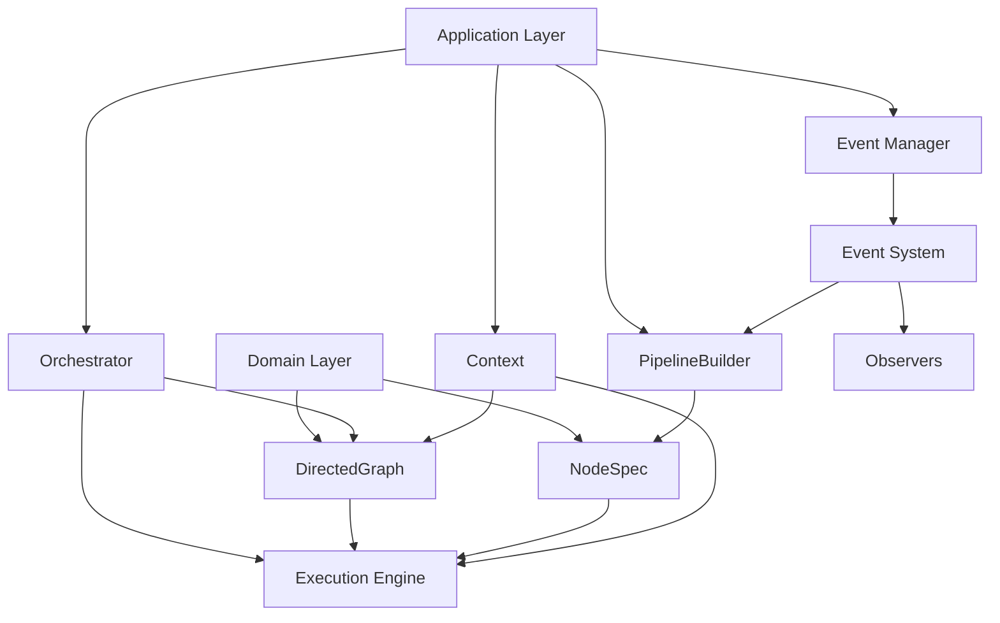

# 🚀 hexAI Framework Implementation Guide

> **A comprehensive guide for implementing features using the hexAI framework - a modular, deterministic AI workflow orchestration system**

## 📖 Table of Contents

1. [Framework Overview](#framework-overview)
2. [Architecture Principles](#architecture-principles)
3. [Core Components](#core-components)
4. [Node Development Guidelines](#node-development-guidelines)
5. [Port & Adapter Pattern](#port--adapter-pattern)
6. [Context System](#context-system)
7. [Event System & Observability](#event-system--observability)
8. [Testing Methodologies](#testing-methodologies)
9. [Error Handling Best Practices](#error-handling-best-practices)
10. [Production Deployment](#production-deployment)

---

## 🏗️ Framework Overview

### hexAI Architecture

The hexAI framework follows hexagonal architecture principles with a focus on modular, deterministic AI workflow orchestration. It provides a clean separation between business logic, external dependencies, and execution concerns.




## 🏛️ Architecture Principles

### 1. Hexagonal Architecture

The hexAI framework implements hexagonal architecture (also known as ports and adapters) to create a clean separation between the core business logic and external dependencies.

**Core Domain** (`hexai.app.domain`):
The domain layer contains the pure business logic and core entities. It's completely independent of external dependencies and focuses on the core concepts of workflow orchestration, DAG management, and execution models.

**Application Layer** (`hexai.app.application`):
The application layer orchestrates domain objects and manages workflow execution. It handles cross-cutting concerns like event management, resource coordination, and execution flow.

**Ports** (`hexai.app.ports`):
Ports define abstract interfaces that external services must implement. They provide clear contracts that ensure loose coupling between the framework and external dependencies.

**Essential Port Example:**
```python
from typing import Any, Protocol

class LLM(Protocol):
    """Language model interface."""

    async def aresponse(self, messages: list[dict[str, Any]]) -> str | None:
        """Generate response from messages."""
        ...

    async def astream(self, messages: list[dict[str, Any]]) -> Any:
        """Stream response from messages."""
        ...
```

**Adapters** (`hexai.adapters`):
Adapters implement port interfaces and handle the actual integration with external services. They translate between the framework's expectations and the external service's API.

**Essential Adapter Example:**
```python
class LLMFactoryAdapter(LLM):
    """Adapter for LLM factory models."""

    def __init__(self, model: Any) -> None:
        self.model = model

    async def aresponse(self, messages: list[dict[str, Any]]) -> str | None:
        """Generate response using factory model."""
        try:
            response = await self.model.aresponse(messages)
            return response.content
        except Exception as e:
            logger.error(f"LLM generation failed: {e}")
            return None
```

### 2. Deterministic Execution

The framework ensures that workflow execution is predictable and reproducible. Given the same inputs and configuration, a workflow will always follow the same execution path and produce the same results.

**DAG-Based Workflows:**
Workflows are represented as Directed Acyclic Graphs (DAGs), where nodes represent processing steps and edges represent dependencies.

**Essential DAG Example:**
```python
from hexai import DirectedGraph, NodeSpec

# Create a directed acyclic graph
graph = DirectedGraph()

# Add nodes with dependencies
node_a = NodeSpec("processor", processor_function)
node_b = NodeSpec("analyzer", analyzer_function, depends_on=["processor"])
node_c = NodeSpec("validator", validator_function, depends_on=["analyzer"])

graph.add(node_a)
graph.add(node_b)
graph.add(node_c)
```

**Wave-Based Execution:**
The orchestrator computes execution waves through topological sorting, allowing nodes to execute in parallel when possible while respecting dependencies.

**Context Management:**
The context system provides shared state across nodes while maintaining isolation. Each node can read from and write to the context, but the framework ensures that state changes are predictable and traceable.

### 3. Type Safety

The framework emphasizes strong typing throughout to catch errors at development time rather than runtime.

**Pydantic Integration:**
The framework integrates deeply with Pydantic for automatic validation, schema inference, and type safety.

**Essential Type Safety Example:**
```python
from pydantic import BaseModel, Field
from typing import Any

class MyFunctionInput(BaseModel):
    """Input model with validation and documentation."""
    text: str = Field(..., description="Text to process")
    priority: int = Field(default=1, ge=1, le=10, description="Priority level")

class MyFunctionOutput(BaseModel):
    """Output model with clear structure."""
    processed_text: str = Field(..., description="Processed text result")
    confidence: float = Field(..., ge=0.0, le=1.0, description="Processing confidence")

async def my_function(
    input_data: MyFunctionInput,
    context: Context,
    **ports: Any
) -> MyFunctionOutput:
    """Process text with full type safety."""
    context.add_trace("my_function", f"Processing {len(input_data.text)} characters")

    # Pydantic handles all input validation automatically
    processed = await process_text(input_data.text, ports.get("llm"))

    return MyFunctionOutput(
        processed_text=processed["text"],
        confidence=processed["confidence"],
        original_input=input_data
    )
```

---

## 🔧 Core Components

### 1. DirectedGraph

The DirectedGraph is the core data structure that represents a workflow. It manages nodes, their dependencies, and the execution order.

**Key Responsibilities:**
- Managing node specifications and their relationships
- Computing execution waves through topological sorting
- Validating graph structure and dependencies
- Ensuring schema compatibility between connected nodes

**Essential Graph Operations:**
```python
from hexai.app.domain.dag import DirectedGraph, NodeSpec

# Create and populate graph
graph = DirectedGraph()

# Add nodes
graph.add(NodeSpec("input", input_function))
graph.add(NodeSpec("process", process_function, depends_on=["input"]))
graph.add(NodeSpec("output", output_function, depends_on=["process"]))

# Validate graph
graph.validate()

# Get execution waves
waves = graph.waves()
print(f"Execution waves: {waves}")
# Output: [['input'], ['process'], ['output']]
```

**Graph Properties:**
- **Acyclic**: No circular dependencies allowed (though one can use the loop node)
- **Directed**: Clear dependency relationships
- **Validated**: Automatic validation of structure and schemas
- **Composable**: Graphs can be combined and reused

### 2. NodeSpec

NodeSpec represents a single processing step in a workflow. It's an immutable specification that defines what a node does, what it expects as input, what it produces as output, and what other nodes it depends on.

**Essential NodeSpec Example:**
```python
from hexai.app.domain.dag import NodeSpec

# Create node specification
node_spec = NodeSpec(
    name="text_processor",
    fn=process_text_function,
    in_type=TextInput,  # Pydantic model
    out_type=TextOutput,  # Pydantic model
    deps={"input_validator"},  # Dependencies
    params={"max_length": 1000}  # Configuration
)

# Add dependencies fluently
node_spec = node_spec.after("input_validator", "data_loader")
```

**Specification Elements:**
- **Name**: Unique identifier within the graph
- **Function**: The actual processing logic to execute
- **Input/Output Types**: Type specifications for validation
- **Dependencies**: Other nodes that must complete first
- **Metadata**: Additional configuration parameters

**Immutability:**
NodeSpecs are immutable to ensure that workflow definitions are predictable and thread-safe.

### 3. Orchestrator

The Orchestrator is the execution engine that runs workflows. It manages the execution of nodes, handles concurrency, manages resources, and coordinates the overall workflow execution.

**Essential Orchestrator Usage:**
```python
from hexai import Orchestrator, Context

# Create orchestrator
orchestrator = Orchestrator(max_concurrent_nodes=5)

# Execute workflow
context = Context()
ports = {"llm": llm_adapter, "database": db_adapter}
input_data = {"query": "test query"}

results = await orchestrator.run(
    graph=my_graph,
    initial_input=input_data,
    context=context,
    ports=ports
)

print(f"Execution results: {results}")
```

**Execution Strategy:**
- **Wave-Based**: Executes nodes in dependency order
- **Concurrent**: Runs independent nodes in parallel
- **Resource-Limited**: Controls concurrency to prevent resource exhaustion
- **Error-Handling**: Graceful handling of node failures

**Key Features:**
- **Deterministic**: Same inputs always produce same execution path
- **Observable**: Comprehensive event system for monitoring
- **Resilient**: Handles failures gracefully without affecting other nodes
- **Scalable**: Configurable concurrency limits

---

## 🎯 Node Development Guidelines

### 1. Node Types

The framework supports several types of nodes, each optimized for different use cases:

**Function Nodes:**
Function nodes execute arbitrary Python functions. They're the most flexible node type and can handle any processing logic.

**Essential Function Node Example:**
```python
async def my_function(
    input_data: Any,
    context: Context,
    **ports: Any
) -> dict[str, Any]:
    """Function node implementation."""

    # Add execution trace
    context.add_trace("my_function", "Starting processing")

    # Validate required ports
    if "llm" not in ports:
        raise ValueError("LLM port is required")

    # Process data
    result = await process_data(input_data, ports["llm"])

    # Store in memory for other nodes
    context.set_memory("my_function_result", result)

    # Return with original data preserved
    return {"processed_result": result, **input_data}
```

**LLM Nodes:**
LLM nodes are specialized for language model interactions. They handle prompt templating, response parsing, and LLM-specific concerns.

**Agent Nodes:**
Agent nodes implement multi-step reasoning with tool usage. They can make multiple calls to external tools and maintain conversation state across steps.

**Loop Nodes:**
Loop nodes implement iterative processing with conditions. They can repeat processing steps until certain conditions are met.

**Conditional Nodes:**
Conditional nodes implement branching logic based on data values. They can route execution down different paths based on conditions.

### 2. Node Development Principles

**Single Responsibility:**
Each node should have a single, well-defined responsibility. This makes nodes easier to test, debug, and reuse.

**Stateless Design:**
Nodes should be stateless when possible, relying on the context for shared state. This makes nodes more predictable and easier to test.

**Error Handling:**
Nodes should handle errors gracefully and provide meaningful error messages. They should not crash the entire workflow when possible.

**Type Safety:**
Nodes should use strong typing for inputs and outputs. This helps catch errors early and provides better documentation.

**Observability:**
Nodes should provide meaningful traces and use the context system for logging and debugging information.

### 3. Pydantic Integration

The framework deeply integrates with Pydantic for automatic validation and schema inference.

**Essential Pydantic Pattern:**
```python
from pydantic import BaseModel, Field
from typing import Any

class MyFunctionInput(BaseModel):
    """Input model with validation and documentation."""
    text: str = Field(..., description="Text to process")
    priority: int = Field(default=1, ge=1, le=10, description="Priority level")
    metadata: dict[str, Any] = Field(default_factory=dict, description="Additional metadata")

class MyFunctionOutput(BaseModel):
    """Output model with clear structure."""
    processed_text: str = Field(..., description="Processed text result")
    confidence: float = Field(..., ge=0.0, le=1.0, description="Processing confidence")
    features: dict[str, Any] = Field(..., description="Extracted features")
    original_input: MyFunctionInput = Field(..., description="Original input for traceability")

async def my_function(
    input_data: MyFunctionInput,
    context: Context,
    **ports: Any
) -> MyFunctionOutput:
    """Process text with full type safety and automatic schema inference."""
    context.add_trace("my_function", f"Processing {len(input_data.text)} characters")

    # Pydantic handles all input validation automatically
    processed = await process_text(input_data.text, ports.get("llm"))

    # Return typed model instance
    return MyFunctionOutput(
        processed_text=processed["text"],
        confidence=processed["confidence"],
        features=processed["features"],
        original_input=input_data
    )
```

---

## 🔌 Port & Adapter Pattern

### 1. Port Design

Ports define abstract interfaces that external services must implement. They provide clear contracts that ensure loose coupling between the framework and external dependencies.

**Essential Port Examples:**
```python
from typing import Any, Protocol

class LLM(Protocol):
    """Language model interface."""

    async def aresponse(self, messages: list[dict[str, Any]]) -> str | None:
        """Generate response from messages."""
        ...

    async def astream(self, messages: list[dict[str, Any]]) -> Any:
        """Stream response from messages."""
        ...

class DatabasePort(Protocol):
    """Database interface."""

    async def get_schema(self, table_name: str) -> dict[str, Any]:
        """Get table schema."""
        ...

    async def execute_query(self, query: str) -> list[dict[str, Any]]:
        """Execute SQL query."""
        ...

class LongTermMemory(Protocol):
    """Long-term memory interface."""

    async def store(self, key: str, value: Any) -> None:
        """Store value with key."""
        ...

    async def retrieve(self, key: str) -> Any | None:
        """Retrieve value by key."""
        ...
```

**Interface Design:**
Ports are designed as Python protocols, providing clear contracts without imposing implementation details. This allows for flexible implementations while maintaining type safety.

**Service Categories:**
The framework defines ports for common AI workflow needs:
- **LLM Port**: Language model interactions
- **Database Port**: Data storage and retrieval
- **Memory Port**: Long-term memory storage
- **Tool Router Port**: External tool integration
- **Ontology Port**: Business knowledge access
- **Embedding Selector Port**: Vector similarity search

### 2. Adapter Implementation

Adapters implement port interfaces and handle the actual integration with external services. They translate between the framework's expectations and the external service's API.

**Essential Adapter Examples:**
```python
class LLMFactoryAdapter(LLM):
    """Adapter for LLM factory models."""

    def __init__(self, model: Any) -> None:
        self.model = model

    async def aresponse(self, messages: list[dict[str, Any]]) -> str | None:
        """Generate response using factory model."""
        try:
            response = await self.model.aresponse(messages)
            return response.content
        except Exception as e:
            logger.error(f"LLM generation failed: {e}")
            return None

class MockLLM(LLM):
    """Mock LLM for testing."""

    def __init__(self, responses: list[str]) -> None:
        self.responses = responses
        self.call_count = 0

    async def aresponse(self, messages: list[dict[str, Any]]) -> str | None:
        """Return predefined responses."""
        if self.call_count < len(self.responses):
            response = self.responses[self.call_count]
            self.call_count += 1
            return response
        return "Mock response"
```

**Implementation Patterns:**
- **Factory Adapters**: Handle different model types and configurations
- **Enhanced Adapters**: Provide additional functionality beyond basic ports
- **Mock Adapters**: Provide test implementations for development and testing
- **Production Adapters**: Handle real external services with proper error handling

**Error Handling:**
Adapters should handle external service failures gracefully and provide meaningful error messages. They should not crash the framework when external services are unavailable.

### 3. Port Registration

Port implementations are registered and used throughout the workflow execution.

**Essential Port Usage:**
```python
# Create port implementations
ports = {
    "llm": LLMFactoryAdapter(production_llm_model),
    "database": EnhancedDatabaseAdapter(production_db),
    "memory": ProductionMemoryAdapter(redis_connection),
    "ontology": ProductionOntologyAdapter(ontology_service),
}

# Use in orchestrator
results = await orchestrator.run(graph, input_data, context, ports)
```

---


## 📊 Event System & Observability

### 1. Event Types

The framework provides a comprehensive event system for monitoring and debugging workflow execution.

**Available Event Types:**
```python
from hexai.app.application.events.base import EventType

# Pipeline events
EventType.PIPELINE_STARTED
EventType.PIPELINE_COMPLETED
EventType.PIPELINE_FAILED

# Node events
EventType.NODE_STARTED
EventType.NODE_COMPLETED
EventType.NODE_FAILED

# Wave events
EventType.WAVE_STARTED
EventType.WAVE_COMPLETED

# LLM events
EventType.LLM_PROMPT_GENERATED
EventType.LLM_RESPONSE_RECEIVED

# Tool events
EventType.TOOL_CALLED
EventType.TOOL_COMPLETED

# Validation events
EventType.VALIDATION_WARNING
```

### 2. Event Observers

The event system uses the observer pattern to provide flexible monitoring capabilities.

**Essential Observer Setup:**
```python
from hexai.app.application.events.observers import (
    LoggingObserver,
    MetricsObserver,
    FileObserver
)

# Set up comprehensive monitoring
event_manager = PipelineEventManager()
event_manager.subscribe(LoggingObserver())
event_manager.subscribe(MetricsObserver())
event_manager.subscribe(FileObserver("pipeline_events.log"))

# Use in orchestrator
orchestrator = Orchestrator(event_manager=event_manager)
```

**Built-in Observers:**
- **Logging Observer**: Output events to logging systems
- **Metrics Observer**: Collect performance and usage metrics
- **File Observer**: Write events to files for analysis
- **WebSocket Observer**: Stream events to real-time dashboards

**Custom Observers:**
Developers can implement custom observers for specific monitoring needs. Observers can filter events, aggregate data, or integrate with external monitoring systems.

### 3. Production Monitoring

The event system provides comprehensive monitoring capabilities for production environments.

**Essential Monitoring Setup:**
```python
from hexai.app.application.events import PipelineEventManager
from hexai.app.application.events.observers import LoggingObserver, MetricsObserver
import logging

# Production monitoring
event_manager = PipelineEventManager()
event_manager.subscribe(LoggingObserver(log_level=logging.INFO))
event_manager.subscribe(MetricsObserver())

# Use in orchestrator
orchestrator = Orchestrator(event_manager=event_manager)
```

**Performance Monitoring:**
- **Execution Times**: Track how long each node takes to execute
- **Resource Usage**: Monitor memory and CPU usage
- **Throughput**: Track requests per second and concurrent executions
- **Error Rates**: Monitor failure rates and error patterns

**Business Monitoring:**
- **User Activity**: Track user interactions and usage patterns
- **Feature Usage**: Monitor which features are being used
- **Success Rates**: Track successful vs failed workflow executions
- **Custom Metrics**: Track business-specific metrics

---

## 🧪 Testing Methodologies

### 1. Unit Testing

Unit testing focuses on testing individual components in isolation, ensuring they work correctly without external dependencies.

**Essential Unit Test Pattern:**
```python
import pytest
from unittest.mock import AsyncMock
from hexai import MockLLM, MockDatabaseAdapter

class TestMyFunction:
    """Test my function implementation."""

    def setup_method(self):
        """Set up test fixtures."""
        self.ports = {
            "llm": MockLLM(["test response"]),
            "database": MockDatabaseAdapter(),
        }

    @pytest.mark.asyncio
    async def test_function_success(self):
        """Test successful execution."""
        input_data = {"query": "test query"}

        result = await my_function(input_data, self.context, **self.ports)

        assert "processed_result" in result
        assert result["query"] == "test query"
        assert len(self.context.trace) > 0

    @pytest.mark.asyncio
    async def test_function_missing_port(self):
        """Test error handling."""
        input_data = {"query": "test"}
        ports_without_llm = {"database": MockDatabaseAdapter()}

        with pytest.raises(ValueError, match="LLM port is required"):
            await my_function(input_data, self.context, **ports_without_llm)
```

**Testing Patterns:**
- **Mock Dependencies**: Use mock adapters for external services
- **Edge Cases**: Test boundary conditions and error scenarios
- **Performance**: Test with realistic data volumes
- **Isolation**: Ensure tests don't interfere with each other

### 2. Integration Testing

Integration testing focuses on testing how components work together, ensuring the overall system functions correctly.

**Essential Integration Test Pattern:**
```python
import pytest
from hexai import DirectedGraph, NodeSpec, Orchestrator

@pytest.mark.asyncio
async def test_workflow_execution():
    """Test complete workflow execution."""
    # Create graph
    graph = DirectedGraph()

    # Add nodes
    node_a = NodeSpec("processor", processor_function)
    node_b = NodeSpec("analyzer", analyzer_function, depends_on=["processor"])

    graph.add(node_a)
    graph.add(node_b)

    # Create ports
    ports = {
        "llm": MockLLM(["analysis result"]),
        "database": MockDatabaseAdapter(),
    }

    # Execute
    orchestrator = Orchestrator()
    context = Context()
    input_data = {"query": "test input"}

    results = await orchestrator.run(graph, input_data, context, ports)

    assert "analyzer" in results
    assert results["analyzer"]["status"] == "success"
```

**Testing Patterns:**
- **End-to-End**: Test complete workflows from start to finish
- **Realistic Data**: Use realistic data volumes and patterns
- **Error Scenarios**: Test how the system handles various failure modes
- **Performance**: Measure and optimize system performance

### 3. Mock Adapters

The framework provides comprehensive mock implementations for all ports, making testing reliable and predictable.

**Essential Mock Usage:**
```python
from hexai.adapters.mock import (
    MockLLM,
    MockDatabaseAdapter,
    MockMemoryAdapter,
    MockToolRouter
)

# Use in tests one can actually define the responces from the MockLLM.
ports = {
    "llm": MockLLM(["response1", "response2"]),
    "database": MockDatabaseAdapter(),
    "memory": MockMemoryAdapter(),
    "tool_router": MockToolRouter()
}
```

**Mock Features:**
- **Predictable Responses**: Configure mock adapters to return specific responses
- **Error Simulation**: Simulate various error conditions and failure modes
- **Performance Simulation**: Simulate realistic response times and resource usage
- **State Tracking**: Track how mock adapters are used during testing

---

## ⚠️ Error Handling Best Practices

### 1. Input Validation

Robust input validation is essential for preventing errors and ensuring system reliability.

**Essential Validation Pattern:**
```python
from pydantic import BaseModel, ValidationError

class MyFunctionInput(BaseModel):
    """Input validation model."""
    query: str
    user_id: str
    priority: int = 1

async def robust_function(input_data: Any, context: Context, **ports: Any) -> dict[str, Any]:
    """Function with comprehensive error handling."""

    try:
        # Validate input using Pydantic
        validated_input = MyFunctionInput(**input_data)
        context.add_trace("function", "Input validation successful")

    except ValidationError as e:
        context.add_trace("function", f"Input validation failed: {e}")
        raise ValueError(f"Invalid input: {e}")

    # Process validated data
    result = await process_data(validated_input, ports)

    return {"result": result, **validated_input.model_dump()}
```

**Validation Strategies:**
- **Schema Validation**: Use Pydantic models for automatic validation
- **Business Rules**: Validate business-specific constraints
- **Sanitization**: Clean and sanitize input data
- **Type Checking**: Ensure data types match expectations

### 2. Port Validation

Port validation ensures that external services are available and functioning correctly.

**Essential Port Validation:**
```python
def validate_ports(**ports: Any) -> None:
    """Validate required ports."""
    required = ["llm", "database"]
    missing = [p for p in required if p not in ports or ports[p] is None]

    if missing:
        raise ValueError(f"Missing required ports: {missing}")

    # Validate port interfaces
    if not hasattr(ports["llm"], "aresponse"):
        raise ValueError("LLM port must implement 'aresponse' method")

    if not hasattr(ports["database"], "execute_query"):
        raise ValueError("Database port must implement 'execute_query' method")
```

**Validation Strategies:**
- **Health Checks**: Verify that external services are healthy
- **Interface Validation**: Ensure ports implement required interfaces
- **Capability Checks**: Verify that services have required capabilities
- **Error Handling**: Test how services handle various error conditions

### 3. Graceful Degradation

The system should handle failures gracefully without affecting overall functionality.

**Essential Degradation Pattern:**
```python
async def resilient_function(input_data: Any, context: Context, **ports: Any) -> dict[str, Any]:
    """Function with fallback strategies."""

    try:
        # Primary processing
        result = await primary_processing(input_data, ports)
        context.add_trace("function", "Primary processing successful")
        return {"result": result, "method": "primary", **input_data}

    except Exception as primary_error:
        context.add_trace("function", f"Primary failed: {primary_error}")

        try:
            # Fallback processing
            result = await fallback_processing(input_data, ports)
            context.add_trace("function", "Fallback successful")
            return {"result": result, "method": "fallback", **input_data}

        except Exception as fallback_error:
            # Return safe result to prevent workflow failure
            context.add_trace("function", f"All methods failed")
            return {
                "result": None,
                "method": "failed",
                "error": str(fallback_error),
                **input_data
            }
```

**Degradation Strategies:**
- **Fallback Logic**: Provide alternative processing paths when primary paths fail
- **Partial Results**: Return partial results when complete processing isn't possible
- **Error Recovery**: Automatically retry failed operations when appropriate
- **User Communication**: Clearly communicate what happened and what users can expect

---


---

*This guide provides a comprehensive overview of the hexAI framework architecture and implementation patterns. Follow these principles to ensure consistency with the existing codebase and maintain high-quality, maintainable code.*
