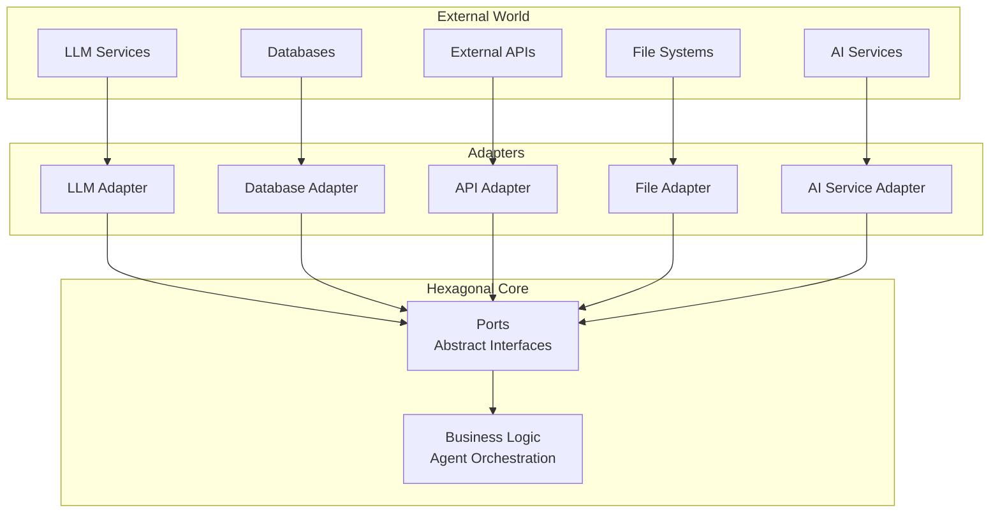
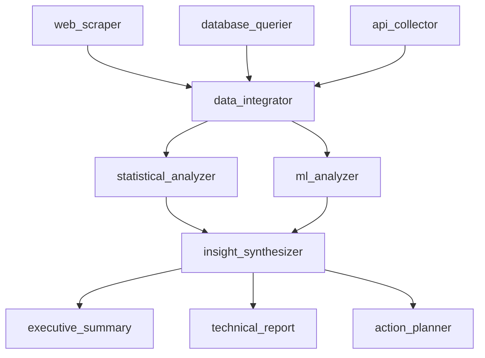

# 🤔 Philosophy & Design Principles

## Why hexDAG?

hexDAG was born from the frustration of working with overly complex orchestration frameworks that treat simple AI agent workflows as monumental challenges. We believe that building AI agents and data science workloads should be **intuitive**, **maintainable**, and **enterprise-ready** without unnecessary complexity.

## 🎯 Core Philosophy

### The Six Pillars

hexDAG is built on six fundamental principles that guide every design decision:

#### 1. **Async-First Architecture**
**Everything is async by default**

```python
# Every operation is async
async def process_data(input_data: InputModel) -> OutputModel:
    result = await external_ai_service.call(input_data)
    return OutputModel(result=result)

# Orchestrator handles async execution elegantly
result = await orchestrator.run(graph, input_data)
```

**Why async?**
- **Performance**: Non-blocking I/O for external AI service calls
- **Scalability**: Handle thousands of concurrent agent workflow executions
- **Modern**: Aligns with contemporary Python best practices for AI development

#### 2. **Event-Driven Observability**
**Understanding what happened is as important as making it happen**

```python
# Rich event system for monitoring agent interactions
@event_observer
async def log_agent_execution(event: AgentStartedEvent):
    logger.info(f"Agent {event.agent_name} started at wave {event.wave_index}")

# Events for every significant action
- AgentStartedEvent
- AgentCompletedEvent
- AgentFailedEvent
- ValidationErrorEvent
- LLMPromptGeneratedEvent
```

**Why events?**
- **Debugging**: See exactly what happened and when in agent workflows
- **Monitoring**: Real-time agent workflow health and performance
- **Auditing**: Complete execution history for compliance

#### 3. **Pydantic Validation Everywhere**
**Type safety and validation at every layer**

```python
# Input/output schemas are enforced everywhere
class ProcessingInput(BaseModel):
    text: str
    language: str = "en"

class ProcessingOutput(BaseModel):
    sentiment: float
    entities: list[str]

# Type errors caught by mypy before deployment
node = ProcessingNode(
    input_schema=ProcessingInput,
    output_schema=ProcessingOutput
)
```

**Benefits:**
- **IDE Support**: Full autocomplete and error detection
- **Runtime Safety**: Pydantic validates data at runtime
- **Documentation**: Schemas serve as living documentation
- **Consistency**: Same validation patterns across the entire framework

#### 4. **Hexagonal Architecture**
**Clean separation between business logic and external dependencies**



**Benefits:**
- **Testability**: Easy to test with mocks
- **Flexibility**: Switch implementations without changing business logic
- **Maintainability**: Business logic isolated from external dependencies

#### 5. **Composable Declarative Files**
**Low-code development through composable YAML configurations**

```yaml
# Simple declarative agent workflow
name: data_analysis_workflow
description: AI-powered data analysis with multiple agents

nodes:
  - type: agent
    id: data_analyzer
    params:
      initial_prompt_template: |
        Analyze the following data: {{input_data}}
        Focus on patterns, trends, and insights.
      max_steps: 5
      available_tools: ["statistical_analysis", "visualization"]
    depends_on: []

  - type: agent
    id: insight_generator
    params:
      initial_prompt_template: |
        Based on the analysis: {{data_analyzer.results}}
        Generate actionable business insights.
      max_steps: 3
    depends_on: [data_analyzer]
```

**Benefits:**
- **Low-Code**: Non-technical users can create AI workflows
- **Composability**: Reusable components and patterns
- **Version Control**: Declarative files are easily versioned
- **Visualization**: YAML structure is easy to visualize and understand

#### 6. **DAG-Based Orchestration**
**Directed Acyclic Graphs enable complex workflow orchestration**

```python
# DAG enables complex dependency management
workflow = DirectedGraph()

# Add nodes with dependencies
workflow.add(data_collector)
workflow.add(data_analyzer, deps=["data_collector"])
workflow.add(insight_generator, deps=["data_analyzer"])
workflow.add(report_generator, deps=["insight_generator"])

# Parallel execution where possible
workflow.add(quality_checker, deps=["data_analyzer"])
workflow.add(backup_storage, deps=["data_collector"])
```

**DAG Benefits:**
- **Dependency Management**: Clear execution order and parallelization
- **Complex Workflows**: Handle intricate multi-agent coordination
- **Optimization**: Automatic parallel execution where dependencies allow
- **Visualization**: Easy to understand workflow structure and data flow
- **Error Handling**: Isolated failures don't cascade through the entire workflow

**Why DAG?**
- **Scalability**: Efficient execution of complex agent networks
- **Reliability**: Isolated failures and clear error boundaries
- **Flexibility**: Support for both sequential and parallel execution patterns
- **Observability**: Clear data flow and execution paths for monitoring

### DAG in Declarative Configuration

**Complex Workflow Patterns**

```yaml
# Multi-stage analysis with parallel processing
name: comprehensive_data_analysis
description: Complex DAG with parallel and sequential execution

nodes:
  # Stage 1: Data Collection (parallel)
  - type: agent
    id: web_scraper
    params:
      initial_prompt_template: "Scrape web data for: {{topic}}"
      max_steps: 3
    depends_on: []

  - type: agent
    id: database_querier
    params:
      initial_prompt_template: "Query database for: {{topic}}"
      max_steps: 2
    depends_on: []

  - type: agent
    id: api_collector
    params:
      initial_prompt_template: "Collect API data for: {{topic}}"
      max_steps: 2
    depends_on: []

  # Stage 2: Data Processing (depends on all collectors)
  - type: agent
    id: data_integrator
    params:
      initial_prompt_template: |
        Integrate data from multiple sources:
        Web: {{web_scraper.data}}
        Database: {{database_querier.data}}
        API: {{api_collector.data}}
      max_steps: 4
    depends_on: [web_scraper, database_querier, api_collector]

  # Stage 3: Analysis (parallel branches)
  - type: agent
    id: statistical_analyzer
    params:
      initial_prompt_template: "Statistical analysis: {{data_integrator.integrated_data}}"
      max_steps: 5
    depends_on: [data_integrator]

  - type: agent
    id: ml_analyzer
    params:
      initial_prompt_template: "ML analysis: {{data_integrator.integrated_data}}"
      max_steps: 5
    depends_on: [data_integrator]

  # Stage 4: Synthesis (depends on all analyzers)
  - type: agent
    id: insight_synthesizer
    params:
      initial_prompt_template: |
        Synthesize insights:
        Statistical: {{statistical_analyzer.results}}
        ML: {{ml_analyzer.results}}
      max_steps: 4
    depends_on: [statistical_analyzer, ml_analyzer]

  # Stage 5: Reporting (parallel outputs)
  - type: agent
    id: executive_summary
    params:
      initial_prompt_template: "Executive summary: {{insight_synthesizer.insights}}"
      max_steps: 3
    depends_on: [insight_synthesizer]

  - type: agent
    id: technical_report
    params:
      initial_prompt_template: "Technical report: {{insight_synthesizer.insights}}"
      max_steps: 4
    depends_on: [insight_synthesizer]

  - type: agent
    id: action_planner
    params:
      initial_prompt_template: "Action plan: {{insight_synthesizer.insights}}"
      max_steps: 3
    depends_on: [insight_synthesizer]
```

**DAG Execution Visualization**



**Benefits of DAG-Based Declarative Configuration:**

1. **Automatic Parallelization**
   - Independent agents run in parallel
   - Dependencies automatically managed
   - Optimal resource utilization

2. **Complex Coordination**
   - Multi-agent workflows with clear data flow
   - Conditional execution based on dependencies
   - Error isolation and recovery

3. **Scalability**
   - Horizontal scaling of agent networks
   - Efficient execution of complex workflows
   - Resource-aware scheduling

4. **Observability**
   - Clear execution paths and data flow
   - Dependency tracking and visualization
   - Performance monitoring and optimization

## 🌊 Real-Time Streaming Architecture

### Streaming Agent Actions to Frontend

hexDAG provides built-in streaming capabilities that enable real-time monitoring of agent actions and memory ingestion, making AI workflows transparent and interactive.

#### **Agent Action Streaming**

```python
# Real-time streaming of agent actions
@event_observer
async def stream_agent_actions(event: AgentActionEvent):
    """Stream agent actions to frontend in real-time"""
    await websocket.send({
        "type": "agent_action",
        "agent_id": event.agent_id,
        "action": event.action,
        "timestamp": event.timestamp,
        "data": event.data
    })

# Agent actions are streamed as they happen
- AgentStartedEvent
- AgentThinkingEvent
- AgentToolCallEvent
- AgentMemoryAccessEvent
- AgentDecisionEvent
- AgentCompletedEvent
```

**Frontend Integration**
```javascript
// Frontend receives real-time agent updates
const ws = new WebSocket('ws://localhost:8000/stream');

ws.onmessage = (event) => {
    const data = JSON.parse(event.data);

    switch(data.type) {
        case 'agent_action':
            updateAgentStatus(data.agent_id, data.action);
            displayAgentProgress(data);
            break;
        case 'memory_ingestion':
            updateMemoryVisualization(data);
            break;
        case 'workflow_progress':
            updateWorkflowProgress(data);
            break;
    }
};
```

#### **Memory Ingestion Streaming**

```python
# Real-time memory ingestion streaming
@event_observer
async def stream_memory_ingestion(event: MemoryIngestionEvent):
    """Stream memory operations to frontend"""
    await websocket.send({
        "type": "memory_ingestion",
        "operation": event.operation,  # store, retrieve, update
        "memory_type": event.memory_type,  # short_term, long_term, working
        "content": event.content,
        "metadata": event.metadata,
        "timestamp": event.timestamp
    })

# Memory operations streamed in real-time
- MemoryStoreEvent
- MemoryRetrieveEvent
- MemoryUpdateEvent
- MemorySearchEvent
- MemoryConsolidationEvent
```

**Memory Visualization**
```yaml
# Declarative configuration with streaming
name: streaming_analysis_workflow
description: Real-time streaming analysis with memory tracking

nodes:
  - type: agent
    id: streaming_analyzer
    params:
      initial_prompt_template: "Analyze: {{input_data}}"
      max_steps: 5
      streaming_enabled: true
      memory_tracking: true
      frontend_updates: true
    depends_on: []

  - type: agent
    id: memory_manager
    params:
      initial_prompt_template: "Process memory: {{streaming_analyzer.memory_events}}"
      max_steps: 3
      memory_operations: ["store", "retrieve", "consolidate"]
      streaming_enabled: true
    depends_on: [streaming_analyzer]
```

### **Streaming Benefits**

#### **1. Real-Time Transparency**
```python
# Users see agent thinking in real-time
async def stream_agent_thinking(agent_id: str, thoughts: list[str]):
    for thought in thoughts:
        await websocket.send({
            "type": "agent_thinking",
            "agent_id": agent_id,
            "thought": thought,
            "timestamp": datetime.now().isoformat()
        })
        await asyncio.sleep(0.1)  # Natural thinking pace
```

#### **2. Interactive Debugging**
```javascript
// Frontend can pause, resume, or modify agent behavior
function pauseAgent(agentId) {
    ws.send(JSON.stringify({
        type: 'control',
        action: 'pause',
        agent_id: agentId
    }));
}

function resumeAgent(agentId) {
    ws.send(JSON.stringify({
        type: 'control',
        action: 'resume',
        agent_id: agentId
    }));
}
```

#### **3. Memory Visualization**
```python
# Real-time memory state visualization
@event_observer
async def stream_memory_state(event: MemoryStateEvent):
    await websocket.send({
        "type": "memory_state",
        "short_term": event.short_term_memory,
        "long_term": event.long_term_memory,
        "working": event.working_memory,
        "connections": event.memory_connections,
        "timestamp": event.timestamp
    })
```

### **Declarative Streaming Configuration**

```yaml
# Streaming-enabled workflow configuration
name: interactive_analysis
description: Interactive analysis with real-time streaming

streaming:
  enabled: true
  events:
    - agent_actions
    - memory_operations
    - workflow_progress
    - error_events
  frontend:
    websocket_endpoint: "/stream"
    update_frequency: "real_time"
    visualization: true

nodes:
  - type: agent
    id: interactive_analyzer
    params:
      initial_prompt_template: "Interactive analysis: {{input}}"
      max_steps: 10
      streaming:
        enabled: true
        events: ["thinking", "tool_calls", "decisions"]
        memory_tracking: true
        frontend_updates: true
      memory:
        short_term_size: 1000
        long_term_size: 10000
        consolidation_frequency: "step"
    depends_on: []

  - type: agent
    id: memory_consolidator
    params:
      initial_prompt_template: "Consolidate memories: {{interactive_analyzer.memory_events}}"
      max_steps: 5
      streaming:
        enabled: true
        events: ["memory_operations", "consolidation"]
      memory_operations:
        - store
        - retrieve
        - consolidate
        - search
    depends_on: [interactive_analyzer]
```

### **Frontend Integration Patterns**

#### **1. Real-Time Dashboard**
```javascript
// Real-time agent workflow dashboard
class AgentDashboard {
    constructor() {
        this.agents = new Map();
        this.memory = new MemoryVisualizer();
        this.workflow = new WorkflowProgress();
    }

    updateAgentStatus(agentId, status) {
        const agent = this.agents.get(agentId);
        agent.updateStatus(status);
        this.workflow.updateProgress();
    }

    updateMemoryOperation(operation) {
        this.memory.addOperation(operation);
        this.memory.visualize();
    }
}
```

#### **2. Interactive Controls**
```javascript
// Interactive agent control panel
class AgentControlPanel {
    pauseAgent(agentId) {
        this.sendControl('pause', agentId);
    }

    resumeAgent(agentId) {
        this.sendControl('resume', agentId);
    }

    modifyAgentPrompt(agentId, newPrompt) {
        this.sendControl('modify_prompt', {
            agent_id: agentId,
            prompt: newPrompt
        });
    }

    injectMemory(agentId, memoryData) {
        this.sendControl('inject_memory', {
            agent_id: agentId,
            memory: memoryData
        });
    }
}
```

### **Streaming Architecture Benefits**

#### **1. Transparency**
- **Real-time visibility**: See agent thinking and decision-making
- **Memory tracking**: Understand how agents use and store information
- **Error visibility**: Immediate feedback on failures and issues

#### **2. Interactivity**
- **Live debugging**: Pause, resume, and modify agent behavior
- **Memory injection**: Add context or information during execution
- **Prompt modification**: Adjust agent behavior on-the-fly

#### **3. Observability**
- **Performance monitoring**: Track agent efficiency and bottlenecks
- **Memory optimization**: Identify memory usage patterns
- **Workflow optimization**: Understand execution patterns

#### **4. User Experience**
- **Engaging interfaces**: Real-time progress and status updates
- **Educational value**: Learn how AI agents work and think
- **Trust building**: Transparent AI decision-making processes

### Simplicity Without Compromise

**"Make simple things simple, and complex things possible"**

- **Simple AI tasks** should require minimal code and declarative configuration
- **Complex agent workflows** should be achievable without fighting the framework
- **Enterprise features** should be opt-in, not mandatory overhead

### Developer Experience First

**"If it's painful to use, it's wrong"**

- **Type Safety**: Full Pydantic integration catches errors at development time
- **Clear APIs**: Intuitive method names and consistent patterns for agent development
- **Rich Examples**: 20+ examples covering every agent workflow use case
- **Instant Feedback**: Pre-commit hooks catch issues before they reach production
- **Declarative Configuration**: YAML-based agent workflow definitions

### Production-Ready by Default

**"Development convenience, production confidence"**

- **Async-First**: Built for modern Python async/await patterns for AI workloads
- **Event-Driven**: Comprehensive monitoring and observability for agent interactions
- **Validation**: Runtime type checking and data validation for AI outputs
- **Testing**: First-class testing support with mocks and fixtures for agent workflows

## 🏗️ Hexagonal Architecture: The Foundation

### Why Hexagonal Architecture?

Traditional AI orchestration frameworks tightly couple business logic with external AI services, making them brittle and hard to test. Hexagonal architecture solves this through **ports and adapters**.


### Benefits in Practice

#### 1. **Testability**
```python
# Easy to test with mocks
mock_llm = MockLLM(responses=["test response"])
orchestrator = Orchestrator(ports={"llm": mock_llm})

# Real integration testing
real_llm = OpenAIAdapter(api_key="...")
orchestrator = Orchestrator(ports={"llm": real_llm})
```

#### 2. **Flexibility**
```python
# Switch between implementations without changing business logic
dev_ports = {"llm": MockLLM(), "db": InMemoryDB()}
prod_ports = {"llm": OpenAIAdapter(), "db": PostgreSQLAdapter()}
```

#### 3. **Maintainability**
- Business logic is isolated from external AI service dependencies
- External service changes don't break core agent workflow logic
- New adapters can be added without modifying existing agent code

## 🚀 Design Principles

### 1. Async-First Architecture

**Modern Python deserves modern patterns for AI workloads**

```python
# Everything is async by default
async def process_data(input_data: InputModel) -> OutputModel:
    result = await external_ai_service.call(input_data)
    return OutputModel(result=result)

# Orchestrator handles async execution elegantly
result = await orchestrator.run(graph, input_data)
```

**Why async?**
- **Performance**: Non-blocking I/O for external AI service calls
- **Scalability**: Handle thousands of concurrent agent workflow executions
- **Modern**: Aligns with contemporary Python best practices for AI development

### 2. Type Safety Everywhere

**Catch errors at development time, not runtime**

```python
# Input/output schemas are enforced
class ProcessingInput(BaseModel):
    text: str
    language: str = "en"

class ProcessingOutput(BaseModel):
    sentiment: float
    entities: list[str]

# Type errors caught by mypy before deployment
node = ProcessingNode(
    input_schema=ProcessingInput,
    output_schema=ProcessingOutput
)
```

**Benefits:**
- **IDE Support**: Full autocomplete and error detection
- **Runtime Safety**: Pydantic validates data at runtime
- **Documentation**: Schemas serve as living documentation

### 3. Event-Driven Observability

**Understanding what happened is as important as making it happen**

```python
# Rich event system for monitoring agent interactions
@event_observer
async def log_agent_execution(event: AgentStartedEvent):
    logger.info(f"Agent {event.agent_name} started at wave {event.wave_index}")

# Events for every significant action
- AgentStartedEvent
- AgentCompletedEvent
- AgentFailedEvent
- ValidationErrorEvent
- LLMPromptGeneratedEvent
```

**Why events?**
- **Debugging**: See exactly what happened and when in agent workflows
- **Monitoring**: Real-time agent workflow health and performance
- **Auditing**: Complete execution history for compliance

### 4. Composable Architecture

**Build complex AI systems from simple, reusable parts**

```python
# Agents are composable building blocks
text_processor = LLMNode()("process", prompt="Analyze: {{input}}")
validator = FunctionNode()("validate", fn=validate_result)
enricher = LLMNode()("enrich", prompt="Enhance: {{processed_data}}")

# Compose into agent workflows
workflow = DirectedGraph()
workflow.add(text_processor)
workflow.add(validator, deps=["process"])
workflow.add(enricher, deps=["validate"])
```

**Composition Benefits:**
- **Reusability**: Write once, use everywhere
- **Testing**: Test components in isolation
- **Maintenance**: Small, focused components are easier to debug

### 5. Declarative Configuration

**Low-code development through composable YAML configurations**

```yaml
# Composable declarative agent workflow
name: data_analysis_workflow
description: AI-powered data analysis with multiple agents

nodes:
  - type: agent
    id: data_analyzer
    params:
      initial_prompt_template: |
        Analyze the following data: {{input_data}}
        Focus on patterns, trends, and insights.
      max_steps: 5
      available_tools: ["statistical_analysis", "visualization"]
    depends_on: []

  - type: agent
    id: insight_generator
    params:
      initial_prompt_template: |
        Based on the analysis: {{data_analyzer.results}}
        Generate actionable business insights.
      max_steps: 3
    depends_on: [data_analyzer]
```

**Benefits:**
- **Low-Code**: Non-technical users can create AI workflows
- **Composability**: Reusable components and patterns
- **Version Control**: Declarative files are easily versioned
- **Visualization**: YAML structure is easy to visualize and understand

### 6. Hexagonal Architecture

**Clean separation between business logic and external dependencies**

Traditional AI orchestration frameworks tightly couple business logic with external AI services, making them brittle and hard to test. Hexagonal architecture solves this through **ports and adapters**.

**Benefits in Practice:**

#### 1. **Testability**
```python
# Easy to test with mocks
mock_llm = MockLLM(responses=["test response"])
orchestrator = Orchestrator(ports={"llm": mock_llm})

# Real integration testing
real_llm = OpenAIAdapter(api_key="...")
orchestrator = Orchestrator(ports={"llm": real_llm})
```

#### 2. **Flexibility**
```python
# Switch between implementations without changing business logic
dev_ports = {"llm": MockLLM(), "db": InMemoryDB()}
prod_ports = {"llm": OpenAIAdapter(), "db": PostgreSQLAdapter()}
```

#### 3. **Maintainability**
- Business logic is isolated from external AI service dependencies
- External service changes don't break core agent workflow logic
- New adapters can be added without modifying existing agent code

## 🤖 Agent-Centric Design Philosophy

### From Pipelines to Agents

hexDAG represents a fundamental shift from traditional pipeline thinking to **agent-centric orchestration**. Instead of treating workflows as linear data processing pipelines, we view them as **intelligent agent networks** that can reason, make decisions, and adapt to changing conditions.

### Multi-Agent Coordination Patterns

**Sequential Agent Chains**
```yaml
# Research → Analysis → Decision → Implementation
nodes:
  - type: agent
    id: research_agent
    params:
      initial_prompt_template: "Research: {{topic}}"
      max_steps: 4
      available_tools: ["web_search", "database_lookup"]
    depends_on: []

  - type: agent
    id: analysis_agent
    params:
      initial_prompt_template: |
        Analyze research findings: {{research_agent.results}}
        Generate insights and recommendations.
      max_steps: 3
    depends_on: [research_agent]

  - type: agent
    id: decision_agent
    params:
      initial_prompt_template: |
        Based on analysis: {{analysis_agent.insights}}
        Make final recommendations and implementation plan.
      max_steps: 2
    depends_on: [analysis_agent]
```

**Parallel Specialist Agents**
```yaml
# Multiple specialists working in parallel
nodes:
  - type: agent
    id: technical_specialist
    params:
      initial_prompt_template: "Technical analysis: {{problem}}"
      max_steps: 5
    depends_on: []

  - type: agent
    id: business_specialist
    params:
      initial_prompt_template: "Business analysis: {{problem}}"
      max_steps: 5
    depends_on: []

  - type: agent
    id: coordinator
    params:
      initial_prompt_template: |
        Synthesize findings:
        Technical: {{technical_specialist.results}}
        Business: {{business_specialist.results}}
      max_steps: 4
    depends_on: [technical_specialist, business_specialist]
```

### Data Science Workflow Integration

**Mixed Agent and Data Processing**
```yaml
# Combine AI agents with traditional data science
nodes:
  - type: function
    id: data_loader
    params:
      fn: load_dataset
      source: "csv"
    depends_on: []

  - type: agent
    id: data_explorer
    params:
      initial_prompt_template: |
        Explore this dataset: {{data_loader.data}}
        Identify patterns, anomalies, and insights.
      max_steps: 4
      available_tools: ["statistical_analysis", "visualization"]
    depends_on: [data_loader]

  - type: function
    id: feature_engineer
    params:
      fn: engineer_features
      input_data: "{{data_loader.data}}"
      insights: "{{data_explorer.insights}}"
    depends_on: [data_explorer]

  - type: agent
    id: model_selector
    params:
      initial_prompt_template: |
        Based on features: {{feature_engineer.features}}
        And insights: {{data_explorer.insights}}
        Recommend the best modeling approach.
      max_steps: 3
    depends_on: [feature_engineer]
```

### Low-Code Development Philosophy

**Democratizing AI Development**

hexDAG's declarative approach makes AI agent development accessible to:
- **Data Scientists**: Focus on algorithms, not infrastructure
- **Business Analysts**: Create AI workflows without coding
- **Domain Experts**: Build specialized AI agents for their field
- **DevOps Engineers**: Deploy and manage AI workflows at scale

**Declarative Benefits:**
- **Readability**: YAML structure is self-documenting
- **Version Control**: Track changes to AI workflows like code
- **Templates**: Reusable patterns for common AI tasks
- **Visualization**: Easy to understand and modify workflows
- **Collaboration**: Non-technical stakeholders can review and suggest changes

### Agent Workflow Patterns

**1. Research & Analysis Pattern**
```yaml
name: research_analysis_workflow
description: Multi-agent research and analysis

nodes:
  - type: agent
    id: researcher
    params:
      initial_prompt_template: "Research: {{topic}}"
      max_steps: 5
      available_tools: ["web_search", "academic_search", "news_search"]
    depends_on: []

  - type: agent
    id: analyst
    params:
      initial_prompt_template: |
        Analyze research: {{researcher.findings}}
        Generate insights and conclusions.
      max_steps: 4
    depends_on: [researcher]

  - type: agent
    id: synthesizer
    params:
      initial_prompt_template: |
        Synthesize analysis: {{analyst.insights}}
        Create executive summary and recommendations.
      max_steps: 3
    depends_on: [analyst]
```

**2. Decision Support Pattern**
```yaml
name: decision_support_workflow
description: Multi-perspective decision making

nodes:
  - type: agent
    id: risk_analyst
    params:
      initial_prompt_template: "Risk analysis: {{decision_context}}"
      max_steps: 4
    depends_on: []

  - type: agent
    id: opportunity_analyst
    params:
      initial_prompt_template: "Opportunity analysis: {{decision_context}}"
      max_steps: 4
    depends_on: []

  - type: agent
    id: decision_maker
    params:
      initial_prompt_template: |
        Make decision based on:
        Risks: {{risk_analyst.assessment}}
        Opportunities: {{opportunity_analyst.assessment}}
      max_steps: 3
    depends_on: [risk_analyst, opportunity_analyst]
```

**3. Content Generation Pattern**
```yaml
name: content_generation_workflow
description: Multi-stage content creation

nodes:
  - type: agent
    id: content_planner
    params:
      initial_prompt_template: "Plan content: {{topic}}"
      max_steps: 3
    depends_on: []

  - type: agent
    id: content_writer
    params:
      initial_prompt_template: |
        Write content based on plan: {{content_planner.outline}}
        Topic: {{topic}}
      max_steps: 5
    depends_on: [content_planner]

  - type: agent
    id: content_reviewer
    params:
      initial_prompt_template: |
        Review content: {{content_writer.draft}}
        Ensure quality, accuracy, and tone.
      max_steps: 3
    depends_on: [content_writer]
```

### Enterprise Integration

**Agent Workflows in Production**

hexDAG's agent-centric approach enables enterprise AI adoption through:
- **Scalability**: Agent workflows scale horizontally across infrastructure
- **Monitoring**: Comprehensive observability for agent interactions
- **Security**: Role-based access control for agent workflows
- **Compliance**: Audit trails for agent decisions and actions
- **Integration**: Seamless connection to existing enterprise systems

## 🧩 Composable Declarative Architecture

### Building Blocks Philosophy

hexDAG's declarative approach is built on the principle that **complex AI workflows should be composed from simple, reusable building blocks**. This enables both rapid prototyping and enterprise-scale deployments.

### Component Reusability

**Reusable Agent Components**
```yaml
# Base agent template
name: base_analyzer
description: Reusable analysis agent template

nodes:
  - type: agent
    id: analyzer
    params:
      initial_prompt_template: "{{analysis_prompt}}"
      max_steps: "{{max_steps}}"
      available_tools: "{{tools}}"
    depends_on: []
```

**Composing Complex Workflows**
```yaml
# Complex workflow composed from simple components
name: comprehensive_analysis
description: Multi-stage analysis using reusable components

nodes:
  # Stage 1: Data Collection (reusable component)
  - type: agent
    id: data_collector
    params:
      initial_prompt_template: "Collect data for: {{topic}}"
      max_steps: 3
      available_tools: ["web_search", "database_query"]
    depends_on: []

  # Stage 2: Analysis (reusable component)
  - type: agent
    id: data_analyzer
    params:
      initial_prompt_template: |
        Analyze collected data: {{data_collector.results}}
        Focus on: {{analysis_focus}}
      max_steps: 5
      available_tools: ["statistical_analysis", "pattern_recognition"]
    depends_on: [data_collector]

  # Stage 3: Insight Generation (reusable component)
  - type: agent
    id: insight_generator
    params:
      initial_prompt_template: |
        Generate insights from: {{data_analyzer.analysis}}
        Target audience: {{audience}}
      max_steps: 4
    depends_on: [data_analyzer]

  # Stage 4: Recommendation Engine (reusable component)
  - type: agent
    id: recommendation_engine
    params:
      initial_prompt_template: |
        Based on insights: {{insight_generator.insights}}
        Generate actionable recommendations for: {{stakeholders}}
      max_steps: 3
    depends_on: [insight_generator]
```

### Template System

**Workflow Templates**
```yaml
# Research template
name: research_workflow_template
description: Standardized research workflow

nodes:
  - type: agent
    id: researcher
    params:
      initial_prompt_template: "Research: {{topic}}"
      max_steps: 5
      available_tools: ["web_search", "academic_search", "news_search"]
    depends_on: []

  - type: agent
    id: synthesizer
    params:
      initial_prompt_template: |
        Synthesize research: {{researcher.findings}}
        Create executive summary.
      max_steps: 3
    depends_on: [researcher]
```

**Customizing Templates**
```yaml
# Customized research workflow
name: market_research
description: Market research using research template

# Inherit from template and customize
extends: research_workflow_template

# Override specific parameters
nodes:
  - type: agent
    id: researcher
    params:
      initial_prompt_template: "Research market trends for: {{product}}"
      max_steps: 6
      available_tools: ["web_search", "market_data", "competitor_analysis"]
    depends_on: []

  - type: agent
    id: synthesizer
    params:
      initial_prompt_template: |
        Synthesize market research: {{researcher.findings}}
        Focus on competitive landscape and opportunities.
      max_steps: 4
    depends_on: [researcher]
```

### Modular Configuration

**Configuration Composition**
```yaml
# Modular configuration system
name: enterprise_analysis
description: Enterprise-grade analysis with modular components

# Import reusable components
imports:
  - base_analyzer
  - research_workflow_template
  - decision_support_pattern

nodes:
  # Use imported components
  - type: agent
    id: enterprise_analyzer
    extends: base_analyzer
    params:
      analysis_prompt: "Enterprise analysis: {{business_context}}"
      max_steps: 7
      tools: ["enterprise_data", "market_intelligence", "risk_assessment"]
    depends_on: []

  - type: agent
    id: strategic_advisor
    extends: decision_support_pattern
    params:
      decision_context: "{{enterprise_analyzer.analysis}}"
      stakeholders: ["executives", "board", "investors"]
    depends_on: [enterprise_analyzer]
```

### Version Control and Collaboration

**Declarative Files as Code**
```yaml
# Version-controlled workflow
name: customer_sentiment_analysis
version: "1.2.0"
description: Customer sentiment analysis with version control

# Track changes like code
changelog:
  - version: "1.2.0"
    date: "2024-01-15"
    changes:
      - "Added sentiment scoring"
      - "Enhanced visualization tools"
      - "Improved accuracy metrics"

nodes:
  - type: agent
    id: sentiment_analyzer
    params:
      initial_prompt_template: |
        Analyze customer sentiment: {{customer_feedback}}
        Provide detailed scoring and insights.
      max_steps: 4
      available_tools: ["sentiment_analysis", "emotion_detection", "trend_analysis"]
    depends_on: []
```

### Benefits of Composable Declarative Architecture

**1. Rapid Prototyping**
- **Quick Iteration**: Modify workflows without coding
- **Visual Development**: See workflow structure at a glance
- **Instant Testing**: Test changes immediately

**2. Enterprise Scalability**
- **Standardization**: Consistent patterns across teams
- **Governance**: Version-controlled workflow definitions
- **Compliance**: Audit trails for workflow changes

**3. Team Collaboration**
- **Non-Technical Users**: Business analysts can create workflows
- **Domain Experts**: Subject matter experts can contribute
- **Cross-Functional**: Teams can collaborate on workflow design

**4. Maintenance and Evolution**
- **Incremental Updates**: Modify specific components without affecting others
- **Backward Compatibility**: Maintain existing workflows while adding features
- **Migration Paths**: Clear upgrade paths for workflow versions

## 🎭 Real-World Impact

### Before hexDAG

```python
# Typical AI orchestration framework pain
class MyAgentWorkflow(ComplexBaseClass):
    def __init__(self):
        super().__init__(
            config_file="complex_config.yaml",
            executor_type="kubernetes",
            retry_policy=RetryPolicy(...),
            # ... 50 more configuration options
        )

    def process(self, data):
        # Business logic mixed with infrastructure concerns
        if self.config.use_cache:
            cached = self.cache_client.get(data.key)
            if cached:
                return cached

        # Actual business logic buried in boilerplate
        result = self.external_ai_service.call(data)

        if self.config.use_cache:
            self.cache_client.set(data.key, result)

        return result
```

### With hexDAG

```python
# Clean, focused business logic
async def process_data(data: InputModel, llm: LLMPort) -> OutputModel:
    """Pure business logic - no infrastructure concerns"""
    result = await llm.generate(prompt=f"Process: {data.text}")
    return OutputModel(result=result)

# Infrastructure configured separately
orchestrator = Orchestrator(
    ports={"llm": OpenAIAdapter()},  # Pluggable adapters
    validator=coerce_validator(),    # Configurable validation
)

# Clean execution
result = await orchestrator.run(graph, input_data)
```

**Or even simpler with declarative configuration:**

```yaml
# Declarative agent workflow
name: simple_analysis
nodes:
  - type: agent
    id: analyzer
    params:
      initial_prompt_template: "Analyze: {{input}}"
      max_steps: 3
    depends_on: []
```

## 🌟 The hexDAG Advantage

### For Developers
- **Fast Learning Curve**: Intuitive APIs that follow Python conventions
- **Great DX**: Rich type hints, comprehensive examples, instant feedback
- **Debugging Joy**: Clear error messages and comprehensive event logging
- **Low-Code Options**: Declarative YAML for rapid prototyping

### For Teams
- **Maintainable**: Hexagonal architecture keeps code organized and testable
- **Scalable**: Async-first design handles growth gracefully
- **Reliable**: Type safety and validation catch errors early
- **Collaborative**: Declarative files enable non-technical team members

### For Organizations
- **Future-Proof**: Clean architecture adapts to changing AI requirements
- **Cost-Effective**: Less debugging time = more feature development
- **Compliant**: Event system provides audit trails and observability
- **Accessible**: Low-code approach democratizes AI development

## 🔮 Vision for the Future

We envision a world where:

- **AI agent development** is as enjoyable as writing regular Python code
- **Data science workflows** are orchestrated through simple declarative files
- **Testing and debugging** agent workflows is straightforward and comprehensive
- **Production deployments** are confident and reliable
- **Team collaboration** is seamless with clear interfaces and documentation
- **Non-technical users** can create sophisticated AI workflows through declarative configuration

hexDAG is our contribution to making this vision reality.

---

*"The best framework is the one you don't have to think about"* - hexDAG Team
