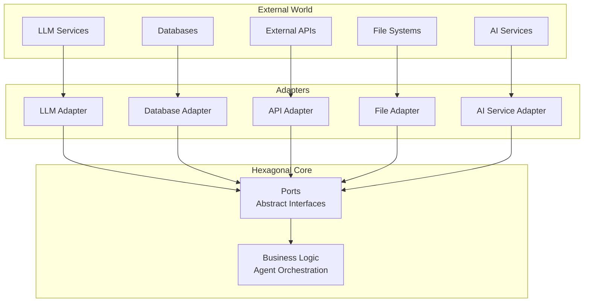
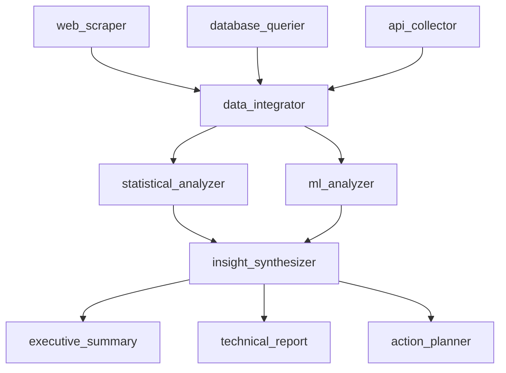

# 🤔 Philosophy & Design Principles

## Why hexDAG?

hexDAG was born from the frustration of working with overly complex orchestration frameworks that treat simple AI agent workflows as monumental challenges. We believe that building AI agents and data science workloads should be **intuitive**, **maintainable**, and **enterprise-ready** without unnecessary complexity.

## 🔍 AI Framework Landscape & Positioning

### Where hexDAG Fits Among AI Frameworks

The AI agent and LLM orchestration space has exploded with frameworks, each taking different approaches. Here's how hexDAG positions itself in the AI-first ecosystem:

#### **LLM Application Frameworks**

| Framework | Philosophy | Strengths | Limitations | hexDAG's Advantage |
|-----------|------------|-----------|-------------|-------------------|
| **LangChain** | Everything-included LLM toolkit | Massive ecosystem, rapid prototyping | Complex abstractions, debugging nightmares, monolithic | Clean architecture, type safety, composable |
| **LlamaIndex** | Data-focused RAG | Excellent data ingestion, indexing | Limited to search/retrieval patterns | Full workflow orchestration |
| **Semantic Kernel** | Microsoft's LLM framework | Enterprise backing, .NET/Python | Heavy abstractions, Microsoft-centric | Lightweight, vendor-agnostic |
| **Haystack** | NLP pipeline framework | Production-ready, search-focused | Complex setup, domain-specific | Simple setup, general-purpose |

#### **Multi-Agent Frameworks**

| Framework | Philosophy | Strengths | Limitations | hexDAG's Advantage |
|-----------|------------|-----------|-------------|-------------------|
| **LangGraph** | Graph-based LLM workflows | LangChain ecosystem, state management | Complex setup, LangChain baggage | Clean architecture, simpler patterns |
| **CrewAI** | Role-based agent teams | Agent specialization, hierarchies | Limited orchestration patterns | Flexible DAG orchestration |
| **AutoGen** | Conversational multi-agents | Rich agent conversations | Chat-focused, limited workflows | Structured workflows with conversation |
| **AgentGPT/AutoGPT** | Autonomous goal-seeking | Autonomous operation | Unpredictable, hard to control | Deterministic, controllable |
| **Swarm** | OpenAI's lightweight agents | Simple, OpenAI-native | Basic orchestration, limited patterns | Advanced orchestration with simplicity |

### 🎯 **hexDAG vs LangGraph: The Graph Orchestration Face-Off**

Since LangGraph is our closest competitor in graph-based AI orchestration, here's a detailed comparison:

| Aspect | LangGraph | hexDAG |
|--------|-----------|--------|
| **Philosophy** | LangChain-first with graph orchestration | Python-first with AI patterns |
| **Setup Complexity** | Requires LangChain ecosystem knowledge | Simple Python imports |
| **Type Safety** | Minimal, relies on LangChain patterns | Full Pydantic validation everywhere |
| **Debugging** | Complex, inherited LangChain abstractions | Clear execution paths and events |
| **State Management** | Built-in persistent state | Event-driven state with custom persistence |
| **Learning Curve** | Steep (LangChain + graph concepts) | Gentle (familiar Python patterns) |
| **Production Readiness** | Requires additional tooling | Built-in monitoring, retries, validation |


## 🎯 Core Philosophy

### The Six Pillars

hexDAG is built on six fundamental principles that guide every design decision:

#### 1. **Async-First Architecture**
**Everything is async by default**

```python
# Every operation is async
async def process_data(input_data: InputModel) -> OutputModel:
    result = await external_ai_service.call(input_data)
    return OutputModel(result=result)

# Orchestrator handles async execution elegantly
result = await orchestrator.run(graph, input_data)
```

**Why async?**
- **Performance**: Non-blocking I/O for external AI service calls
- **Scalability**: Handle thousands of concurrent agent workflow executions
- **Modern**: Aligns with contemporary Python best practices for AI development

#### 2. **Event-Driven Observability**
**Understanding what happened is as important as making it happen**

```python
# Rich event system for monitoring agent interactions
@event_observer
async def log_agent_execution(event: AgentStartedEvent):
    logger.info(f"Agent {event.agent_name} started at wave {event.wave_index}")

# Events for every significant action
- AgentStartedEvent
- AgentCompletedEvent
- AgentFailedEvent
- ValidationErrorEvent
- LLMPromptGeneratedEvent
```

**Why events?**
- **Memory**: Memory as the observer pattern and a node
- **Debugging**: See exactly what happened and when in agent workflows
- **Monitoring**: Real-time agent workflow health and performance
- **Auditing**: Complete execution history for compliance

#### 3. **Pydantic Validation Everywhere**
**Type safety and validation at every layer**

```python
# Input/output schemas are enforced everywhere
class ProcessingInput(BaseModel):
    text: str
    language: str = "en"

class ProcessingOutput(BaseModel):
    sentiment: float
    entities: list[str]

# Type errors caught by mypy before deployment
node = ProcessingNode(
    input_schema=ProcessingInput,
    output_schema=ProcessingOutput
)
```

**Benefits:**
- **IDE Support**: Full autocomplete and error detection
- **Runtime Safety**: Pydantic validates data at runtime
- **Documentation**: Schemas serve as living documentation
- **Consistency**: Same validation patterns across the entire framework

#### 4. **Hexagonal Architecture**
**Clean separation between business logic and external dependencies**



**Benefits:**
- **Testability**: Easy to test with mocks
- **Flexibility**: Switch implementations without changing business logic
- **Maintainability**: Business logic isolated from external dependencies

#### 5. **Composable Declarative Files**
**Low-code development through composable YAML configurations**

```yaml
# Simple declarative agent workflow
name: data_analysis_workflow
description: AI-powered data analysis with multiple agents

nodes:
  - type: agent
    id: data_analyzer
    params:
      initial_prompt_template: |
        Analyze the following data: {{input_data}}
        Focus on patterns, trends, and insights.
      max_steps: 5
      available_tools: ["statistical_analysis", "visualization"]
    depends_on: []

  - type: agent
    id: insight_generator
    params:
      initial_prompt_template: |
        Based on the analysis: {{data_analyzer.results}}
        Generate actionable business insights.
      max_steps: 3
    depends_on: [data_analyzer]
```

**Benefits:**
- **Low-Code**: Non-technical users can create AI workflows
- **Composability**: Reusable components and patterns
- **Version Control**: Declarative files are easily versioned
- **Visualization**: YAML structure is easy to visualize and understand

#### 6. **DAG-Based Orchestration**
**Directed Acyclic Graphs enable complex workflow orchestration**

```python
# DAG enables complex dependency management
workflow = DirectedGraph()

# Add nodes with dependencies
workflow.add(data_collector)
workflow.add(data_analyzer, deps=["data_collector"])
workflow.add(insight_generator, deps=["data_analyzer"])
workflow.add(report_generator, deps=["insight_generator"])

# Parallel execution where possible
workflow.add(quality_checker, deps=["data_analyzer"])
workflow.add(backup_storage, deps=["data_collector"])
```

**DAG Benefits:**
- **Dependency Management**: Clear execution order and parallelization
- **Complex Workflows**: Handle intricate multi-agent coordination
- **Optimization**: Automatic parallel execution where dependencies allow
- **Visualization**: Easy to understand workflow structure and data flow
- **Error Handling**: Isolated failures don't cascade through the entire workflow

**Why DAG?**
- **Scalability**: Efficient execution of complex agent networks
- **Reliability**: Isolated failures and clear error boundaries
- **Flexibility**: Support for both sequential and parallel execution patterns
- **Observability**: Clear data flow and execution paths for monitoring

### DAG in Declarative Configuration

**Complex Workflow Patterns**

```yaml
# Multi-stage analysis with parallel processing
name: comprehensive_data_analysis
description: Complex DAG with parallel and sequential execution

nodes:
  # Stage 1: Data Collection (parallel)
  - type: agent
    id: web_scraper
    params:
      initial_prompt_template: "Scrape web data for: {{topic}}"
      max_steps: 3
    depends_on: []

  - type: agent
    id: database_querier
    params:
      initial_prompt_template: "Query database for: {{topic}}"
      max_steps: 2
    depends_on: []

  - type: agent
    id: api_collector
    params:
      initial_prompt_template: "Collect API data for: {{topic}}"
      max_steps: 2
    depends_on: []

  # Stage 2: Data Processing (depends on all collectors)
  - type: agent
    id: data_integrator
    params:
      initial_prompt_template: |
        Integrate data from multiple sources:
        Web: {{web_scraper.data}}
        Database: {{database_querier.data}}
        API: {{api_collector.data}}
      max_steps: 4
    depends_on: [web_scraper, database_querier, api_collector]

  # Stage 3: Analysis (parallel branches)
  - type: agent
    id: statistical_analyzer
    params:
      initial_prompt_template: "Statistical analysis: {{data_integrator.integrated_data}}"
      max_steps: 5
    depends_on: [data_integrator]

  - type: agent
    id: ml_analyzer
    params:
      initial_prompt_template: "ML analysis: {{data_integrator.integrated_data}}"
      max_steps: 5
    depends_on: [data_integrator]

  # Stage 4: Synthesis (depends on all analyzers)
  - type: agent
    id: insight_synthesizer
    params:
      initial_prompt_template: |
        Synthesize insights:
        Statistical: {{statistical_analyzer.results}}
        ML: {{ml_analyzer.results}}
      max_steps: 4
    depends_on: [statistical_analyzer, ml_analyzer]

  # Stage 5: Reporting (parallel outputs)
  - type: agent
    id: executive_summary
    params:
      initial_prompt_template: "Executive summary: {{insight_synthesizer.insights}}"
      max_steps: 3
    depends_on: [insight_synthesizer]

  - type: agent
    id: technical_report
    params:
      initial_prompt_template: "Technical report: {{insight_synthesizer.insights}}"
      max_steps: 4
    depends_on: [insight_synthesizer]

  - type: agent
    id: action_planner
    params:
      initial_prompt_template: "Action plan: {{insight_synthesizer.insights}}"
      max_steps: 3
    depends_on: [insight_synthesizer]
```

**DAG Execution Visualization**



**Benefits of DAG-Based Declarative Configuration:**

1. **Automatic Parallelization**
   - Independent agents run in parallel
   - Dependencies automatically managed
   - Optimal resource utilization

2. **Complex Coordination**
   - Multi-agent workflows with clear data flow
   - Conditional execution based on dependencies
   - Error isolation and recovery

3. **Scalability**
   - Horizontal scaling of agent networks
   - Efficient execution of complex workflows
   - Resource-aware scheduling

4. **Observability**
   - Clear execution paths and data flow
   - Dependency tracking and visualization
   - Performance monitoring and optimization

## 🎭 Real-World Impact

### Before hexDAG

```python
# Typical AI orchestration framework pain
class MyAgentWorkflow(ComplexBaseClass):
    def __init__(self):
        super().__init__(
            config_file="complex_config.yaml",
            executor_type="kubernetes",
            retry_policy=RetryPolicy(...),
            # ... 50 more configuration options
        )

    def process(self, data):
        # Business logic mixed with infrastructure concerns
        if self.config.use_cache:
            cached = self.cache_client.get(data.key)
            if cached:
                return cached

        # Actual business logic buried in boilerplate
        result = self.external_ai_service.call(data)

        if self.config.use_cache:
            self.cache_client.set(data.key, result)

        return result
```

### With hexDAG

```python
# Clean, focused business logic
async def process_data(data: InputModel, llm: LLMPort) -> OutputModel:
    """Pure business logic - no infrastructure concerns"""
    result = await llm.generate(prompt=f"Process: {data.text}")
    return OutputModel(result=result)

# Infrastructure configured separately
orchestrator = Orchestrator(
    ports={"llm": OpenAIAdapter()},  # Pluggable adapters
    validator=coerce_validator(),    # Configurable validation
)

# Clean execution
result = await orchestrator.run(graph, input_data)
```

**Or even simpler with declarative configuration:**

```yaml
# Declarative agent workflow
name: simple_analysis
nodes:
  - type: agent
    id: analyzer
    params:
      initial_prompt_template: "Analyze: {{input}}"
      max_steps: 3
    depends_on: []
```

## 🌟 The hexDAG Advantage

### For Developers
- **Fast Learning Curve**: Intuitive APIs that follow Python conventions
- **Great DX**: Rich type hints, comprehensive examples, instant feedback
- **Debugging Joy**: Clear error messages and comprehensive event logging
- **Low-Code Options**: Declarative YAML for rapid prototyping

### For Teams
- **Maintainable**: Hexagonal architecture keeps code organized and testable
- **Scalable**: Async-first design handles growth gracefully
- **Reliable**: Type safety and validation catch errors early
- **Collaborative**: Declarative files enable non-technical team members

### For Organizations
- **Future-Proof**: Clean architecture adapts to changing AI requirements
- **Cost-Effective**: Less debugging time = more feature development
- **Compliant**: Event system provides audit trails and observability
- **Accessible**: Low-code approach democratizes AI development

## 🔮 Vision for the Future

We envision a world where:

- **AI agent development** is as enjoyable as writing regular Python code
- **Data science workflows** are orchestrated through simple declarative files
- **Testing and debugging** agent workflows is straightforward and comprehensive
- **Production deployments** are confident and reliable
- **Team collaboration** is seamless with clear interfaces and documentation
- **Non-technical users** can create sophisticated AI workflows through declarative configuration

hexDAG is our contribution to making this vision reality.

---

*"The best framework is the one you don't have to think about"* - hexDAG Team
