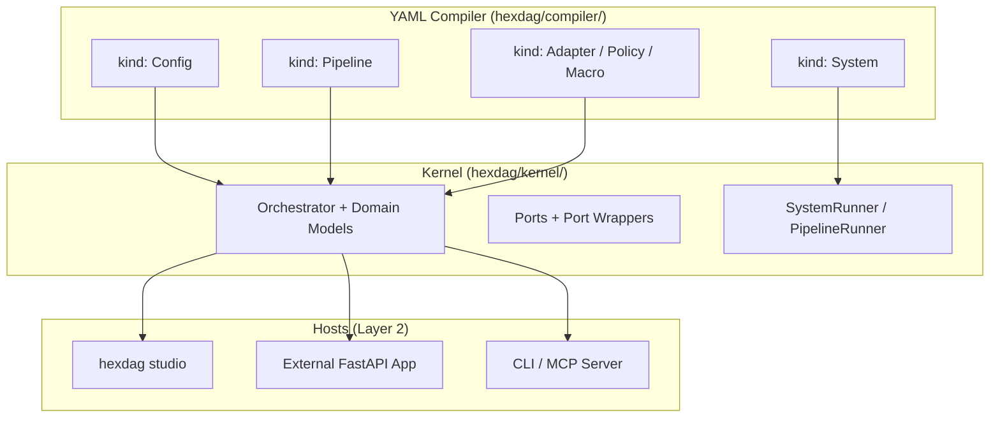

# Development Roadmap: hexDAG Framework

> **Strategic development plan for the hexDAG agent operating system**

For the current architecture, see [ARCHITECTURE.md](ARCHITECTURE.md).
For the detailed YAML compiler design spec, see [YAML_COMPILER_PLAN.md](YAML_COMPILER_PLAN.md).

## Vision & Architecture

### Core Philosophy
- **hexDAG**: Operating system for AI agents -- kernel (execution engine), stdlib (built-in components), drivers (infrastructure), compiler (YAML manifests)
- **YAML Compiler**: YAML manifests are the source language, compiled into kernel domain models for execution
- **Library-First**: All runtime primitives work as plain Python objects -- no server required



---

## Completed Work

### Core Framework
- [x] **DAG Orchestration Engine** -- Topological sort, wave-based parallel execution
- [x] **Node System** -- FunctionNode, LLMNode, AgentNode, LoopNode, ConditionalNode
- [x] **Validation Framework** -- Multi-strategy validation (Pydantic, type checking, custom)
- [x] **Event System** -- NodeStarted, NodeCompleted, NodeFailed, PipelineStarted, PipelineCompleted
- [x] **Hexagonal Architecture** -- Ports (contracts) / Adapters (implementations) / Drivers (infrastructure)
- [x] **Linux-aligned Restructure** -- `core/`->`kernel/`, `builtin/`->`stdlib/`, `adapters/`->`drivers/`

### YAML Pipeline Compiler
- [x] **YamlPipelineBuilder** -- Declarative YAML -> DirectedGraph compilation
- [x] **Macros** -- Reusable node templates (`kind: Macro`) with subgraph expansion
- [x] **Environment Management** -- Multi-document YAML with `metadata.namespace`
- [x] **Preprocessing** -- Env var substitution, `!include` tags, Jinja2 templates
- [x] **Custom YAML Tags** -- `!py` for Python expressions, `!include` for file inclusion
- [x] **Compiler Refactor (Step 0a)** -- Moved `kernel/pipeline_builder/` -> `compiler/`

### Ports & Adapters
- [x] **LLM Port** -- OpenAI, Anthropic, Mock adapters
- [x] **DataStore Port** -- `SupportsKeyValue`, `SupportsQuery`, `SupportsTTL`, `SupportsSchema`, `SupportsTransactions`
- [x] **PipelineSpawner Port** -- Fork/exec for child pipelines
- [x] **ToolRouter** -- Function calling and tool execution
- [x] **FileStorage, SecretStore, Memory** -- Data access ports
- [x] **Executor, ObserverManager** -- Infrastructure ports

### System Libraries (Libs)
- [x] **ProcessRegistry** -- In-memory pipeline run tracker (like `ps`)
- [x] **EntityState** -- Declarative state machines with `StateMachineConfig`
- [x] **Scheduler** -- asyncio-based delayed/recurring pipeline execution
- [x] **DatabaseTools** -- Agent-callable SQL query tools

### API & Integration
- [x] **MCP Server** -- 9 tools in `api/processes.py` for process management
- [x] **Studio REST API** -- Pipeline execution, validation, export routes
- [x] **CLI** -- `hexdag run`, `hexdag validate`, `hexdag studio`

### Infrastructure
- [x] **Pre-commit Hooks** -- ruff, pyupgrade, mypy, pyright, nbstripout
- [x] **CI/CD** -- Azure pipelines
- [x] **20+ Examples** -- Getting started to enterprise patterns
- [x] **Jupyter Notebooks** -- Interactive documentation

---

## Track 1: YAML Compiler & Multi-Process Orchestration

### Phase 1: Compiler Foundation + `kind: Config`

- [x] **Move config loader to compiler** (Step 0b)
  - `kernel/config/loader.py` -> `compiler/config_loader.py`
  - Kernel keeps only domain models, compiler handles parsing

- [x] **Extend HexDAGConfig** (Step 0c)
  - Add `orchestrator: OrchestratorConfig` (reuse existing)
  - Add `limits: DefaultLimits`, `caps: DefaultCaps`

- [ ] **`kind: Config` YAML manifest** (Step 1)
  - Replace `hexdag.toml` with YAML `kind: Config`
  - Parse `spec.kernel`, `spec.limits`, `spec.caps`
  - Backward compat: TOML still works with deprecation warning

### Phase 2: Resource Limits & Caps

- [ ] **Resource Limits** (Step 2)
  - `ResourceLimits` frozen dataclass in `kernel/domain/`
  - `ResourceAccounting` runtime enforcer in `kernel/orchestration/`
  - Pre-call checks in `ObservableLLMWrapper` and `ObservableToolRouterWrapper`
  - Events: `ResourceWarning`, `ResourceLimitExceeded`

- [ ] **Caps (Capabilities)** (Step 3)
  - `CapSet` frozen dataclass with `allows()`, `intersect()`
  - Port wrapper enforcement
  - Child process inheritance (child <= parent)
  - Events: `CapDenied`

- [ ] **Pipeline Integration** (Step 4)
  - Wire limits + caps into `PipelineRunner` and YAML `spec.limits`/`spec.caps`
  - ContextVars: `_resource_accounting`, `_cap_set`

- [ ] **`kind: Adapter`** (Step 5)
  - Standalone adapter configs, referenceable by `{ ref: name }`
  - DRY across System manifests

- [ ] **`kind: Policy`** (Step 6)
  - Reusable execution policies (retry, timeout, rate-limit)
  - First-class declarative policy definitions

### Phase 3: `kind: System` + SystemRunner

- [ ] **Pipes domain model** (Step 7)
  - `Pipe` frozen dataclass: `from_process`, `to_process`, `mapping`
  - Jinja2 template resolution for inter-process data flow

- [ ] **`kind: System` + SystemBuilder** (Step 8)
  - `SystemConfig` Pydantic model
  - SystemBuilder: parse System YAML, resolve exec paths, validate pipe DAG
  - SystemValidator: no cycles, valid process refs

- [ ] **SystemRunner** (Step 9)
  - Execute `SystemConfig` via `PipelineRunner` per process
  - Topological execution order from pipe DAG
  - Shared ports with per-process overrides
  - `manual` mode (one-shot) first

### Phase 4: Studio as Daemon Host

- [ ] **`schedule` mode** in SystemRunner
  - Recurring execution via Scheduler (asyncio timers)

- [ ] **Studio System Manager**
  - Load System manifests on startup
  - Process supervision (like systemd)
  - REST API: `/api/system/status`, `/api/system/start`, `/api/system/stop`
  - MCP server: expose full `api/` surface as MCP tools for external agents

- [ ] **`continuous` mode**
  - Restart processes on completion
  - Restart policies and health monitoring

- [ ] **`event` mode** (requires EventBus)
  - Trigger system execution from EventBus events

---

## Track 2: Kernel Extensions

### VFS (Virtual Filesystem)

**Location:** `kernel/ports/vfs.py`

Uniform path-based interface for all hexDAG entities. Every pipeline run,
component, port, and configuration is addressable by path -- the core of
"everything is a file."

#### Two interfaces, one system

hexDAG exposes system state through two complementary interfaces, exactly
as Linux does:

```
                        ┌──────────────────────────────────────────────┐
                        │          Agent / MCP / Studio                │
                        └─────────┬────────────────────┬───────────────┘
                                  │                    │
                    ┌─────────────▼──────────┐  ┌──────▼───────────────┐
                    │   VFS  (namespace)      │  │  Syscalls (api/)     │
                    │                         │  │                      │
                    │  aread   /proc/runs/42  │  │  list_pipeline_runs( │
                    │  alist   /lib/nodes/    │  │    status="done",    │
                    │  astat   /proc/ent/...  │  │    limit=50)         │
                    │  aexec   /etc/pipe/... ²│  │  spawn_pipeline(...) │
                    │  awatch  /proc/runs/.. ³│  │  schedule_pipeline() │
                    │                         │  │  transition_entity() │
                    │  Path-based.            │  │  Parameterized.      │
                    │  One entity at a time.  │  │  Filtering, sorting, │
                    │  Uniform addressing.    │  │  branching logic.    │
                    └─────────┬───────────────┘  └──────┬───────────────┘
                              │                         │
                              ▼                         ▼
                    ┌──────────────────────────────────────────────────┐
                    │           System Libs  (stdlib/lib/)             │
                    │  ProcessRegistry · EntityState · Scheduler       │
                    └──────────────────────────────────────────────────┘
```

**VFS = namespace.** Like `/proc` in Linux. Given a path, return the entity
at that path. No query parameters, no filtering -- just hierarchical
name-to-content resolution. Its power is **uniform addressing**: agents
can browse the entire system through one interface (`aread`, `alist`,
`astat`), and in Phase 2 invoke any entity through `aexec`.

**Syscalls = typed operations.** Like `ps(1)`, `kill(2)`, `waitpid(2)`.
The `api/processes.py` functions take typed parameters (`status`, `ref_id`,
`limit`), do smart dispatch, and return structured results.

Both interfaces delegate to the same underlying libs. They coexist --
the VFS doesn't replace the syscalls, and the syscalls don't make the
VFS redundant.

| Linux | hexDAG VFS | hexDAG Syscall |
|---|---|---|
| `cat /proc/1234/status` | `vfs.aread("/proc/runs/<id>")` | `get_pipeline_run(registry, run_id)` |
| `ls /proc/` | `vfs.alist("/proc/runs/")` | -- |
| `ps aux --sort=-pcpu \| head` | -- | `list_pipeline_runs(status=..., limit=50)` |
| `kill -9 1234` | `vfs.aexec("/proc/runs/<id>/cancel", {})` ² | `cancel_scheduled(scheduler, task_id)` |

² = Phase 2 &emsp; ³ = Phase 3

#### VFS Phases

**Phase 1 -- Introspection:**

```python
class VFS(Protocol):
    async def aread(self, path: str) -> str: ...
    async def alist(self, path: str) -> list[DirEntry]: ...
    async def astat(self, path: str) -> StatResult: ...
```

- [ ] `aread`, `alist`, `astat` path-based access
- [ ] **VFSTools lib** (`stdlib/lib/vfs_tools.py`) -- Agent-callable VFS operations: `aread_path`, `alist_directory`, `astat_path`

**Phase 2 -- Execution:**

```python
    async def aexec(self, path: str, args: dict) -> Any: ...
```

- [ ] `aexec` to invoke entities by path (spawn pipelines, transition state, call tools)
- [ ] VFSTools Phase 2 methods: `aexec_path(path, args)`

#### Namespace tree

```
/proc/runs/<run_id>/status|info       ProcessRegistry
/proc/scheduled/<task_id>/status      Scheduler
/proc/entities/<type>/<id>/state      EntityState
/dev/ports/<name>                     Bound adapter info
/lib/nodes|adapters|macros|tools|libs|prompts|tags/
/etc/pipelines/<name>                 Pipeline definitions
/sys/version|config                   System metadata
```

#### Mount system

Providers register at path prefixes. Longest-prefix match resolves paths.
Each subsystem implements `VFSProvider`:

```python
class VFSProvider(Protocol):
    async def read(self, relative_path: str) -> str: ...
    async def write(self, relative_path: str, data: str) -> int: ...
    async def stat(self, relative_path: str) -> StatResult: ...
    async def readdir(self, relative_path: str) -> list[DirEntry]: ...
```

#### Impact on existing code

- `kernel/discovery.py` -- unchanged (scanning engine, VFS providers call it)
- `kernel/resolver.py` -- unchanged (module path resolution)
- `api/components.py` -- read-only functions become thin VFS wrappers (backwards compatible)
- `api/processes.py` -- mutation functions route through `vfs.aexec()` in Phase 2; parameterized query functions remain as syscall-style APIs
- `ToolRouter` -- unchanged in Phase 1; auto-populated from VFS in Phase 4 (deferred)

**Stdlib default:** `LocalVFS` in `drivers/vfs/local.py` -- in-process, mount-based dispatch.
**User implementations:** Distributed VFS (etcd/consul), REST-backed VFS.

### EventBus

**Location:** `kernel/ports/event_bus.py`

Cross-pipeline pub/sub signals. Pipelines emit and subscribe to named events across
runs, enabling reactive multi-pipeline coordination.

**Use cases:**
- Pipeline A completes -> triggers Pipeline B automatically
- Order state change in Pipeline A -> notifies monitoring Pipeline C
- Error in any pipeline -> triggers alert pipeline
- `kind: System` with `init: { type: event }` -- EventBus triggers system execution

**Protocol sketch:**

```python
class EventBus(Protocol):
    async def apublish(self, topic: str, payload: dict) -> None: ...
    async def asubscribe(self, topic: str, handler: Callable) -> str: ...
    async def aunsubscribe(self, subscription_id: str) -> None: ...
```

- [ ] **Cross-pipeline pub/sub** -- Reactive multi-pipeline coordination
- [ ] **In-memory default** + Redis/Kafka/NATS adapters

**Stdlib default:** In-memory pub/sub with asyncio queues.
**User implementations:** Redis Pub/Sub, Kafka, NATS, cloud event buses.

### GovernancePort

**Location:** `kernel/ports/governance.py`

Authorization and audit. Controls who can spawn pipelines, transition entity states,
and access data. Complements Caps (process-scoped permissions) with user-level auth.

**Use cases:**
- Only authorized users can trigger production pipelines
- Audit log of all pipeline executions and state transitions
- Entity state transitions require approval based on role

**Protocol sketch:**

```python
class Governance(Protocol):
    async def aauthorize(self, action: str, principal: str, resource: str) -> bool: ...
    async def aaudit(self, action: str, principal: str, resource: str, result: str) -> None: ...
    async def alist_permissions(self, principal: str) -> list[str]: ...
```

- [ ] **Authorization and audit** -- User-level permissions complementing Caps
- [ ] **RBAC/ABAC** default implementations

**Stdlib default:** Allow-all policy (no restrictions).
**User implementations:** RBAC, ABAC, OPA integration, cloud IAM.

### Studio MCP Server

**Location:** `hexdag/studio/` + `hexdag/api/`

Expose Studio's full capabilities as MCP tools so that external agents can
operate the system programmatically. The `hexdag/api/` layer already provides
shared business logic consumed by both Studio REST routes and existing MCP tools.
The Studio MCP server extends this to cover the full `api/` surface:

- `api/components` -- Browse nodes, adapters, tools, macros, tags
- `api/execution` -- Execute pipelines
- `api/validation` -- Validate pipeline YAML
- `api/pipeline` -- Create/modify pipeline YAML
- `api/processes` -- Pipeline runs, scheduling, entity state (existing 9 tools)
- `api/vfs` -- Virtual filesystem introspection
- `api/documentation` -- Guides and references
- `api/export` -- Project export

**Permission boundaries:** Each MCP client gets a permission profile:
- `read` -- List/get operations only
- `execute` -- Read + run pipelines, spawn processes
- `modify` -- Execute + create/edit YAML, transition entities
- `admin` -- Full access

Leverages CapSet at the API layer.

- [ ] **Expose api/ layer as MCP tools** -- Full Studio capabilities for external agents
- [ ] **Permission profiles** -- read / execute / modify / admin per MCP client

### CentralAgent (External)

**Location:** External (example / separate package -- NOT in stdlib)

Meta-orchestrator ("CPU"). An LLM-powered agent that uses hexDAG's MCP tools
to assign tasks across multiple pipelines based on goals and available capabilities.

Lives outside hexDAG. Uses only the public API and MCP server -- no special
kernel access. Any MCP client connected to hexDAG's MCP server can act as a
CentralAgent.

**What it does:**
1. Uses ProcessRegistry tools to see what pipelines are available and running
2. Uses PipelineSpawner to launch appropriate pipelines
3. Monitors progress via ProcessRegistry events
4. Makes routing decisions via LLM

**Dependencies:** hexDAG MCP server with process tools, VFSTools, execution tools.

- [ ] **Example / recipe** -- External LLM agent using Studio MCP tools
- [ ] Simple open source example ships separately from hexDAG

### Kernel Internals

- [ ] **RunContext** -- Rename ExecutionContext, add `run_id`, `pipeline_name`, `parent_run_id` as first-class fields, typed accessors for common ports (`.llm`, `.memory`, `.database`)
- [ ] **NodeHook / PortHook** -- Per-node and per-port lifecycle hooks (before/after execution). Use cases: logging, caching, authorization, retry, circuit breaking.
- [ ] **`hexdag explain`** -- CLI command (like `kubectl explain`) for YAML field docs

---

## Track 3: Framework Polish

### Performance & DX
- [ ] **Graph Optimizer Passes** -- Dead-node elimination, constant-folding
- [ ] **Static Pipeline Linter** -- `hexdag lint` with rule IDs (E100, W200)
- [ ] **JSON Schema Export** -- Per-kind schemas for IDE YAML autocomplete

### API Stabilization
- [ ] **Version 1.0 API Freeze** -- Backward compatibility commitment
- [ ] **PyPI Publication** -- `pip install hexdag` with semantic versioning
- [ ] **Optional Dependencies** -- `[cli]`, `[viz]`, `[dev]` groups

### Node Enhancements
- [ ] **Majority Vote Macro** -- Multi-input consensus mechanism
- [ ] **Enhanced Loop Node** -- Complex termination, state preservation
- [ ] **Conditional Enhancement** -- Data-driven routing with schema validation

---

## Track 4: Agent Applications

### Core Workflows
- [ ] **Text-to-SQL Pipeline** -- Multi-strategy with majority voting
- [ ] **Research Pipeline** -- Multi-agent coordination with fact verification
- [ ] **Chat Integration Macro** -- Conversational interface

### Advanced Applications
- [ ] **AutoRAG Pipeline** -- Automatic indexing and query optimization
- [ ] **ETL Pipeline** -- Artifact objects for large data support

### Adapter Ecosystem
- [ ] **Enhanced OpenAI Adapter** -- Streaming, function calling, rate limiting
- [ ] **Anthropic Claude Adapter** -- Tool use capabilities
- [ ] **Open Source LLM Adapter** -- Ollama/NIM integration

---

## Deferred Items

### LockPort
**Status:** Deferred -- premature for single-process execution. Only needed for
distributed multi-process scenarios (multiple machines).
**Stdlib default:** In-memory asyncio locks. **User:** Redis (redlock), etcd leases, Consul.

### ArtifactStore
**Status:** Deferred -- FileStorage + DataStore are sufficient for current needs.
**Stdlib default:** Local filesystem. **User:** S3, Azure Blob, GCS, MLflow.

### VFS Phase 3 (watch) & Phase 4 (tool integration)
**Status:** Deferred -- EventBus covers reactive subscriptions better (Phase 3).
ToolRouter already handles tool discovery (Phase 4).

---

## Existing vs Planned Overview

```
kernel/ports/ (existing)              kernel/ports/ (planned)
  LLM                                   VFS
  DataStore                              EventBus
  Database (deprecated)                  Governance
  ToolRouter
  ObserverManager
  Executor
  PipelineSpawner
  FileStorage
  SecretStore
  Memory (deprecated)

kernel/domain/ (planned)
  ResourceLimits
  CapSet
  Pipe
  Policy

compiler/ (existing + planned)
  yaml_builder.py (existing)           system_builder.py (planned)
  pipeline_config.py (existing)        system_config.py (planned)
  config_loader.py (existing)          system_validator.py (planned)
  plugins/macro_definition.py (existing)
  plugins/config_definition.py (planned)
  plugins/adapter_definition.py (planned)
  plugins/policy_definition.py (planned)

stdlib/lib/ (existing)               stdlib/lib/ (planned)
  ProcessRegistry                       VFSTools
  EntityState
  Scheduler
  DatabaseTools

kernel/ internals (planned)
  RunContext (rename ExecutionContext)
  NodeHook / PortHook
  SystemRunner
  ResourceAccounting
```

---

## Implementation Priority

1. **YAML Compiler refactor** -- Move `pipeline_builder/` -> `compiler/`, config loader, typed config defaults. **(Steps 0a, 0b, 0c complete)**
2. **`kind: Config` + Resource Limits + Caps** -- Organization-wide safety defaults. Budget enforcement. Process-scoped permissions.
3. **`kind: System` + SystemRunner** -- Multi-process orchestration with pipes and topological execution.
4. **`kind: Adapter` + `kind: Policy`** -- Reusable adapter configs and execution policies.
5. **VFS Phase 1** -- Uniform introspection. Primary query interface. Simplifies api/ layer.
6. **EventBus** -- Cross-pipeline IPC. Required by CentralAgent and `init: { type: event }`.
7. **RunContext rename** -- Low risk, high clarity improvement. Can be done anytime.
8. **VFS Phase 2 (exec)** -- Entity invocation by path.
9. **NodeHook / PortHook** -- Enables middleware-style extensibility.
10. **GovernancePort** -- Required for production multi-tenant deployments.
11. **Studio MCP Server** -- Expose full api/ surface as MCP tools with permission boundaries.

---

## Success Metrics

### hexDAG Core
- Zero external dependencies (except Pydantic)
- 100% type coverage
- < 100ms overhead per node
- Published on PyPI

### Multi-Process Orchestration
- Support 100+ concurrent pipelines
- < 1s pipeline startup time
- Resource limit enforcement accuracy

### Developer Experience
- 5 minute quick start
- `hexdag explain` for instant YAML documentation
- IDE autocomplete via JSON Schema
- Extensive examples (20+ comprehensive examples)

---

## Milestones

### Milestone 1: YAML Compiler Foundation (In Progress)
- [x] Compiler refactor (`pipeline_builder/` -> `compiler/`)
- [x] Config loader migration
- [x] Typed defaults (`DefaultLimits`, `DefaultCaps`, `OrchestratorConfig` on `HexDAGConfig`)
- [ ] `kind: Config` YAML manifest

### Milestone 2: Safety Rails
- [ ] Resource Limits + Caps enforcement
- [ ] `kind: Adapter` + `kind: Policy`
- [ ] Pipeline-level limits/caps in YAML

### Milestone 3: Multi-Process Orchestration
- [ ] `kind: System` + SystemBuilder + SystemRunner
- [ ] Pipes and topological execution
- [ ] Manual mode end-to-end

### Milestone 4: Production Runtime
- [ ] Studio as daemon host (schedule/continuous modes)
- [ ] VFS Phase 1 + EventBus
- [ ] GovernancePort

### Milestone 5: Stable Release
- [ ] API freeze and 1.0 release
- [ ] PyPI publication
- [ ] Community documentation site
