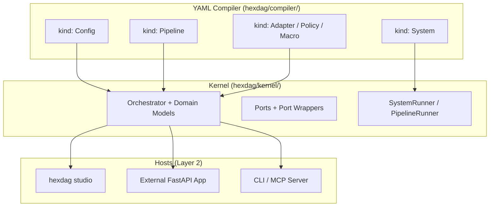

# Development Roadmap: hexDAG Framework

> **Strategic development plan for the hexDAG agent operating system**

## Vision & Architecture

### Core Philosophy
- **hexDAG**: Operating system for AI agents -- kernel (execution engine), stdlib (built-in components), drivers (infrastructure), compiler (YAML manifests)
- **YAML Compiler**: YAML manifests are the source language, compiled into kernel domain models for execution
- **Library-First**: All runtime primitives work as plain Python objects -- no server required

---

## Completed Work

### Core Framework
- [x] **DAG Orchestration Engine** -- Topological sort, wave-based parallel execution
- [x] **Node System** -- FunctionNode, LLMNode, AgentNode, LoopNode, ConditionalNode
- [x] **Validation Framework** -- Multi-strategy validation (Pydantic, type checking, custom)
- [x] **Event System** -- NodeStarted, NodeCompleted, NodeFailed, PipelineStarted, PipelineCompleted
- [x] **Hexagonal Architecture** -- Ports (contracts) / Adapters (implementations) / Drivers (infrastructure)
- [x] **Linux-aligned Restructure** -- `core/`->`kernel/`, `builtin/`->`stdlib/`, `adapters/`->`drivers/`

### YAML Pipeline Compiler
- [x] **YamlPipelineBuilder** -- Declarative YAML -> DirectedGraph compilation
- [x] **Macros** -- Reusable node templates (`kind: Macro`) with subgraph expansion
- [x] **Environment Management** -- Multi-document YAML with `metadata.namespace`
- [x] **Preprocessing** -- Env var substitution, `!include` tags, Jinja2 templates
- [x] **Custom YAML Tags** -- `!py` for Python expressions, `!include` for file inclusion
- [x] **Compiler Refactor (Step 0a)** -- Moved `kernel/pipeline_builder/` -> `compiler/`

### Ports & Adapters
- [x] **LLM Port** -- OpenAI, Anthropic, Mock adapters
- [x] **DataStore Port** -- `SupportsKeyValue`, `SupportsQuery`, `SupportsTTL`, `SupportsSchema`, `SupportsTransactions`
- [x] **PipelineSpawner Port** -- Fork/exec for child pipelines
- [x] **ToolRouter** -- Function calling and tool execution
- [x] **FileStorage, SecretStore, Memory** -- Data access ports
- [x] **Executor, ObserverManager** -- Infrastructure ports

### System Libraries (Libs)
- [x] **ProcessRegistry** -- In-memory pipeline run tracker (like `ps`)
- [x] **EntityState** -- Declarative state machines with `StateMachineConfig`
- [x] **Scheduler** -- asyncio-based delayed/recurring pipeline execution
- [x] **DatabaseTools** -- Agent-callable SQL query tools

### API & Integration
- [x] **MCP Server** -- 9 tools in `api/processes.py` for process management
- [x] **Studio REST API** -- Pipeline execution, validation, export routes
- [x] **CLI** -- `hexdag run`, `hexdag validate`, `hexdag studio`

### Infrastructure
- [x] **Pre-commit Hooks** -- ruff, pyupgrade, mypy, pyright, nbstripout
- [x] **CI/CD** -- Azure pipelines
- [x] **20+ Examples** -- Getting started to enterprise patterns
- [x] **Jupyter Notebooks** -- Interactive documentation

---

## Track 1: YAML Compiler & Multi-Process Orchestration

### Phase 1: Compiler Foundation + `kind: Config`

- [ ] **Move config loader to compiler** (Step 0b)
  - `kernel/config/loader.py` -> `compiler/config_loader.py`
  - Kernel keeps only domain models, compiler handles parsing

- [ ] **Extend HexDAGConfig** (Step 0c)
  - Add `orchestrator: OrchestratorConfig` (reuse existing)
  - Add `limits: DefaultLimits`, `caps: DefaultCaps`

- [ ] **`kind: Config` YAML manifest** (Step 1)
  - Replace `hexdag.toml` with YAML `kind: Config`
  - Parse `spec.kernel`, `spec.limits`, `spec.caps`
  - Backward compat: TOML still works with deprecation warning

### Phase 2: Resource Limits & Caps

- [ ] **Resource Limits** (Step 2)
  - `ResourceLimits` frozen dataclass in `kernel/domain/`
  - `ResourceAccounting` runtime enforcer in `kernel/orchestration/`
  - Pre-call checks in `ObservableLLMWrapper` and `ObservableToolRouterWrapper`
  - Events: `ResourceWarning`, `ResourceLimitExceeded`

- [ ] **Caps (Capabilities)** (Step 3)
  - `CapSet` frozen dataclass with `allows()`, `intersect()`
  - Port wrapper enforcement
  - Child process inheritance (child <= parent)
  - Events: `CapDenied`

- [ ] **Pipeline Integration** (Step 4)
  - Wire limits + caps into `PipelineRunner` and YAML `spec.limits`/`spec.caps`
  - ContextVars: `_resource_accounting`, `_cap_set`

- [ ] **`kind: Adapter`** (Step 5)
  - Standalone adapter configs, referenceable by `{ ref: name }`
  - DRY across System manifests

- [ ] **`kind: Policy`** (Step 6)
  - Reusable execution policies (retry, timeout, rate-limit)
  - First-class declarative policy definitions

### Phase 3: `kind: System` + SystemRunner

- [ ] **Pipes domain model** (Step 7)
  - `Pipe` frozen dataclass: `from_process`, `to_process`, `mapping`
  - Jinja2 template resolution for inter-process data flow

- [ ] **`kind: System` + SystemBuilder** (Step 8)
  - `SystemConfig` Pydantic model
  - SystemBuilder: parse System YAML, resolve exec paths, validate pipe DAG
  - SystemValidator: no cycles, valid process refs

- [ ] **SystemRunner** (Step 9)
  - Execute `SystemConfig` via `PipelineRunner` per process
  - Topological execution order from pipe DAG
  - Shared ports with per-process overrides
  - `manual` mode (one-shot) first

### Phase 4: Studio as Daemon Host

- [ ] **`schedule` mode** in SystemRunner
  - Recurring execution via Scheduler (asyncio timers)

- [ ] **Studio System Manager**
  - Load System manifests on startup
  - Process supervision (like systemd)
  - REST API: `/api/system/status`, `/api/system/start`, `/api/system/stop`

- [ ] **`continuous` mode**
  - Restart processes on completion
  - Restart policies and health monitoring

- [ ] **`event` mode** (requires EventBus)
  - Trigger system execution from EventBus events

---

## Track 2: Kernel Extensions

### VFS (Virtual Filesystem)
- [ ] **Phase 1: Introspection** -- `aread`, `alist`, `astat` path-based access
- [ ] **Phase 2: Execution** -- `aexec` to invoke entities by path
- [ ] **VFSTools lib** -- Agent-callable VFS operations

### EventBus
- [ ] **Cross-pipeline pub/sub** -- Reactive multi-pipeline coordination
- [ ] **In-memory default** + Redis/Kafka/NATS adapters

### GovernancePort
- [ ] **Authorization and audit** -- User-level permissions complementing Caps
- [ ] **RBAC/ABAC** default implementations

### Kernel Internals
- [ ] **RunContext** -- Rename ExecutionContext, add typed accessors
- [ ] **NodeHook / PortHook** -- Middleware-style lifecycle hooks
- [ ] **`hexdag explain`** -- CLI command (like `kubectl explain`) for YAML field docs

---

## Track 3: Framework Polish

### Performance & DX
- [ ] **Graph Optimizer Passes** -- Dead-node elimination, constant-folding
- [ ] **Static Pipeline Linter** -- `hexdag lint` with rule IDs (E100, W200)
- [ ] **JSON Schema Export** -- Per-kind schemas for IDE YAML autocomplete

### API Stabilization
- [ ] **Version 1.0 API Freeze** -- Backward compatibility commitment
- [ ] **PyPI Publication** -- `pip install hexdag` with semantic versioning
- [ ] **Optional Dependencies** -- `[cli]`, `[viz]`, `[dev]` groups

### Node Enhancements
- [ ] **Majority Vote Macro** -- Multi-input consensus mechanism
- [ ] **Enhanced Loop Node** -- Complex termination, state preservation
- [ ] **Conditional Enhancement** -- Data-driven routing with schema validation

---

## Track 4: Agent Applications

### Core Workflows
- [ ] **Text-to-SQL Pipeline** -- Multi-strategy with majority voting
- [ ] **Research Pipeline** -- Multi-agent coordination with fact verification
- [ ] **Chat Integration Macro** -- Conversational interface

### Advanced Applications
- [ ] **AutoRAG Pipeline** -- Automatic indexing and query optimization
- [ ] **ETL Pipeline** -- Artifact objects for large data support

### Adapter Ecosystem
- [ ] **Enhanced OpenAI Adapter** -- Streaming, function calling, rate limiting
- [ ] **Anthropic Claude Adapter** -- Tool use capabilities
- [ ] **Open Source LLM Adapter** -- Ollama/NIM integration

---

## Success Metrics

### hexDAG Core
- Zero external dependencies (except Pydantic)
- 100% type coverage
- < 100ms overhead per node
- Published on PyPI

### Multi-Process Orchestration
- Support 100+ concurrent pipelines
- < 1s pipeline startup time
- Resource limit enforcement accuracy

### Developer Experience
- 5 minute quick start
- `hexdag explain` for instant YAML documentation
- IDE autocomplete via JSON Schema
- Extensive examples (20+ comprehensive examples)

---

## Milestones

### Milestone 1: YAML Compiler Foundation (In Progress)
- [x] Compiler refactor (`pipeline_builder/` -> `compiler/`)
- [ ] Config loader migration
- [ ] `kind: Config` with typed defaults

### Milestone 2: Safety Rails
- [ ] Resource Limits + Caps enforcement
- [ ] `kind: Adapter` + `kind: Policy`
- [ ] Pipeline-level limits/caps in YAML

### Milestone 3: Multi-Process Orchestration
- [ ] `kind: System` + SystemBuilder + SystemRunner
- [ ] Pipes and topological execution
- [ ] Manual mode end-to-end

### Milestone 4: Production Runtime
- [ ] Studio as daemon host (schedule/continuous modes)
- [ ] VFS Phase 1 + EventBus
- [ ] GovernancePort

### Milestone 5: Stable Release
- [ ] API freeze and 1.0 release
- [ ] PyPI publication
- [ ] Community documentation site
