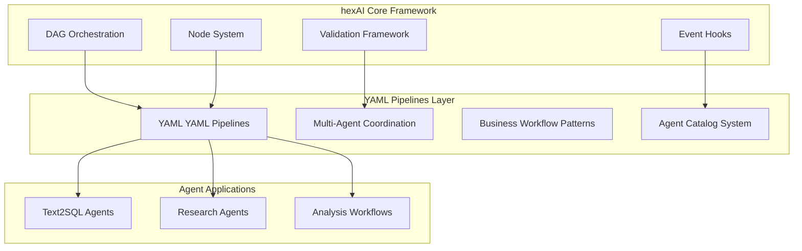

# 🗺️ Development Roadmap: hexAI Framework & YAML Pipelines

> **Strategic development plan separating the core hexAI framework from YAML pipelines applications**

## 🎯 Vision & Architecture Separation

### Core Philosophy
- **hexAI**: Lightweight, focused DAG orchestration framework
- **YAML Pipelines**: YAML-based agent workflow builder with multi-agent coordination patterns
- **Clear Boundaries**: Framework provides hooks, YAML pipelines adds business workflow capabilities



---

## 🏗️ Track 1: hexAI Core Framework Development

### **Immediate: Core Framework Polish**
**Objective**: Stabilize and optimize existing functionality

#### **Architecture Improvements**
- [ ] **Extract Retry Logic from LLMNode**
  - Move 400+ lines of retry logic to validation framework
  - Use validation strategies instead of node-specific logic
  - Simplify to ~50 lines total

- [ ] **Fix Agent Built-in Tools Architecture**
  - Move `tool_end` and `change_phase` from adapter layer to core domain
  - Implement CoreAgentTools to maintain hexagonal architecture
  - Remove direct UnifiedToolRouter dependency from agent_node.py

- [ ] **Create Event Emission Decorators**
  ```python
  @emit_node_events
  async def execute_node(...):
      return await node_spec.fn(...)
  ```

- [ ] **Simplify Node Factory Signatures**
  - Reduce parameters from 10+ to 3-4 essential ones
  - Use builder pattern or config objects
  - Provide sensible defaults

#### **Performance & DX Improvements**
- [ ] **Extract JSON Parsing Strategies**
  - Remove regex duplication
  - Create pluggable parser interface
  - Move to `hexdag.parsing` module
  - Check the security of it
  - Create YAML Parsing Strategy

- [ ] **Static Pipeline Linter (`hexdag-lint`)**
  - CLI tool for validating pipelines before execution
  - Detect cycles, unused outputs, unknown parameters
  - Emit rule IDs (E100, W200, I300) for different error types

- [ ] **Repository CI/CD Pipeline Setup**
  - Azure pipelines workflow for automated testing
  - Multi-Python version testing (3.10, 3.11, 3.12+)
  - Code coverage reporting with codecov integration
  - Automated security scanning (bandit, safety)
  - Pre-commit hooks for code quality (ruff, uv, flake8, mypy, pyright and other)
  - Automated PyPI package publishing on release tags
  - Documentation building and deployment
  - Example validation in CI (run all examples as tests)

- [ ] **AI Development Assistant Configuration**
  - Create `.cursorrules` file with hexAI coding standards and patterns
  - Add `CURSOR_GUIDE.md` with Cursor-specific development workflows
  - Create `CLAUDE_PROMPTS.md` with standardized Claude prompts for hexAI development
  - Add AI assistant context files for consistent code generation
  - Document AI-assisted development best practices for the project


### **Phase 1: Advanced Core Features**

#### **Enhanced Node Types**
- [ ] **Majority Vote Macro**
  - Multi-input consensus mechanism
  - Configurable voting strategies (unanimous, majority, weighted)
  - Confidence scoring and result aggregation

- [ ] **Enhanced Loop Node**
  - Complex termination conditions
  - State preservation across iterations
  - Nested loop support

- [ ] **Conditional Enhancement**
  - Complex branching logic with multiple conditions
  - Data-driven routing with schema validation
  - Dynamic path selection based on runtime data

#### **Port Registry System**
- [ ] **Dynamic Port Discovery**
  ```python
  @register_port("vector_store")
  class VectorStorePort:
      """Custom port for vector operations"""
  ```
  - Remove hardcoded port names
  - Enable runtime port registration
  - Type-safe port contracts

#### **Validation Framework Enhancement**
- [ ] **Performance Mode**
  - Validation result caching
  - Compile-time validation optimization
  - Zero-overhead passthrough mode

- [ ] **Custom Validator Plugins**
  - Simple registration API
  - Chainable validators
  - Domain-specific validation rules

### **Phase 2: Framework Stability**

#### **API Stabilization**
- [ ] **Version 1.0 API Freeze**
  - Backward compatibility commitment
  - Deprecation policy
  - Migration guides

#### **Performance Optimization**
- [ ] **Execution Engine Tuning**
  - Wave calculation caching
  - Minimal memory footprint
  - Benchmark suite establishment

- [ ] **Graph Optimizer Passes**
  - Dead-node elimination and constant-folding before runtime
  - Visitor pattern for optimization transformations
  - Development vs production optimization profiles

#### **Developer Experience**
- [ ] **Type Stubs Generation**
  - Full type coverage
  - IDE autocomplete support
  - Runtime type checking options

- [ ] **Universal Input Mapping Across All Nodes**
  - Standardize input mapping implementation across all node types
  - Create shared mapping utilities and patterns
  - Unify field transformation logic in BaseNodeFactory

#### **Library Publication**
- [ ] **PyPI Package Publication**
  - Publish hexDAG as standalone library: `pip install hexdag`
  - Semantic versioning and release automation
  - Comprehensive package metadata and documentation
  - Minimal dependencies (only Pydantic)

- [ ] **Optional Dependencies Refactor**
  - CLI tools as optional dependency group [cli]
  - Visualization as optional dependency group [viz]
  - Development tools as [dev] group
  - Graceful import handling for missing dependencies

### **Phase 3: Advanced Infrastructure**

#### **Extensibility & Plugins**
- [ ] **Plugin System Architecture**
  - Custom node type plugins
  - Port adapter plugins
  - Validation strategy plugins
  - Event observer plugins

---

## 🏢 Track 2: YAML Pipelines Enhancement

### **Phase 1: Enterprise Features **

#### **Advanced Pipeline Management**
- [ ] **Version Control Integration**
  - Git-based pipeline versioning
  - Rollback capabilities
  - A/B testing support

#### **Advanced Features**
- [ ] **Deterministic Replay & Checkpointing**
  - Append-only checkpoint logs (`checkpoints/{session}.jsonl`)
  - CLI replay command: `hexdag replay --session {id} --from {node}`
  - Input/output hash verification for consistency

- [ ] **Reusable Sub-Graphs ("Macros")**
  - YAML macros for reducing node sequence duplication
  - `use_macro:` directive for inline expansion
  - Node-id prefixing for macro instance isolation

### **Phase 2: Memory & Persistence**

#### **Memory Architecture**
- [ ] **Memory Ports**
  ```python
  class MemoryPort:
      async def store(self, key: str, value: Any, ttl: int = None)
      async def retrieve(self, key: str) -> Any
  ```

- [ ] **MemoryNode & ObserverNode**
  - Explicit memory operations as pipeline nodes
  - Automatic memory capture during execution
  - Cross-pipeline memory sharing capabilities

- [ ] **Storage Backends**
  - Redis for distributed memory
  - PostgreSQL for structured data
  - S3 for large objects
  - Local cache for performance

#### **Event Persistence**
- [ ] **Event Store Implementation**
  - Audit trail capabilities
  - Pipeline replay functionality
  - Analytics integration

### **Phase 3: Distributed Execution**

#### **Distributed Infrastructure**
- [ ] **Remote Orchestrator Service**
  - REST API for pipeline execution
  - Queue-based job management
  - Horizontal scaling support

- [ ] **Resource Management**
  - CPU/Memory limits per pipeline
  - Priority-based scheduling
  - Cost tracking integration

#### **MCP Integration**
- [ ] **MCP (Model Context Protocol) Server Framework**
  - MCP protocol implementation for external tool integration
  - Dynamic MCP server discovery and registration
  - Native MCP support in ReActAgentNode

---

## 🧪 Track 2.5: Testing & Quality Infrastructure

### **Phase 1: Comprehensive Testing Framework**

#### **Unit Testing Enhancement**
- [ ] **Test Coverage Goals**
  - Achieve 90%+ code coverage for core modules
  - 100% coverage for critical paths (validation, orchestration)
  - Coverage reporting integration with CI/CD

- [ ] **Integration Testing Suite**
  - End-to-end pipeline tests
  - Multi-node workflow tests
  - Error propagation tests
  - Performance regression tests

- [ ] **Property-Based Testing**
  - Hypothesis integration for validation framework
  - Fuzzing for parser components
  - Generative testing for DAG structures

#### **Testing Tools & Infrastructure**
- [ ] **Test Fixtures Library**
  - Reusable mock components
  - Test data generators
  - Pipeline test harness
  - Agent behavior simulators

- [ ] **Debugging & Profiling Tools**
  - Step-through DAG debugger
  - Node execution profiler
  - Memory usage analyzer
  - Event trace visualizer

### **Phase 2: Documentation & DevEx**

#### **Documentation Generation**
- [ ] **API Documentation System**
  - Auto-generated API docs from docstrings
  - Interactive examples in docs
  - Architecture diagrams generation
  - Deployment guides

- [ ] **Developer Portal**
  - Getting started tutorials
  - Best practices guide
  - Common patterns cookbook
  - Troubleshooting guide

### **Phase 3: Security & Reliability**

#### **Security Framework**
- [ ] **Agent Sandboxing**
  - Secure execution environment for agents
  - Resource limits enforcement
  - Network access controls
  - Secrets management

- [ ] **Input Sanitization**
  - LLM prompt injection prevention
  - YAML bomb protection
  - Path traversal prevention
  - Command injection safeguards

#### **Error Handling & Recovery**
- [ ] **Structured Error System**
  - Error categorization and codes
  - Recovery strategies per error type
  - Error context preservation
  - User-friendly error messages

- [ ] **Circuit Breaker Pattern**
  - Service failure detection
  - Automatic recovery mechanisms
  - Fallback strategies
  - Health monitoring

---

## 🚀 Track 3: Agent Applications

### **Phase 1: Core Agent Workflows**

#### **Text-to-SQL Pipeline**
- [ ] **Multi-Strategy Execution**
  - SQL agent with planning
  - PetSQL integration
  - Neurosymbolic approach
  - Majority voting

#### **Research Pipeline**
- [ ] **Multi-Agent Coordination**
  - Web search integration
  - Document analysis
  - Fact verification
  - Report generation

- [ ] **Deep Research Agent**
  - Multi-source information gathering
  - Fact verification and cross-referencing
  - Citation management
  - Knowledge synthesis

#### **Chat Integration Pipeline macro**
- [ ] **Conversational Interface**
  - Context-aware dialogue management
  - Multi-turn conversation support
  - Natural language pipeline invocation

### **Phase 2: Advanced Applications**

#### **AutoRAG Pipeline**
- [ ] **Document Intelligence**
  - Automatic indexing
  - Query optimization
  - Knowledge graph construction

#### **ETL Pipeline**
- [ ] **Data Artifact Support**
  - Artifact objects (URI, media_type, size) for large ETL outputs
  - Bypass JSON serialization for files >512KB
  - Parquet, CSV, and binary file format support

### **Phase 3: Adapter Ecosystem**

#### **LLM Adapters**
- [ ] **Enhanced OpenAI Adapter**
  - Streaming response support
  - Function calling integration
  - Rate limiting and quota management

- [ ] **Anthropic Claude Adapter**
  - Constitutional AI integration
  - Tool use capabilities

- [ ] **Open Source LLM Adapter**
  - Ollama and NIM integration
  - Model switching capabilities

---


## 📚 Success Metrics

### hexAI Core
- Framework size < 10,000 LOC ✅ (Currently ~8,000 LOC)
- Zero external dependencies (except Pydantic) ✅
- 100% type coverage
- < 100ms overhead per node
- Successful PyPI publication with >1000 downloads

### YAML Pipelines
- Support 1000+ concurrent pipelines
- < 1s pipeline startup time
- 99.9% uptime
- Horizontal scaling to 100+ nodes

### Developer Experience
- 5 minute quick start ✅
- Clear framework vs enterprise boundary ✅
- Extensive examples ✅ (20 comprehensive examples)
- Active community

---

## 🎯 Library Development Milestones

### Milestone 1: Core Stabilization
- [ ] Complete architecture fixes
- [ ] Finalize public API
- [ ] Performance optimizations
- [ ] Enhanced validation framework

### Milestone 2: PyPI Release
- [ ] Package structure optimization
- [ ] Automated testing and CI/CD
- [ ] Version tagging and release automation
- [ ] Published on PyPI with semantic versioning

### Milestone 3: Enterprise Features
- [ ] Agent factory distributed execution
- [ ] Memory layer implementation
- [ ] Advanced pipeline applications
- [ ] MCP integration

### Milestone 4: Community Adoption
- [ ] Developer documentation site
- [ ] Example repositories and tutorials
- [ ] Community feedback integration
- [ ] Stable 1.0 release

---
