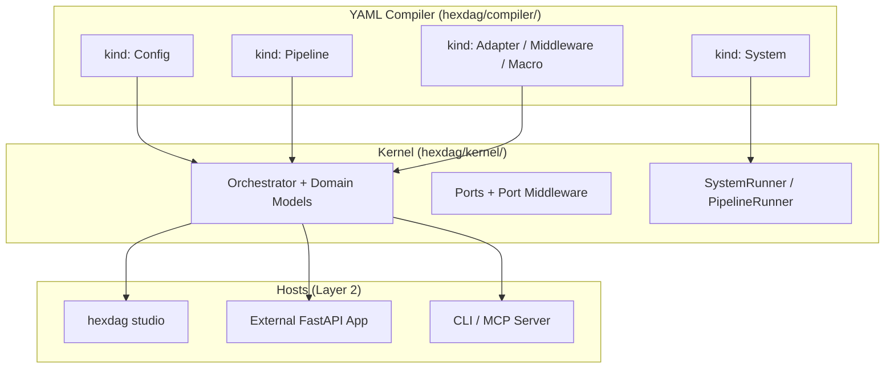

# Development Roadmap: hexDAG Framework

> **Strategic development plan for the hexDAG agent operating system**

For the current architecture, see [ARCHITECTURE.md](ARCHITECTURE.md).

## Vision & Architecture

### Core Philosophy
- **hexDAG**: Operating system for AI agents -- kernel (execution engine), stdlib (built-in components), drivers (infrastructure), compiler (YAML manifests)
- **YAML Compiler**: YAML manifests are the source language, compiled into kernel domain models for execution
- **Library-First**: All runtime primitives work as plain Python objects -- no server required
- **Agent Protocol (VAS)**: VAS (Virtual Agent System) is the universal agent-to-system protocol -- agents interact with hexDAG through a uniform path-based interface with built-in permissions (caps), resource limits (cgroups), agent memory, and piping, all configurable in YAML. Inspired by Linux VFS but designed for agent-specific needs beyond filesystem semantics.


```mermaid
graph TD
    subgraph "YAML Compiler (hexdag/compiler/)"
        A[kind: Config]
        B[kind: Pipeline]
        C[kind: System]
        D[kind: Adapter / Middleware / Macro]
    end

    subgraph "Kernel (hexdag/kernel/)"
        E[Orchestrator + Domain Models]
        F[Ports + Port Middleware]
        G[SystemRunner / PipelineRunner]
    end

    subgraph "Hosts (Layer 2)"
        H[hexdag studio]
        I[External FastAPI App]
        J[CLI / MCP Server]
    end

    A --> E
    B --> E
    C --> G
    D --> E
    E --> H
    E --> I
    E --> J
```

### Unified Entity Model

Every extension point in hexDAG follows one pattern: **kernel defines contract → stdlib ships builtins → users write their own → YAML references by module path.**

Two tiers:
- **Infrastructure (drivers/)** — how hexDAG talks to the runtime. Like kernel modules. Typically one per deployment.
- **Application (stdlib/)** — composable components users mix and match per pipeline. Like `/usr/lib`.

| Tier | Entity | Kernel Contract | Stdlib Builtins | User Extension | YAML Reference | Status |
|------|--------|----------------|-----------------|----------------|----------------|--------|
| Infra | **Drivers** | Port protocols (`kernel/ports/`) | `drivers/` (LocalExecutor, LocalObserverManager, LocalPipelineSpawner) | `myapp.drivers.X` | `spec.driver:` | First-class |
| App | **Adapters** | Port protocols (`kernel/ports/`) | `stdlib/adapters/` (OpenAI, Anthropic, Mock, SQLite) | `myapp.adapters.X` | `spec.ports.<name>.adapter:` | First-class |
| App | **Nodes** | `BaseNodeFactory` | `stdlib/nodes/` (LLMNode, AgentNode, LoopNode, ConditionalNode) | `myapp.nodes.X` | `kind:` in node spec | First-class |
| App | **Macros** | Convention (subgraph expansion) | `stdlib/macros/` (ReasoningAgent) | `myapp.macros.X` | `kind: Macro` | First-class |
| App | **Middleware** | Protocol interfaces | `stdlib/middleware/` (ObservableLLM, StructuredOutputFallback) | `myapp.middleware.X` | `spec.ports.<name>.middleware:` / `kind: Middleware` | Planned (C2) |
| App | **Services** | `Service` base (`kernel/service.py`) | `stdlib/lib/` (ProcessRegistry, EntityState, Scheduler) | `myapp.services.X` | `spec.services.<name>.class:` | First-class |
| App | **Observers** | `Observer` protocol | `stdlib/lib/observers/` (CostProfiler, AlertingObserver) | `myapp.observers.X` | `spec.observers:` | Planned |
| App | **Prompts** | Convention (callable/template) | `stdlib/prompts/` (tool_prompts) | `myapp.prompts.X` | `spec.prompts:` | Planned |

All entity types use the same `resolve()` mechanism for module path resolution. The `/lib/` VAS namespace exposes all discoverable entity types for agent introspection.

**Middleware in YAML:** Middleware stacks are declared per-port via `spec.ports.<name>.middleware:` (inline list) or as standalone `kind: Middleware` manifests (reusable, referenceable by name). `prepare_ports()` reads these declarations and assembles the stack. Currently `prepare_ports()` hardcodes the stack; Phase C2 makes it data-driven from YAML.

---

## Completed Work

### Core Framework
- [x] **DAG Orchestration Engine** -- Topological sort, wave-based parallel execution
- [x] **Node System** -- FunctionNode, LLMNode, AgentNode, LoopNode, ConditionalNode
- [x] **Validation Framework** -- Multi-strategy validation (Pydantic, type checking, custom)
- [x] **Event System** -- NodeStarted, NodeCompleted, NodeFailed, PipelineStarted, PipelineCompleted
- [x] **Hexagonal Architecture** -- Ports (contracts) / Adapters (implementations) / Drivers (infrastructure)
- [x] **Linux-aligned Restructure** -- `core/`->`kernel/`, `builtin/`->`stdlib/`, `adapters/`->`drivers/`

### YAML Pipeline Compiler
- [x] **YamlPipelineBuilder** -- Declarative YAML -> DirectedGraph compilation
- [x] **Macros** -- Reusable node templates (`kind: Macro`) with subgraph expansion
- [x] **Environment Management** -- Multi-document YAML with `metadata.namespace`
- [x] **Preprocessing** -- Env var substitution, `!include` tags, Jinja2 templates
- [x] **Custom YAML Tags** -- `!py` for Python expressions, `!include` for file inclusion
- [x] **Compiler Refactor (Step 0a)** -- Moved `kernel/pipeline_builder/` -> `compiler/`

### Ports & Adapters
- [x] **LLM Port** -- OpenAI, Anthropic, Mock adapters
- [x] **DataStore Port** -- `SupportsKeyValue`, `SupportsQuery`, `SupportsTTL`, `SupportsSchema`, `SupportsTransactions`
- [x] **PipelineSpawner Port** -- Fork/exec for child pipelines
- [x] **ToolRouter** -- Function calling and tool execution
- [x] **FileStorage, SecretStore, Memory** -- Data access ports
- [x] **Executor, ObserverManager** -- Infrastructure ports
- [x] **`SupportsStructuredOutput` Protocol** -- Native structured output for OpenAI (JSON Schema mode), Anthropic (tool_use), Mock (JSON parse). Fallback middleware for adapters without native support.

### Port Middleware (Phase C1)
- [x] **Composable middleware pattern** -- `stdlib/middleware/` with `StructuredOutputFallback`, `ObservableLLM`, `ObservableToolRouter`. Each layer explicitly implements protocol interfaces so `isinstance()` works.
- [x] **`prepare_ports()`** -- Orchestrator auto-stacks middleware based on adapter capabilities. Users never configure middleware.
- [x] **Unified LLM Node YAML spec** -- `human_message`, `system_message`, `examples`, `conversation`, `output_schema`. Presence of `output_schema` implies structured output (no `parse_json` flag). Deprecated fields (`prompt_template`, `system_prompt`, `parse_json`, `template`) still work with warnings.

### Port Events (Phase C1.5)
- [x] **Unified `PortCallEvent` base** -- `PortCallEvent(Event)` with `port_type`, `method`, `node_name`, `duration_ms`. `LLMPortCall(PortCallEvent)` replaces `LLMEvent`/`LLMGeneration`/`LLMFunctionCalling`/`LLMVision`/`LLMEmbedding`. `ToolRouterPortCall(PortCallEvent)` replaces `ToolRouterEvent`. Old names are backward-compatible aliases.
- [x] **Observable middleware inline** -- `ObservableLLM` and `ObservableToolRouter` emit `LLMPortCall`/`ToolRouterPortCall` with inline timer/context/notify (no `@observe` decorator — rejected as too much indirection).
- [x] **Queryable port calls** -- Two complementary observer sinks in `stdlib/lib/observers/port_call_observers.py`:
  - `PortCallStoreObserver` -- accumulates `StoredPortCall` records in memory, filterable by `port_type`/`node_name`/`method`, optional persistence to `SupportsKeyValue` store via `save(run_id)`/`load(run_id)`.
  - `PortCallLogObserver` -- structured JSON log lines for external aggregators (Grafana, CloudWatch, ELK). Configurable `include_details` flag.

### System Libraries (Libs)
- [x] **ProcessRegistry** -- In-memory pipeline run tracker (like `ps`)
- [x] **EntityState** -- Declarative state machines with `StateMachineConfig`
- [x] **Scheduler** -- asyncio-based delayed/recurring pipeline execution
- [x] **DatabaseTools** -- Agent-callable SQL query tools

### Production Reliability
- [x] **Error handler blocks** -- `on_error` field on `NodeSpec`; failed nodes route to a named handler node receiving `{"_error": {...}}` instead of halting the pipeline
- [x] **Body execution observability** -- `BodyStarted` / `BodyCompleted` / `BodyFailed` events for inline body and `body_pipeline` executions; body nodes share the parent pipeline's observer stream
- [x] **`checkpoint_node`** -- Declarative mid-pipeline save/restore using the `checkpoint` port (`SupportsKeyValue`); supports `action: save | restore`, `run_id` templates, and selective `keys`

### API & Integration
- [x] **MCP Server** -- 9 process management functions in `api/processes.py` (note: not yet wired into `mcp_server.py`; MCP currently exposes VAS, docs, execution, validation, and pipeline tools)
- [x] **Studio REST API** -- Pipeline execution, validation, export routes
- [x] **CLI** -- `hexdag run`, `hexdag validate`, `hexdag studio`

### Infrastructure
- [x] **Pre-commit Hooks** -- ruff, pyupgrade, mypy, pyright, nbstripout
- [x] **CI/CD** -- Azure pipelines
- [x] **Examples** -- Getting started to enterprise patterns (`examples/demo/`, `examples/libs/`, `examples/mcp/`)
- [x] **Jupyter Notebooks** -- Interactive documentation

---

## Track 1: YAML Compiler & Multi-Process Orchestration

### Phase 1: Compiler Foundation + `kind: Config`

- [x] **Move config loader to compiler** (Step 0b)
  - `kernel/config/loader.py` -> `compiler/config_loader.py`
  - Kernel keeps only domain models, compiler handles parsing

- [x] **Extend HexDAGConfig** (Step 0c)
  - Add `orchestrator: OrchestratorConfig` (reuse existing)
  - Add `limits: DefaultLimits`, `caps: DefaultCaps`

- [x] **`kind: Config` YAML manifest** (Step 1)
  - Replace `hexdag.toml` with YAML `kind: Config`
  - Parse `spec.kernel`, `spec.limits`, `spec.caps`
  - Backward compat: TOML still works with deprecation warning
  - Inline `kind: Config` in multi-doc YAML (merged via `PipelineRunner._effective_config()`)
  - 4-level override chain: explicit constructor args > per-pipeline spec > `kind: Config` defaults > hardcoded

### Phase 2: Port Probes & Declarative Manifests

Port Probes, Resource Limits, and Caps are now part of the **Agent Protocol** track
(see Track 2). This phase retains only the items that are purely Track 1 concerns.

- [ ] **`kind: Adapter`** (Step 6)
  - Standalone adapter configs, referenceable by `{ ref: name }`
  - DRY across System manifests

- [ ] **`kind: Middleware`** (Step 7)
  - Standalone reusable middleware stack definitions (retry, timeout, rate-limit, caching, circuit-breaker)
  - First-class declarative middleware entity, same pattern as `kind: Macro`
  - Referenced by name from `spec.ports.<name>.middleware:` or inline as a list of module paths
  - Resolved by `prepare_ports()` into middleware layers (see Phase C2 in Track 2)
  - Example: `{ ref: production-llm-middleware }` → stacks `RateLimiter` + `RetryWithBackoff` + `CostTracker`

### Phase 3: `kind: System` + SystemRunner

- [x] **Pipes domain model** (Step 7)
  - `Pipe` frozen dataclass: `from_process`, `to_process`, `mapping`
  - Jinja2 template resolution for inter-process data flow

- [x] **`kind: System` + SystemBuilder** (Step 8)
  - `SystemConfig` Pydantic model
  - SystemBuilder: parse System YAML, resolve exec paths, validate pipe DAG
  - SystemValidator: no cycles, valid process refs

- [x] **SystemRunner** (Step 9)
  - Execute `SystemConfig` via `PipelineRunner` per process
  - Topological execution order from pipe DAG
  - Shared ports with per-process overrides
  - `manual` mode (one-shot) first

### Phase 4: Studio as Daemon Host

- [ ] **`schedule` mode** in SystemRunner
  - Recurring execution via Scheduler (asyncio timers)

- [ ] **Studio System Manager**
  - Load System manifests on startup
  - Process supervision (like systemd)
  - REST API: `/api/system/status`, `/api/system/start`, `/api/system/stop`
  - MCP server: expose full `api/` surface as MCP tools for external agents

- [ ] **`continuous` mode**
  - Restart processes on completion
  - Restart policies and health monitoring

- [ ] **`event` mode** (requires EventBus)
  - Trigger system execution from EventBus events

---

## Track 2: Agent Protocol (VAS)

VAS (Virtual Agent System) is the **universal agent-to-system protocol**. Inspired
by Linux VFS but designed for agents: uniform path-based addressing + agent memory +
piping + mid-pipeline injection + built-in permissions (caps) and resource limits
(cgroups). Port Probes are the enforcement substrate beneath it.

**Why VAS, not VFS?** Linux VFS is a *filesystem* abstraction. VAS is an *agent system*
abstraction. Agents need things files don't: working memory, self-awareness
(`/proc/self/`), cross-run piping, and mid-pipeline data injection. The "S" in VAS
stands for System -- the entire agent operating environment, not just file I/O.

### Architecture

#### Three Layers

```
Layer 3: AGENT INTERFACE
         VAS namespace  +  api/ syscalls  +  MCP tools

Layer 2: SYSTEM SERVICES
         ProcessRegistry, EntityState, Scheduler, PipelineRegistry (new)
         + CapSet, ResourceAccounting (new enforcement services)

Layer 1: ENFORCEMENT SUBSTRATE
         Port Probes (kprobe-style method patching)
```

#### Dual Interface

hexDAG exposes system state through two complementary interfaces (like Linux):

```
                        ┌──────────────────────────────────────────────┐
                        │          Agent / MCP / Studio                │
                        └─────────┬────────────────────┬───────────────┘
                                  │                    │
                    ┌─────────────▼──────────┐  ┌──────▼───────────────┐
                    │   VAS  (namespace)      │  │  Syscalls (api/)     │
                    │                         │  │                      │
                    │  aread   /proc/runs/42  │  │  list_pipeline_runs( │
                    │  alist   /lib/nodes/    │  │    status="done",    │
                    │  astat   /proc/ent/...  │  │    limit=50)         │
                    │  aexec   /etc/pipe/...  │  │  spawn_pipeline(...) │
                    │  awatch  /proc/runs/..  │  │  schedule_pipeline() │
                    │  apipe   src → target   │  │  transition_entity() │
                    │                         │  │                      │
                    │  Path-based.            │  │  Parameterized.      │
                    │  One entity at a time.  │  │  Filtering, sorting, │
                    │  Uniform addressing.    │  │  branching logic.    │
                    │  Agent memory + piping. │  │                      │
                    └─────────┬───────────────┘  └──────┬───────────────┘
                              │                         │
                              ▼                         ▼
                    ┌──────────────────────────────────────────────────┐
                    │           System Libs  (stdlib/lib/)             │
                    │  ProcessRegistry · EntityState · Scheduler       │
                    └──────────────────────────────────────────────────┘
```

**VAS = namespace + agent workspace.** Like Linux `/proc` + `/dev/shm` + pipes.
Agents browse the system through 3-4 operations (`aread`, `alist`, `astat`, `aexec`),
access working memory (`/mem/`), introspect themselves (`/proc/self/`), and pipe
data between runs.

**Syscalls = typed operations.** Like `ps(1)`, `kill(2)`. The `api/` functions take
typed parameters, do smart dispatch, and return structured results.

Both coexist and delegate to the same underlying libs.

| Linux | hexDAG VAS | hexDAG Syscall |
|---|---|---|
| `cat /proc/1234/status` | `vas.aread("/proc/runs/<id>")` | `get_pipeline_run(registry, run_id)` |
| `ls /proc/` | `vas.alist("/proc/runs/")` | -- |
| `ps aux --sort=-pcpu \| head` | -- | `list_pipeline_runs(status=..., limit=50)` |
| `kill -9 1234` | `vas.aexec("/proc/runs/<id>/cancel", {})` | `cancel_scheduled(scheduler, task_id)` |
| `cat /proc/self/status` | `vas.aread("/proc/self/caps")` | -- |
| `echo data > /dev/shm/workspace` | `vas.awrite("/mem/self/scratchpad", data)` | -- |
| `cmd1 \| cmd2` | `vas.apipe("/proc/runs/<id>/output", "/etc/pipelines/<name>")` | -- |

#### What VAS Adds Beyond Linux VFS

| Concept | Linux VFS | hexDAG VAS | Why agents need it |
|---|---|---|---|
| **Agent memory** | `/dev/shm`, `/tmp` | `/mem/<agent>/` (context, scratchpad, facts) | Agents maintain reasoning state across steps |
| **Self-awareness** | `/proc/self/` | `/proc/self/` (caps, limits, usage, tools) | Agents need to know their own constraints |
| **Piping** | `\|` (stdout→stdin) | `apipe(source, target, mapping)` | Agents compose runs by connecting outputs to inputs |
| **Injection** | `write()` to fd | `awrite("/proc/runs/<id>/inject/<node>")` | External input into running pipelines |
| **Tool discovery** | `which`, `type` | `/lib/tools/<name>/schema\|examples` | Agents need schema + usage guidance, not just existence |

#### MCP ↔ VAS Mapping

MCP protocol concepts map directly to VAS. With VAS as primary surface, agents
need only **4-5 universal VAS tools** instead of 20+ specialized tools -- improving
LLM tool selection (fewer tools = better performance):

| MCP Concept | hexDAG VAS Mapping |
|---|---|
| **Tools** | 4-5 VAS tools: `vas_read`, `vas_list`, `vas_stat`, `vas_exec`, `vas_pipe` |
| **Resources** | VAS read-only paths (`/lib/`, `/proc/`, `/etc/pipelines/`, `/sys/`) |
| **Prompts** | `/lib/prompts/` VAS namespace |
| **Roots** | VAS mount points |

#### YAML-Declarative Security (Narrowing Chain)

Security is configured in YAML and enforced at every level. Each level can only
**narrow** permissions, never widen (like Linux capability dropping):

```
kind: Config (org-level)                    ← widest scope
  └── caps.profiles: {admin, agent, read-only}
  └── mcp.permissions: {claude-code: agent, monitoring: read-only}
  └── limits: {default: {...}, per_pipeline: {...}}
        ↓ narrows to
kind: Pipeline (pipeline-level)             ← pipeline scope
  └── spec.caps: {allow: [...], deny: [...]}
  └── spec.limits: {max_llm_calls: 10}
        ↓ narrows to
spec.nodes[].caps (node-level)              ← narrowest scope
  └── Per-agent-node cap restrictions
```

**Example `kind: Config` with security:**

```yaml
apiVersion: hexdag/v1
kind: Config
metadata:
  name: production
spec:
  caps:
    profiles:
      read-only:
        allow: [vas.read, vas.list, vas.stat]
        deny: [vas.exec, vas.write, port.llm, proc.spawn, mem.write]
      agent-standard:
        allow: [vas.read, vas.list, vas.stat, vas.exec, port.llm, port.tool_router, mem.read, mem.write]
        deny: [vas.write, proc.spawn.system]
      admin:
        allow: ["*"]

  mcp:
    permissions:
      default: read-only
      profiles:
        claude-code: agent-standard
        studio: admin
        monitoring: read-only

  limits:
    default:
      max_llm_calls: 100
      max_tokens: 50000
      max_tool_calls: 200
      max_wall_time_ms: 300000
    per_pipeline:
      order-processing:
        max_llm_calls: 20
```

**Pipeline-level narrowing:**

```yaml
apiVersion: hexdag/v1
kind: Pipeline
metadata:
  name: order-processing
spec:
  caps:
    allow: [port.llm, port.data_store, entity.transition]
    deny: [proc.spawn, vas.write]
  limits:
    max_llm_calls: 10
  nodes:
    - kind: agent_node
      metadata: { name: order_agent }
      spec:
        caps:
          allow: [port.llm, entity.transition]
```

#### Declarative Manifests (`kind: Manifest`)

When VAS is extracted as a standalone protocol (Milestone 9), adapter packages ship a
**declarative manifest** that declares their mount points, capability requirements, and
cap profiles. This enables:

- **Self-describing adapters** -- the host discovers what an adapter provides and needs
- **YAML-only security** -- no programmatic capability negotiation
- **Narrowing chain extends across packages** -- Config (org) → Manifest (adapter) → Pipeline → Node

**Adapter package manifest:**

```yaml
# Shipped inside the adapter package (e.g., langchain-vas/manifest.yaml)
apiVersion: vas/v1
kind: Manifest
metadata:
  name: langchain
  version: 0.1.0
spec:
  mounts:
    - path: /tools/
      provider: langchain_vas.providers.ToolProvider
      caps:
        read: [vas.list, vas.read, vas.stat]
        exec: [vas.exec]
    - path: /mem/
      provider: langchain_vas.providers.MemoryProvider
      caps:
        read: [mem.read]
        write: [mem.write]
    - path: /proc/self/
      provider: langchain_vas.providers.AgentSelfProvider
      caps:
        read: [vas.read]

  profiles:
    langchain-agent:
      allow: [vas.read, vas.list, vas.stat, vas.exec, mem.read, mem.write]
      deny: [proc.spawn, vas.write]
    langchain-readonly:
      allow: [vas.read, vas.list, vas.stat, mem.read]
```

**Host `kind: Config` inherits and narrows from adapter profiles:**

```yaml
apiVersion: vas/v1
kind: Config
metadata:
  name: production
spec:
  caps:
    profiles:
      langchain-restricted:
        inherit: langchain-agent     # from adapter's manifest
        deny: [mem.write]            # host narrows further

  agents:
    permissions:
      research-agent: langchain-agent
      monitoring-agent: langchain-restricted
```

The full narrowing chain with manifests:

```
kind: Config (org-level)                    ← widest scope
  └── can reference manifest profiles via `inherit`
        ↓ narrows to
kind: Manifest (adapter-declared)           ← adapter declares its own profiles
  └── profiles are the MAXIMUM an adapter can request
        ↓ narrows to
kind: Pipeline (pipeline-level)             ← pipeline scope
        ↓ narrows to
spec.nodes[].caps (node-level)              ← narrowest scope
```

**Extraction spec** (Milestone 9): The standalone `vas-protocol` package ships
**7 methods + 4 types + 2 YAML schemas** (`kind: Manifest` + `kind: Config`).

### VAS Implementation Status

**Existing (Phase 1 Introspection -- partial):**

- [x] VAS port protocol (`aread`, `alist`, `astat`) in `kernel/ports/vfs.py`
- [x] `LocalVFS` driver with mount system in `drivers/vfs/local.py`
- [x] Domain models (`DirEntry`, `EntryType`, `StatResult`) in `kernel/domain/vfs.py`
- [x] 4 VAS providers in `drivers/vfs/providers/`:
  - [x] `LibProvider` (`/lib/`) -- component discovery
  - [x] `ProcRunsProvider` (`/proc/runs/`) -- pipeline runs (built, not wired in MCP)
  - [x] `ProcScheduledProvider` (`/proc/scheduled/`) -- scheduled tasks (built, not wired in MCP)
  - [x] `ProcEntitiesProvider` (`/proc/entities/`) -- entity state (built, not wired in MCP)
- [x] `VASTools` service in `stdlib/lib/vfs_tools.py`
- [x] API layer in `api/vfs.py`
- [x] MCP integration (3 tools: `vas_read`, `vas_list`, `vas_stat`)

**Missing (needed to complete the namespace tree):**

- [ ] `EtcPipelinesProvider` (`/etc/pipelines/`) -- pipeline discovery
- [ ] `PipelineRegistry` -- scans directories for pipeline YAML files
- [ ] `DevPortsProvider` (`/dev/ports/`) -- bound adapter introspection
- [ ] `SysProvider` (`/sys/`) -- version, config, cgroups, caps
- [ ] `/proc/self/` sub-provider -- agent self-awareness (caps, limits, usage, tools, context)
- [ ] `/mem/` provider -- agent memory (per-agent, shared, per-run ephemeral)
- [ ] Wire `/proc/*` providers into MCP (need lib instances)

### Agent Protocol Target Shape

Emerges incrementally across Phases A-E:

```python
class AgentSystemProtocol(Protocol):
    """Universal agent-to-system protocol (VAS).

    Exposed via MCP as 4-6 tools. Exposed to internal agents via VASTools.
    Security enforced via CapSet (YAML-configured). Resources tracked via cgroups.
    """

    # Phase A: Namespace
    async def alist(self, path: str) -> list[DirEntry]: ...
    async def aread(self, path: str) -> str: ...
    async def astat(self, path: str) -> StatResult: ...

    # Phase B: Action
    async def aexec(self, path: str, args: dict) -> Any: ...
    async def awrite(self, path: str, data: str) -> int: ...

    # Phase D: Observe + Navigate
    async def awatch(self, path: str) -> AsyncIterator[VASEvent]: ...
    async def areadlink(self, path: str) -> str: ...

    # Phase E: Piping
    async def apipe(self, source: str, target: str, mapping: dict) -> None: ...

    # Permissions (also via /sys/caps/ VAS paths)
    async def aget_caps(self, scope: str) -> CapSet: ...
    async def acheck_cap(self, scope: str, capability: str) -> bool: ...

    # Resources (also via /sys/cgroup/ VAS paths)
    async def aget_limits(self, scope: str) -> ResourceLimits: ...
    async def aget_usage(self, scope: str) -> ResourceUsage: ...
```

### Namespace Tree

```
/lib/nodes|adapters|macros|middleware|services|observers|prompts|tools|tags/    Component discovery
/proc/runs/<run_id>/status|info                        ProcessRegistry
/proc/scheduled/<task_id>/status                       Scheduler
/proc/entities/<type>/<id>/state|history               EntityState
/proc/self/caps|limits|usage|tools|context             Agent self-awareness
/mem/agent/<agent_id>/context|scratchpad|facts          Per-agent persistent memory
/mem/shared/<namespace>/                               Shared memory across agents
/mem/run/<run_id>/                                     Per-run ephemeral memory
/etc/pipelines/<name>                                  Pipeline definitions (YAML)
/dev/ports/<name>                                      Bound adapter info
/sys/version|config                                    System metadata
/sys/cgroup/<scope>/limits|usage                       Resource limits & accounting
/sys/caps/current|profiles|available                   Capability sets
```

### Mount System

Providers register at path prefixes. Longest-prefix match resolves paths:

```python
class VASProvider(Protocol):
    async def read(self, relative_path: str) -> str: ...
    async def write(self, relative_path: str, data: str) -> int: ...
    async def stat(self, relative_path: str) -> StatResult: ...
    async def readdir(self, relative_path: str) -> list[DirEntry]: ...
```

**Stdlib default:** `LocalVAS` in `drivers/vfs/local.py` -- in-process, mount-based.
**User implementations:** Distributed VAS (etcd/consul), REST-backed VAS.

### Phase A: Complete VAS Namespace Tree

**No Port Probes needed. Uses existing provider patterns.**

- [ ] **`PipelineRegistry`** (`stdlib/lib/pipeline_registry.py`)
  - Scans configured directories for `.yaml` pipeline files, indexes by name
  - Returns metadata: description, node count, input schema

- [ ] **`EtcPipelinesProvider`** (`drivers/vfs/providers/etc_provider.py`)
  - Paths: `/etc/pipelines/` lists names, `/etc/pipelines/<name>` returns YAML + metadata
  - Mounted at `/etc/pipelines/`

- [ ] **`DevPortsProvider`** (`drivers/vfs/providers/dev_provider.py`)
  - Takes `ports: dict[str, Any]`, uses `kernel/ports/detection.py` for classification
  - Paths: `/dev/ports/` lists ports, `/dev/ports/llm` returns adapter class + capabilities

- [ ] **`SysProvider`** (`drivers/vfs/providers/sys_provider.py`)
  - Static: `/sys/version`, `/sys/config`
  - Stub: `/sys/cgroup/` (Phase C), `/sys/caps/` (Phase B)

- [ ] **`ProcSelfProvider`** (`drivers/vfs/providers/proc_self_provider.py`)
  - `/proc/self/caps` -- agent's effective CapSet
  - `/proc/self/limits` -- resource limits for this scope
  - `/proc/self/usage` -- current resource usage
  - `/proc/self/tools` -- available tools in this context
  - `/proc/self/context` -- current node name, run_id, pipeline name

- [ ] **`MemProvider`** (`drivers/vfs/providers/mem_provider.py`)
  - `/mem/agent/<agent_id>/` -- persistent per-agent memory (context, scratchpad, facts)
  - `/mem/shared/<namespace>/` -- shared memory across agents
  - `/mem/run/<run_id>/` -- ephemeral per-run scratch space (auto-cleaned)
  - Backed by DataStore port (`SupportsKeyValue`)

- [ ] **Wire all providers into `create_vas()` and MCP**
  - Wire `/proc/*` providers into MCP server (need lib instances)
  - All 7 top-level namespaces: `/lib/`, `/proc/`, `/mem/`, `/etc/`, `/dev/`, `/sys/`

### Phase B: CapSet + YAML Security + VAS Permissions

**No Port Probes needed. VAS checks caps directly in LocalVAS.**

- [ ] **`CapSet` domain model** (`kernel/domain/caps.py`)
  - Frozen dataclass: `allows(cap)`, `intersect(other)`, `grant(cap)`, `revoke(cap)`
  - Capability taxonomy: `vas.read`, `vas.write`, `vas.exec`, `port.llm`,
    `port.tool_router`, `port.data_store`, `proc.spawn`, `entity.transition`,
    `mem.read`, `mem.write`
  - `CapSet.from_config(DefaultCaps)` bridges existing config stubs

- [ ] **`kind: Config` security extensions**
  - `caps.profiles: dict[str, CapSet]` -- named capability profiles
  - `mcp.permissions: dict[str, str]` -- MCP client → cap profile mapping
  - `limits.per_pipeline: dict[str, ResourceLimits]` -- per-pipeline limits

- [ ] **`kind: Manifest` loader** (for protocol extraction)
  - Parse adapter-declared `kind: Manifest` YAML (mounts, cap requirements, profiles)
  - `inherit:` resolution -- profile inherits from manifest profile, then narrows
  - Validate: manifest profiles cannot exceed host Config's allowed caps
  - Load manifests from adapter packages (discover via entry points or explicit config)

- [ ] **VAS permission checking**
  - `LocalVAS` accepts optional `cap_set: CapSet`
  - Checks caps before dispatching to providers
  - `CapDeniedError(VASError)` when denied
  - Default: no `CapSet` = unrestricted (backward compatible)

- [ ] **`/sys/caps/` sub-provider**
  - `/sys/caps/current` returns active `CapSet`
  - `/sys/caps/profiles` lists defined profiles
  - `/sys/caps/available` lists all capabilities with descriptions

- [ ] **MCP permission enforcement**
  - Resolve MCP client → cap profile from `kind: Config`
  - All VAS operations automatically enforced

- [ ] **Child process cap inheritance (narrowing chain)**
  - `PipelineSpawner.aspawn()` passes parent `CapSet`
  - `child_caps = parent_caps.intersect(child_declared_caps)`
  - Pipeline `spec.caps` narrows from org-level; node `spec.caps` narrows from pipeline

### Phase C: Port Middleware + Resource Accounting

Split into C1 (observability, complete), C1.5 (unified events + decorator), C2 (declarative stacking via `kind: Middleware`), and C3 (resource accounting).

- [x] **Phase C1: Port Middleware -- Observability + Structured Output** (Complete)
  - Composable middleware pattern in `stdlib/middleware/`
  - Each middleware explicitly implements protocol interfaces (not `__getattr__`)
  - `prepare_ports()` in `kernel/orchestration/port_wrappers.py` auto-stacks layers:
    - `adapter → StructuredOutputFallback (if needed) → ObservableLLM`
    - `ToolRouter → ObservableToolRouter`
  - `SupportsStructuredOutput` protocol with native OpenAI (JSON Schema mode) and Anthropic (tool_use)
  - Fixes `isinstance()` breakage from old wrapper approach
  - Unified LLM node YAML spec: `human_message`, `system_message`, `examples`, `conversation`, `output_schema`
  - **Linux analogy:** middleware = netfilter chains wrapping syscall handlers

- [x] **Phase C1.5: Unified Port Events** (Complete)
  - [x] **Unified `PortCallEvent` base** -- single base event for all port calls (`port_type`, `method`, `node_name`, `duration_ms`)
    - `LLMPortCall(PortCallEvent)` -- replaces `LLMEvent`/`LLMGeneration`/`LLMFunctionCalling`/`LLMVision`/`LLMEmbedding`
    - `ToolRouterPortCall(PortCallEvent)` -- replaces `ToolRouterEvent`
    - Old event names are backward-compatible aliases
    - Future: `DataStorePortCall`, `FileStoragePortCall`, etc.
  - [x] **Observable middleware inline** -- `ObservableLLM` and `ObservableToolRouter` emit unified events with inline timer/context/notify. No `@observe` decorator (rejected — too much indirection).
  - [x] **Queryable port calls** -- two complementary observer sinks in `stdlib/lib/observers/port_call_observers.py`:
    - `PortCallStoreObserver` -- accumulates `StoredPortCall` records in memory, filterable by `port_type`/`node_name`/`method`, optional persistence to `SupportsKeyValue` via `save()`/`load()`
    - `PortCallLogObserver` -- structured JSON logs for external aggregators (Grafana, CloudWatch, ELK). Configurable `include_details` flag.
  - **Linux analogy:** unified `PortCallEvent` = `/proc/syscalls` tracing interface

- [x] **Phase C2: Port Middleware -- Declarative Stacking** (Complete)
  - [x] Data-driven middleware stacking via `prepare_ports(middleware_config=...)` reading from YAML
  - [x] `kind: Middleware` compiler plugin (`compiler/plugins/middleware_definition.py`) — registers named stacks in module-level registry
  - [x] Inline `spec.ports.<name>.middleware:` list support — single string, list, or named stack reference
  - [x] `OrchestratorFactory._extract_middleware_config()` resolves middleware specs (inline, named, single string)
  - [x] Two-phase stacking: user middleware (inner) → auto-middleware (outermost). Port type classification before user middleware preserves `isinstance()`.
  - [x] Concrete middleware in `stdlib/middleware/`: `RetryWithBackoff` (exponential backoff + jitter), `RateLimiter` (token-bucket), `ResponseCache` (LRU), `Timeout` (asyncio deadline)
  - [ ] Remaining: `CostTracker` (token budget enforcement), `CircuitBreaker` (failure threshold → open/half-open/closed)
  - Stacking order: `Cache → RateLimiter → Retry → Timeout → CostTracker → Observable`

- [ ] **Phase C3: `ResourceAccounting`** (`kernel/domain/resource_accounting.py`)
  - `ResourceUsage`: `llm_calls`, `tool_calls`, `total_tokens`, `estimated_cost_usd`
  - `ResourceAccountant`: reads from `PortCallStoreObserver` data (Phase C1.5) + enforces limits as middleware (Phase C2)
  - Events: `ResourceWarning`, `ResourceLimitExceeded`

- [ ] **`/sys/cgroup/` sub-provider**
  - `/sys/cgroup/<scope>/limits`, `/sys/cgroup/<scope>/usage`
  - Agents check their own budget: `vas_read("/sys/cgroup/current/usage")`

- [ ] **Unified error handling**
  - Collapse 4 duplicated `except` blocks in `node_executor.py` into `_emit_failure_and_raise()`

### Phase D: VAS Write + Execute (Action Through VAS)

Needs Phase B (caps) and Phase C (enforcement).

- [ ] **Extend VAS protocol** with `aexec(path, args)` and `awrite(path, data)`
- [ ] **Provider `exec` implementations:**
  - `EtcPipelinesProvider.exec("/etc/pipelines/<name>/run", {input})` → spawn pipeline
  - `ProcEntitiesProvider.exec("/proc/entities/<type>/<id>/transition", {to_state})` → transition
  - `ProcRunsProvider.exec("/proc/runs/<id>/cancel", {})` → cancel run
  - `ProcScheduledProvider.exec("/proc/scheduled/<id>/cancel", {})` → cancel task
- [ ] **VASTools Phase 2 + MCP** -- `aexec_path`, `awrite_path` tools
- [ ] **Mid-pipeline injection** via `awrite("/proc/runs/<id>/inject/<node>", data)`
  - Allows external agents to feed data into a running pipeline

### Phase E: VAS Watch + areadlink + Piping (Reactive)

Needs EventBus for underlying pub/sub.

- [ ] `awatch(path)` → `AsyncIterator[VASEvent]` -- subscribe to changes
- [ ] `areadlink(path)` → follow references:
  - `/proc/runs/42/pipeline` → `/etc/pipelines/order-processing`
  - `/proc/entities/order/ORD-123/runs` → list of `/proc/runs/` entries
- [ ] `apipe(source, target, mapping)` → pipe output of one run into another:
  - `apipe("/proc/runs/42/output/summary", "/proc/runs/43/input/context", {"summary": "context"})`
  - Like Unix pipes but between pipeline runs, with field mapping

### Entity-Bound Pipelines

**Location:** `compiler/`, `stdlib/lib/observers/`, pipeline schema

Pipelines don't transition state -- pipelines **are** the transition. Like a Linux
process doesn't call `set_my_state(RUNNING)` -- the kernel transitions process state
as a side effect of `fork()`, `exit()`, and scheduling.

Entity-bound pipelines declare which business entities they operate on and what state
transitions pipeline lifecycle events trigger. The orchestrator handles transitions
automatically via an observer -- no explicit state-management nodes in the DAG.

**YAML surface:**

```yaml
apiVersion: hexdag/v1
kind: Pipeline
metadata:
  name: process_order
spec:
  entities:
    - type: order
      id: $input.order_id
      transitions:
        on_start: PROCESSING
        on_complete: SHIPPED
        on_failure: FAILED

    - type: fulfillment
      id: $input.fulfillment_id
      transitions:
        on_start: IN_PROGRESS
        on_complete: COMPLETED
        on_failure: CANCELLED

  nodes:
    # Pure business logic -- no state management nodes
    - kind: llm_node
      metadata:
        name: validate_order
      spec:
        prompt_template: "Validate: {{order_data}}"
```

**Architecture:**

```
spec.entities (YAML declaration)
    ↓ parsed by pipeline builder
StateTransitionObserver (stdlib observer, auto-registered)
    ↓ listens to PipelineStarted / PipelineCompleted events
EntityState.atransition() (stdlib service)
    ↓ validates against StateMachineConfig
State machine validation + audit trail (kernel domain)
```

One `StateTransitionObserver` per entity in the list. Auto-registered by the pipeline
builder when `spec.entities` is present. No manual wiring.

**Implementation:**

- [ ] **`StateTransitionObserver`** (`stdlib/lib/observers/state_transition_observer.py`)
  - Watches `PipelineStarted`, `PipelineCompleted` events
  - Resolves `entity_id` from `initial_input` via expression (e.g., `$input.order_id`)
  - Calls `EntityState.atransition()` with validated state
  - One observer instance per entity binding

- [ ] **`spec.entities` in pipeline schema**
  - Add optional `entities` section to `kind: Pipeline` spec
  - Schema: `list[{type: str, id: str, transitions: {on_start?, on_complete?, on_failure?}}]`
  - Update `schemas/pipeline-schema.yaml`

- [ ] **Pipeline builder auto-wiring**
  - Parse `spec.entities`, create `StateTransitionObserver` instances
  - Register with `observer_manager` before pipeline execution
  - Resolve entity ID expressions against `initial_input`

- [ ] **EntityState `@step` decorator**
  - Add `@step` to `atransition()`, `aregister_entity()`, `aget_state()`
  - Makes these methods available via `service_call_node` for edge cases
    where explicit transitions are still needed

**Open questions:**
- Entity ID from node results (created mid-pipeline) -- defer to Phase 2
- Node-level transition hooks (`on_complete.transition` on individual nodes) -- defer

### EventBus

**Location:** `kernel/ports/event_bus.py`

Cross-pipeline pub/sub signals. Pipelines emit and subscribe to named events across
runs, enabling reactive multi-pipeline coordination.

**Use cases:**
- Pipeline A completes -> triggers Pipeline B automatically
- Order state change in Pipeline A -> notifies monitoring Pipeline C
- Error in any pipeline -> triggers alert pipeline
- `kind: System` with `init: { type: event }` -- EventBus triggers system execution

**Protocol sketch:**

```python
class EventBus(Protocol):
    async def apublish(self, topic: str, payload: dict) -> None: ...
    async def asubscribe(self, topic: str, handler: Callable) -> str: ...
    async def aunsubscribe(self, subscription_id: str) -> None: ...
```

- [ ] **Cross-pipeline pub/sub** -- Reactive multi-pipeline coordination
- [ ] **In-memory default** + Redis/Kafka/NATS adapters

**Stdlib default:** In-memory pub/sub with asyncio queues.
**User implementations:** Redis Pub/Sub, Kafka, NATS, cloud event buses.

### GovernancePort

**Location:** `kernel/ports/governance.py`

Authorization and audit. Controls who can spawn pipelines, transition entity states,
and access data. Complements Caps (process-scoped permissions) with user-level auth.

**Use cases:**
- Only authorized users can trigger production pipelines
- Audit log of all pipeline executions and state transitions
- Entity state transitions require approval based on role

**Protocol sketch:**

```python
class Governance(Protocol):
    async def aauthorize(self, action: str, principal: str, resource: str) -> bool: ...
    async def aaudit(self, action: str, principal: str, resource: str, result: str) -> None: ...
    async def alist_permissions(self, principal: str) -> list[str]: ...
```

- [ ] **Authorization and audit** -- User-level permissions complementing Caps
- [ ] **RBAC/ABAC** default implementations

**Stdlib default:** Allow-all policy (no restrictions).
**User implementations:** RBAC, ABAC, OPA integration, cloud IAM.

### Studio MCP Server

**Location:** `hexdag/studio/` + `hexdag/api/`

Expose Studio's full capabilities as MCP tools so that external agents can
operate the system programmatically. The `hexdag/api/` layer already provides
shared business logic consumed by both Studio REST routes and existing MCP tools.
The Studio MCP server extends this to cover the full `api/` surface:

- `api/components` -- Browse nodes, adapters, tools, macros, tags
- `api/execution` -- Execute pipelines
- `api/validation` -- Validate pipeline YAML
- `api/pipeline` -- Create/modify pipeline YAML
- `api/processes` -- Pipeline runs, scheduling, entity state (existing 9 tools)
- `api/vfs` -- Virtual Agent System (VAS) introspection
- `api/documentation` -- Guides and references
- `api/export` -- Project export

**Permission boundaries:** Leverages Agent Protocol `CapSet` and YAML-configured
`mcp.permissions` from `kind: Config`. Each MCP client maps to a cap profile
(see Track 2 Phase B). Default profiles:
- `read-only` -- VAS read operations only
- `agent-standard` -- Read + exec (run pipelines, use tools)
- `admin` -- Full access

- [ ] **Expose api/ layer as MCP tools** -- Full Studio capabilities for external agents
- [ ] **Permission profiles** -- Enforced via Agent Protocol `CapSet` (Track 2 Phase B)

### CentralAgent (External)

**Location:** External (example / separate package -- NOT in stdlib)

Meta-orchestrator ("CPU"). An LLM-powered agent that uses hexDAG's MCP tools
to assign tasks across multiple pipelines based on goals and available capabilities.

Lives outside hexDAG. Uses only the public API and MCP server -- no special
kernel access. Any MCP client connected to hexDAG's MCP server can act as a
CentralAgent.

**What it does:**
1. Uses ProcessRegistry tools to see what pipelines are available and running
2. Uses PipelineSpawner to launch appropriate pipelines
3. Monitors progress via ProcessRegistry events
4. Makes routing decisions via LLM

**Dependencies:** hexDAG MCP server with process tools, VASTools, execution tools.

- [ ] **Example / recipe** -- External LLM agent using Studio MCP tools
- [ ] Simple open source example ships separately from hexDAG

### Pipeline Resume & Multi-Round Extraction

**Location:** `kernel/orchestration/orchestrator.py`, `kernel/domain/extraction_state.py`, `stdlib/lib/extraction_job.py`

Pipelines that span real-world time (e.g., waiting for carrier email replies between
extraction rounds) need two things: (1) the ability to resume a pipeline from a
checkpoint, skipping already-completed nodes, and (2) a service that tracks multi-round
extraction state across invocations.

**OS metaphor:** Like a process image saved to disk (`SIGSTOP` + core dump) and resumed
later (`SIGCONT` + restore). The `ExtractionJob` service is the process image; the
orchestrator's `pre_seeded_results` is the `SIGCONT` mechanism.

**Design principle:** Each extraction round is a separate pipeline invocation — no
SuspendNode, no workflow engine, no macro. State lives in the `ExtractionJob` service
(persisted via `SupportsKeyValue`), and the orchestrator can optionally skip
already-completed nodes via pre-seeded results.

#### Kernel: `pre_seeded_results` on Orchestrator

- [ ] **`Orchestrator.run(pre_seeded_results=...)`**
  - New optional `dict[str, Any] | None` parameter on `run()` and `_execute_with_ports()`
  - Pre-seeds `node_results` dict so downstream nodes see completed upstream results
  - Filters waves to skip nodes whose names appear in `pre_seeded_results`
  - Makes `CheckpointManager.filter_completed()` actually useful (currently dead code)
  - `PipelineStarted` event reflects remaining (not total) waves/nodes
  - Backward compatible: `None` (default) = current behavior

- [ ] **`PipelineRunner.run(pre_seeded_results=...)`**
  - Pass-through to `orchestrator.run()` via `_execute()`

#### Domain Model: `ExtractionState`

- [ ] **`ExtractionState` + `RoundRecord`** (`kernel/domain/extraction_state.py`)
  - `ExtractionState`: Pydantic model tracking `job_id`, `entity_type`, `entity_id`,
    `status` (pending|extracting|complete|failed), `current_round`, `max_rounds`,
    `required_fields`, `extracted_data`, `missing_fields` (computed), `round_history`
  - `RoundRecord`: per-round snapshot — `round_number`, `extracted_fields`, `source`, `timestamp`, `raw_data`
  - Follows `CheckpointState` pattern (Pydantic BaseModel with `model_dump_json()`/`model_validate_json()`)

#### Stdlib Service: `ExtractionJob`

- [ ] **`ExtractionJob`** (`stdlib/lib/extraction_job.py`)
  - `Service` subclass with `@tool`/`@step` methods (follows `EntityState` pattern)
  - Optional `SupportsKeyValue` storage; falls back to in-memory dict
  - Constructor: `storage`, `max_rounds`, `required_fields`
  - `@tool @step aload_or_create(job_id, entity_type, entity_id)` — load or initialize extraction state
  - `@tool @step arecord_round(job_id, extracted_data, source)` — merge new fields, increment round, save
  - `@tool aget_missing_fields(job_id)` — return fields still needed
  - `@tool ais_complete(job_id)` — check if all required fields present
  - `@tool amark_failed(job_id, reason)` — set status to failed
  - `@step aevaluate_and_decide(job_id)` — return `{action: "complete"|"continue"|"fail", ...}`

**YAML usage:**

```yaml
apiVersion: hexdag/v1
kind: Pipeline
metadata:
  name: carrier-extraction-round
spec:
  services:
    extraction:
      class: hexdag.stdlib.lib.ExtractionJob
      config:
        max_rounds: 5
        required_fields: [carrier_name, policy_number, claim_amount, date_of_loss]
  nodes:
    - kind: service_call_node
      metadata: { name: load_state }
      spec: { service: extraction, method: aload_or_create }
      dependencies: []
    - kind: llm_node
      metadata: { name: extract }
      spec:
        prompt_template: |
          Extract fields from carrier reply.
          Still needed: {{load_state.missing_fields}}
          Already have: {{load_state.extracted_data}}
          Reply: {{$input.carrier_reply}}
      dependencies: [load_state]
    - kind: service_call_node
      metadata: { name: record }
      spec: { service: extraction, method: arecord_round }
      dependencies: [extract]
    - kind: service_call_node
      metadata: { name: decide }
      spec: { service: extraction, method: aevaluate_and_decide }
      dependencies: [record]
```

**Caller per-round:**

```python
result = await runner.run("carrier-extraction-round.yaml", {
    "job_id": "extract-12345", "entity_type": "claim",
    "entity_id": "CLM-2024-001", "carrier_reply": email_body,
})
action = result["decide"]["action"]  # "complete" | "continue" | "fail"
```

### Kernel Internals

- [ ] **RunContext** -- Rename ExecutionContext, add `run_id`, `pipeline_name`, `parent_run_id` as first-class fields, typed accessors for common ports (`.llm`, `.memory`, `.database`)
- [x] **Port Middleware (Phase C1)** -- Composable middleware pattern in `stdlib/middleware/`. `prepare_ports()` auto-stacks: `StructuredOutputFallback`, `ObservableLLM`, `ObservableToolRouter`. `SupportsStructuredOutput` protocol. Fixes `isinstance()` breakage.
- [ ] **Port Middleware Declarative Stacking (Phase C2)** -- `kind: Middleware` + `spec.ports.<name>.middleware:`. Middleware: `RateLimiter`, `RetryWithBackoff`, `ResponseCache`, `CostTracker`, `CircuitBreaker`, `Timeout`. Part of Agent Protocol Phase C.
- [ ] **`hexdag explain`** -- CLI command (like `kubectl explain`) for YAML field docs

---

## Track 3: Framework Polish

### Performance & DX
- [ ] **Graph Optimizer Passes** -- Dead-node elimination, constant-folding
- [ ] **Static Pipeline Linter** -- `hexdag lint` with rule IDs (E100, W200)
- [ ] **JSON Schema Export** -- Per-kind schemas for IDE YAML autocomplete

### API Stabilization
- [ ] **Version 1.0 API Freeze** -- Backward compatibility commitment
- [ ] **PyPI Publication** -- `pip install hexdag` with semantic versioning
- [ ] **Optional Dependencies** -- `[cli]`, `[viz]`, `[dev]` groups

### Node Enhancements
- [ ] **Majority Vote Macro** -- Multi-input consensus mechanism
- [ ] **Enhanced Loop Node** -- Complex termination, state preservation
- [ ] **Conditional Enhancement** -- Data-driven routing with schema validation

---

## Track 4: Agent Applications

### Core Workflows
- [ ] **Text-to-SQL Pipeline** -- Multi-strategy with majority voting
- [ ] **Research Pipeline** -- Multi-agent coordination with fact verification
- [ ] **Chat Integration Macro** -- Conversational interface

### Advanced Applications
- [ ] **AutoRAG Pipeline** -- Automatic indexing and query optimization
- [ ] **ETL Pipeline** -- Artifact objects for large data support

### Adapter Ecosystem
- [ ] **Enhanced OpenAI Adapter** -- Streaming, function calling, rate limiting
- [ ] **Anthropic Claude Adapter** -- Tool use capabilities
- [ ] **Open Source LLM Adapter** -- Ollama/NIM integration

---

## Deferred Items

### LockPort
**Status:** Deferred -- premature for single-process execution. Only needed for
distributed multi-process scenarios (multiple machines).
**Stdlib default:** In-memory asyncio locks. **User:** Redis (redlock), etcd leases, Consul.

### ArtifactStore
**Status:** Deferred -- FileStorage + DataStore are sufficient for current needs.
**Stdlib default:** Local filesystem. **User:** S3, Azure Blob, GCS, MLflow.

### VAS Phase E (watch + readlink + piping)
**Status:** Planned in Agent Protocol Phase E -- requires EventBus for underlying
pub/sub. See Track 2 Phase E.

---

## Existing vs Planned Overview

```
kernel/ports/ (existing)              kernel/ports/ (planned)
  LLM                                   EventBus
  DataStore                              Governance
  Database (deprecated)
  ToolRouter
  ObserverManager
  Executor
  PipelineSpawner
  FileStorage
  SecretStore
  VAS (was VFS)                        ← exists, extending with aexec/awrite/awatch/apipe
  Memory (deprecated)

kernel/orchestration/ (existing)      kernel/orchestration/ (planned)
  port_wrappers.py (prepare_ports)        ← data-driven middleware stacking from YAML (Phase C2)

stdlib/middleware/ (existing)          stdlib/middleware/ (planned)
                                          rate_limiter.py [NEW]
  compose.py                              retry.py [NEW]
  observable.py                           response_cache.py [NEW]
  observable_tool_router.py               cost_tracker.py [NEW]
  structured_output.py

kernel/domain/ (existing + planned)
  vfs.py (DirEntry, StatResult)         caps.py (CapSet) [NEW]
  pipeline_config.py                    resource_accounting.py [NEW]
  system_config.py                      middleware_config.py [NEW]

compiler/ (existing + planned)
  yaml_builder.py                      plugins/adapter_definition.py [NEW]
  pipeline_config.py                   plugins/middleware_definition.py [NEW]
  config_loader.py                     plugins/config_definition.py [NEW]
  system_builder.py
  system_validator.py
  plugins/macro_definition.py

drivers/vfs/providers/ (existing)     drivers/vfs/providers/ (planned)
  lib_provider.py                       etc_provider.py [NEW] (/etc/pipelines/)
  proc_runs_provider.py                 dev_provider.py [NEW] (/dev/ports/)
  proc_scheduled_provider.py            sys_provider.py [NEW] (/sys/)
  proc_entities_provider.py

stdlib/lib/ (existing)               stdlib/lib/ (planned)
  ProcessRegistry                       PipelineRegistry [NEW]
  EntityState                           ExtractionJob [NEW]
  Scheduler
  DatabaseTools
  VASTools (was VFSTools)
  checkpoint_node

stdlib/lib/observers/ (existing)     stdlib/lib/observers/ (planned)
  PerformanceMetricsObserver             StateTransitionObserver [NEW]
  AlertingObserver
  CostProfilerObserver
  ExecutionTracerObserver
  SimpleLoggingObserver
  ResourceMonitorObserver
  DataQualityObserver
  PortCallStoreObserver (Phase C1.5)
  PortCallLogObserver (Phase C1.5)

kernel/ internals (planned)
  RunContext (rename ExecutionContext)
  PortCallEvent unified event base (Phase C1.5, complete)
  Port Middleware declarative stacking (Phase C2, complete — core infra)
  ResourceAccounting (Phase C3)
```

---

## Implementation Priority

1. **YAML Compiler refactor** -- **(Complete)**
2. **Agent Protocol Phase A: VAS Namespace Tree** -- Complete `/etc/pipelines/`, `/dev/ports/`, `/sys/`, `/proc/self/`, `/mem/` providers. Wire `/proc/*` into MCP. Enables agent discovery of the full system.
3. **Agent Protocol Phase B: CapSet + YAML Security** -- `CapSet` domain model, `kind: Config` security extensions (`caps.profiles`, `mcp.permissions`), `kind: Manifest` loader (adapter-declared profiles + `inherit:` resolution), VAS permission checking, narrowing chain (org → manifest → pipeline → node).
4. **Agent Protocol Phase C1: Port Middleware (Observability + Structured Output)** -- **(Complete)** Composable middleware pattern (`stdlib/middleware/`). `prepare_ports()` auto-stacks layers: `StructuredOutputFallback` → `ObservableLLM` / `ObservableToolRouter`. `SupportsStructuredOutput` protocol with native OpenAI (JSON Schema mode) and Anthropic (tool_use) implementations. Fixes `isinstance()` breakage. Unified LLM node YAML spec (`human_message`, `system_message`, `examples`, `conversation`, `output_schema`).
5. **Agent Protocol Phase C1.5: Unified Port Events** -- **(Complete)** `PortCallEvent` base event with typed subtypes (`LLMPortCall`, `ToolRouterPortCall`). Observable middleware emits unified events inline. `PortCallStoreObserver` + `PortCallLogObserver` for queryable port call history and structured JSON logging.
6. **Agent Protocol Phase C2: Port Middleware (Declarative Stacking)** -- **(Complete)** Data-driven middleware stacking via `prepare_ports(middleware_config=...)`. `kind: Middleware` compiler plugin + inline `spec.ports.<name>.middleware:`. Two-phase stacking (user → auto). Concrete middleware: `RetryWithBackoff`, `RateLimiter`, `ResponseCache`, `Timeout`. Remaining: `CostTracker`, `CircuitBreaker`.
7. **Agent Protocol Phase C3: ResourceAccounting** -- `ResourceAccountant` reads from `PortCallStoreObserver`, `/sys/cgroup/` provider, unified error handling for cap/limit enforcement.
8. **`kind: System` + SystemRunner** -- **(Complete)**
9. **Entity-Bound Pipelines** -- `spec.entities` YAML binding + `StateTransitionObserver`.
10. **Pipeline Resume & Multi-Round Extraction** -- `pre_seeded_results` + `ExtractionJob` service.
11. **Agent Protocol Phase D: VAS aexec/awrite** -- Action through VAS paths + mid-pipeline injection.
12. **`kind: Adapter` + `kind: Middleware`** -- Reusable adapter configs and middleware stack definitions. `kind: Middleware` drives declarative stacking (see Phase C2).
13. **EventBus** -- Cross-pipeline IPC.
14. **Agent Protocol Phase E: VAS awatch + areadlink + apipe** -- Reactive subscriptions, cross-references, and inter-pipeline piping.
15. **RunContext rename** -- Low risk, high clarity improvement.
16. **GovernancePort** -- Required for production multi-tenant deployments.
17. **Studio MCP Server** -- Full api/ surface as MCP tools with permission boundaries (leverages Agent Protocol caps).

---

## Success Metrics

### hexDAG Core
- Zero external dependencies (except Pydantic)
- 100% type coverage
- < 100ms overhead per node
- Published on PyPI

### Multi-Process Orchestration
- Support 100+ concurrent pipelines
- < 1s pipeline startup time
- Resource limit enforcement accuracy

### Developer Experience
- 5 minute quick start
- `hexdag explain` for instant YAML documentation
- IDE autocomplete via JSON Schema
- Extensive examples (20+ comprehensive examples)

---

## Milestones

### Milestone 1: YAML Compiler Foundation (Complete)
- [x] Compiler refactor (`pipeline_builder/` -> `compiler/`)
- [x] Config loader migration
- [x] Typed defaults (`DefaultLimits`, `DefaultCaps`, `OrchestratorConfig` on `HexDAGConfig`)
- [x] `kind: Config` YAML manifest

### Milestone 2: Agent Protocol Foundation
- [ ] **Phase A:** Complete VAS namespace tree (`/etc/pipelines/`, `/dev/ports/`, `/sys/`, `/proc/self/`, `/mem/`)
- [ ] **Phase A:** Wire `/proc/*` providers into MCP server
- [ ] **Phase A:** `PipelineRegistry` service for pipeline discovery
- [ ] **Phase B:** `CapSet` domain model with `allows()`, `intersect()`
- [ ] **Phase B:** `kind: Config` security extensions (`caps.profiles`, `mcp.permissions`)
- [ ] **Phase B:** `kind: Manifest` loader (adapter-declared mounts + cap profiles + `inherit:` resolution)
- [ ] **Phase B:** VAS permission checking in `LocalVAS`
- [x] **Phase C1:** Port Middleware -- observability + structured output (`stdlib/middleware/`, `prepare_ports()`)
- [x] **Phase C1.5:** Unified `PortCallEvent` base + inline observable middleware + `PortCallStoreObserver` + `PortCallLogObserver`
- [x] **Phase C2:** Port Middleware -- Declarative Stacking (core infrastructure: `kind: Middleware` plugin, `prepare_ports(middleware_config=...)`, two-phase stacking)

### Milestone 3: Multi-Process Orchestration (Complete)
- [x] `kind: System` + SystemBuilder + SystemRunner
- [x] Pipes and topological execution
- [x] Manual mode end-to-end

### Milestone 4: Agent Protocol Enforcement
- [ ] **Phase C2:** Port Middleware -- declarative stacking (`kind: Middleware` / `spec.ports.<name>.middleware:` → `prepare_ports()`)
- [ ] **Phase C3:** `ResourceAccounting` + `/sys/cgroup/` provider
- [ ] Unified error handling in `node_executor.py`
- [ ] Child process cap inheritance (narrowing chain)
- [ ] Pipeline-level `spec.caps` + `spec.limits` enforcement

### Milestone 5: Entity-Bound Pipelines
- [ ] `StateTransitionObserver` (stdlib observer)
- [ ] `spec.entities` in pipeline schema
- [ ] Pipeline builder auto-wiring (parse entities, register observers)
- [ ] EntityState `@step` decorator additions

### Milestone 6: Pipeline Resume & Multi-Round Extraction
- [ ] `Orchestrator.run(pre_seeded_results=...)` + `PipelineRunner` pass-through
- [ ] `ExtractionState` + `RoundRecord` domain models
- [ ] `ExtractionJob` stdlib service (Service subclass with @tool/@step)

### Milestone 7: Agent Protocol Actions + Reactivity
- [ ] **Phase D:** VAS `aexec`/`awrite` + provider implementations + mid-pipeline injection
- [ ] **Phase D:** VASTools Phase 2 + MCP `vas_exec`/`vas_write` tools
- [ ] **Phase E:** VAS `awatch`/`areadlink`/`apipe` (requires EventBus)

### Milestone 8: Production Runtime
- [ ] Studio as daemon host (schedule/continuous modes)
- [ ] EventBus (cross-pipeline IPC)
- [ ] `kind: Adapter` + `kind: Middleware` (Middleware drives declarative stacking, see Phase C2)
- [ ] GovernancePort

### Milestone 9: Stable Release
- [ ] API freeze and 1.0 release
- [ ] PyPI publication
- [ ] Agent Protocol extraction as standalone `vas-protocol` package
  - 7 methods (`alist`, `aread`, `astat`, `aexec`, `awrite`, `awatch`, `apipe`)
  - 4 types (`DirEntry`, `StatResult`, `VASEvent`, `CapSet`)
  - 2 YAML schemas (`kind: Manifest` for adapter packages, `kind: Config` for host security)
  - Zero hexDAG dependencies -- any framework can `pip install vas-protocol`
- [ ] Community documentation site
