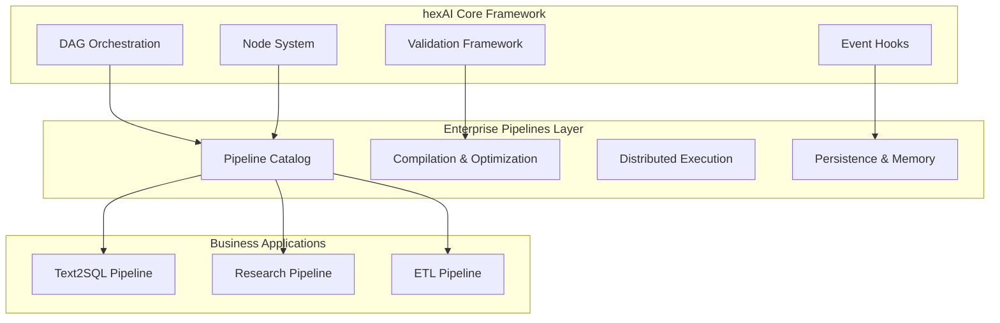

# 🗺️ Development Roadmap: hexAI Framework & Enterprise Pipelines

> **Strategic development plan separating the core hexAI framework from enterprise pipeline applications**

## 🎯 Vision & Architecture Separation

### Core Philosophy
- **hexAI**: Lightweight, focused DAG orchestration framework
- **Pipelines**: Enterprise wrapper with scalability, persistence, and business features
- **Clear Boundaries**: Framework provides hooks, enterprise layer adds capabilities



---

## 🏗️ Track 1: hexAI Core Framework Development

### **Immediate: Simplification Sprint (1-2 weeks)**
**Objective**: Reduce complexity and improve developer experience

#### **Quick Fixes**
- [ ] **Extract Retry Logic from LLMNode**
  - Move 400+ lines of retry logic to validation framework
  - Use validation strategies instead of node-specific logic
  - Simplify to ~50 lines total

- [ ] **Fix Agent Built-in Tools Architecture**
  - Move `tool_end` and `change_phase` from adapter layer to core domain
  - Implement CoreAgentTools or AgentToolRouter to maintain hexagonal architecture
  - Remove direct FunctionBasedToolRouter dependency from agent_node.py
  - Ensure agent's essential behavior isn't defined in adapters

- [ ] **Create Event Emission Decorators**
  ```python
  @emit_node_events
  async def execute_node(...):
      return await node_spec.fn(...)
  ```

- [ ] **Simplify Node Factory Signatures**
  - Reduce parameters from 10+ to 3-4 essential ones
  - Use builder pattern or config objects
  - Provide sensible defaults

- [ ] **Extract JSON Parsing Strategies**
  - Remove regex duplication
  - Create pluggable parser interface
  - Move to `hexai.parsing` module

- [ ] **Remove Verbose Documentation from Code**
  - Move detailed examples to separate docs
  - Keep docstrings concise
  - Focus on what, not how

### **Phase 1: Core Framework Enhancement (Weeks 3-4)**

#### **Port Registry System**
- [ ] **Dynamic Port Discovery**
  ```python
  @register_port("vector_store")
  class VectorStorePort:
      """Custom port for vector operations"""
  ```
  - Remove hardcoded port names
  - Enable runtime port registration
  - Type-safe port contracts

#### **Advanced Node Types**
- [ ] **Majority Vote Node**
  - Multi-input consensus mechanism
  - Configurable voting strategies (unanimous, majority, weighted)
  - Confidence scoring and result aggregation

- [ ] **Enhanced Loop Node**
  - Complex termination conditions
  - State preservation across iterations
  - Nested loop support

- [ ] **Conditional Enhancement**
  - Complex branching logic with multiple conditions
  - Data-driven routing with schema validation
  - Dynamic path selection based on runtime data

#### **Simplified Node Types**
- [ ] **Streamlined Base Node**
  - Extract common patterns to mixins
  - Reduce boilerplate by 70%
  - Clear node lifecycle hooks

- [ ] **Pure Function Nodes**
  - No validation overhead option
  - Direct function execution
  - Minimal wrapper for performance

- [ ] **Static Pipeline Linter (`hexai-lint`)**
  - CLI tool for validating pipelines before execution
  - Detect cycles, unused outputs, unknown parameters
  - Emit rule IDs (E100, W200, I300) for different error types
  - CI/CD integration for automated pipeline validation

#### **Validation Framework Completion**
- [ ] **Performance Mode**
  - Validation result caching
  - Compile-time validation optimization
  - Zero-overhead passthrough mode

- [ ] **Custom Validator Plugins**
  - Simple registration API
  - Chainable validators
  - Domain-specific validation rules

#### **Advanced Execution & Performance**

- [ ] **Deterministic Replay & Checkpointing**
  - Append-only checkpoint logs (`checkpoints/{session}.jsonl`)
  - CLI replay command: `hexai replay --session {id} --from {node}`
  - Input/output hash verification for consistency

- [ ] **Reusable Sub-Graphs ("Macros")**
  - YAML macros for reducing node sequence duplication
  - `use_macro:` directive for inline expansion
  - Node-id prefixing for macro instance isolation

### **Phase 2: Framework Stability (Weeks 5-6)**

#### **API Stabilization**
- [ ] **Version 1.0 API Freeze**
  - Backward compatibility commitment
  - Deprecation policy
  - Migration guides

#### **Performance Optimization**
- [ ] **Execution Engine Tuning**
  - Wave calculation caching
  - Minimal memory footprint
  - Benchmark suite establishment

- [ ] **Graph Optimizer Passes**
  - Dead-node elimination and constant-folding before runtime
  - Visitor pattern for optimization transformations
  - Development vs production optimization profiles

#### **Developer Experience**
- [ ] **Type Stubs Generation**
  - Full type coverage
  - IDE autocomplete support
  - Runtime type checking options

- [ ] **LoopNode Event System Enhancement**
  - Add proper event emission for loop iterations
  - Emit `LoopIterationStartedEvent` and `LoopIterationCompletedEvent`
  - Integrate with agent nodes using internal loop patterns
  - Standardize loop control event metadata
  - Support event tracing for debugging multi-step processes

- [ ] **JSON and Tool Parsing with Internal Feedback Loop**
  - Implement self-correcting tool parsing with retry mechanisms
  - Add validation feedback for malformed tool calls
  - Create internal correction loop for JSON parsing errors
  - Support adaptive parsing strategies based on LLM output patterns
  - Add parsing confidence scoring and fallback mechanisms

- [ ] **Universal Input Mapping Across All Nodes**
  - Standardize input mapping implementation across all node types
  - Create shared mapping utilities and patterns
  - Unify field transformation logic in BaseNodeFactory
  - Add consistent mapping validation and error handling
  - Support complex nested transformations and data restructuring

#### **Library Publication & Distribution**
- [ ] **PyPI Package Publication**
  - Publish hexAI as standalone library: `pip install hexai`
  - Semantic versioning and release automation
  - Comprehensive package metadata and documentation
  - Minimal dependencies (only Pydantic)

- [ ] **Integration with Main Branch**
  - Merge hexAI framework into main repository
  - Establish clear module boundaries
  - Maintain backward compatibility
  - Update CI/CD for library builds

---

## 🏢 Track 2: Enterprise Pipelines Layer

### **Phase 1: Pipeline Management (Weeks 1-4)**

#### **Pipeline Catalog Enhancement**
- [ ] **Version Control Integration**
  - Git-based pipeline versioning
  - Rollback capabilities
  - A/B testing support

- [ ] **Pluggable Execution Backends** ⚠️ **CONCEPTUAL ISSUE: Duplicate with Track 1**
  - Additional execution backends: `ThreadPool`, `RayTask`, `Databricks`
  - YAML configuration: `execution_backend: thread|async|ray`
  - Performance benchmarking across execution modes

- [ ] **Pipeline Compilation v2** *(Game-Changing Speed Optimization)*
  - Pre-computed execution plans
  - Secret pre-fetching (500ms → 1ms access)
  - Function pre-resolution and wave pre-computation
  - 10-100x performance improvement
  - Zero-overhead validation
  - Add pipeline pre-run and post-run hooks

#### **Distributed Execution**
- [ ] **Remote Orchestrator Service**
  - REST API for pipeline execution
  - Queue-based job management
  - Horizontal scaling support
  - Additional execution backends: `ThreadPool`, `RayTask`, `Databricks` and RemoteOrchestrator.
  - YAML configuration: `execution_backend: thread|async|ray`
  - Performance benchmarking across execution modes

- [ ] **Resource Management**
  - CPU/Memory limits per pipeline
  - Priority-based scheduling
  - Cost tracking integration

### **Phase 2: Memory & Persistence (Weeks 5-8)**

#### **Hybrid Memory Architecture** *(Advanced Memory Management)* ⚠️ **CONCEPTUAL ISSUE: Unclear boundary with core context**
- [ ] **Memory Ports**
  ```python
  # Enterprise feature, not in core hexAI
  class MemoryPort:
      async def store(self, key: str, value: Any, ttl: int = None)
      async def retrieve(self, key: str) -> Any
  ```

- [ ] **MemoryNode & ObserverNode**
  - Explicit memory operations as pipeline nodes
  - Automatic memory capture during execution
  - Cross-pipeline memory sharing capabilities

- [ ] **Storage Backends**
  - Redis for distributed memory
  - PostgreSQL for structured data
  - S3 for large objects
  - Local cache for performance

- [ ] **Use Cases & Examples**:
  - **Conversation Memory**: Store chat history across pipeline runs
  - **Research Memory**: Cache web search results and analysis
  - **ETL Memory**: Store intermediate data processing results
  - **Agent Memory**: Maintain agent state and knowledge

#### **Event Persistence**
- [ ] **Event Store Implementation**
  - Audit trail capabilities
  - Pipeline replay functionality
  - Analytics integration

### **Phase 3: Enterprise Features (Weeks 9-12)**

#### **Performance & Multi-Agent Coordination**
- [ ] **Hierarchical Agent Management**
  - Supervisor-subordinate relationships
  - Task delegation and result aggregation
  - Dynamic role assignment

- [ ] **Advanced Event System**
  - Custom event types and handlers
  - Event filtering and routing
  - Performance metrics collection

#### **Monitoring & Observability**
- [ ] **OpenTelemetry Integration**
  - Distributed tracing
  - Metrics collection
  - Log aggregation

- [ ] **Pipeline Analytics**
  - Execution time tracking
  - Resource usage analytics
  - Success/failure rates

#### **Security & Compliance**
- [ ] **Access Control**
  - Pipeline-level permissions
  - Audit logging
  - Compliance reporting

#### **MCP (Model Context Protocol) Integration**
- [ ] **MCP Server Framework**
  - MCP protocol implementation for external tool integration
  - Dynamic MCP server discovery and registration
  - Native MCP support in ReActAgentNode

#### **Automatic API and MCP Endpoint Generation**
- [ ] **Dynamic Pipeline Endpoints**
  - Auto-generation of REST endpoints for each pipeline
  - Real-time pipeline registration and deregistration
  - Dynamic OpenAPI schema generation

- [ ] **Pluggable Execution Backends** ⚠️ **CONCEPTUAL ISSUE: Duplicate with Track 1**
  - Additional execution backends: `ThreadPool`, `RayTask`, `Databricks`
  - YAML configuration: `execution_backend: thread|async|ray`
  - Performance benchmarking across execution modes

- [ ] **Pipeline-as-a-Service Infrastructure**
  - Multi-tenant pipeline execution
  - Pipeline marketplace and catalog API
  - Usage analytics and billing integration

---

## 🚀 Track 3: Business Applications

### **Phase 1: Core Pipelines (Ongoing)**

#### **Text-to-SQL Pipeline**
- [ ] **Multi-Strategy Execution**
  - SQL agent with planning
  - PetSQL integration
  - Neurosymbolic approach
  - Majority voting

#### **Research Pipeline**
- [ ] **Multi-Agent Coordination**
  - Web search integration
  - Document analysis
  - Fact verification
  - Report generation

- [ ] **Deep Research Agent**
  - Multi-source information gathering
  - Fact verification and cross-referencing
  - Citation management
  - Knowledge synthesis

#### **ETL Pipeline** ⚠️ **CONCEPTUAL ISSUE: Depends heavily on Track 2 enterprise features**
- [ ] **Spark Integration**
  - Large-scale data processing
  - Stream processing support
  - Data quality validation

- [ ] **Data Artifact Support**
  - Artifact objects (URI, media_type, size) for large ETL outputs
  - Bypass JSON serialization for files >512KB
  - Parquet, CSV, and binary file format support

#### **Chat Integration Pipeline**
- [ ] **Conversational Interface**
  - Context-aware dialogue management
  - Multi-turn conversation support
  - Natural language pipeline invocation

### **Phase 2: Advanced Applications**

#### **MCP (Model Context Protocol) Integration**
- [ ] **MCP Client Implementation**
  - Tool discovery
  - Dynamic capability registration
  - Multi-server coordination

#### **AutoRAG Pipeline (Document Intelligence)**
- [ ] **Document Intelligence**
  - Automatic indexing
  - Query optimization
  - Knowledge graph construction

- [ ] **Document Processing Chain**
  - Multi-format document ingestion
  - Content extraction and structuring
  - Entity extraction and linking

### **Phase 3: Adapter Ecosystem**

#### **LLM Adapters**
- [ ] **OpenAI Adapter Enhancement**
  - Streaming response support
  - Function calling integration
  - Rate limiting and quota management

- [ ] **Anthropic Claude Adapter**
  - Constitutional AI integration
  - Tool use capabilities

- [ ] **Open Source LLM Adapter**
  - Ollama and NIM integration
  - Model switching capabilities

#### **Database & Infrastructure Adapters**
- [ ] **Enhanced PostgreSQL Adapter**
  - Connection pooling, transaction management
  - Schema introspection improvements
  - Similarity search capabilities

- [ ] **Big Data & ETL Adapters** ⚠️ **CONCEPTUAL ISSUE: ETL adapters require Track 2 infrastructure**
  - Apache Spark integration
  - Message Queue Adapters (RabbitMQ, Kafka)
  - Data Quality Adapter (Great Expectations integration)

---

## 📋 Implementation Priorities

### **Immediate (This Sprint)**
1. Simplification sprint for hexAI core
2. Clear separation of framework vs enterprise
3. Documentation updates
4. Prepare for library publication

### **Short Term (1-2 months)**
1. hexAI 1.0 stabilization and PyPI release
2. Merge with main branch
3. Basic enterprise features
4. Core pipeline templates

### **Medium Term (3-6 months)**
1. Full distributed execution
2. Memory layer implementation
3. Advanced pipeline applications
4. MCP ecosystem integration

### **Long Term (6-12 months)**
1. Enterprise-grade monitoring
2. Advanced ETL and data processing
3. Pipeline marketplace

---

## 🚫 What hexAI Will NOT Include

To maintain focus and simplicity, hexAI core will NOT include:

- ❌ Specific database implementations
- ❌ Authentication/authorization
- ❌ Distributed execution (use enterprise layer)
- ❌ Persistence mechanisms
- ❌ Monitoring/metrics collection
- ❌ Web UI components
- ❌ Specific cloud integrations

These belong in the enterprise pipelines layer or user applications.

---

## 📚 Success Metrics

### hexAI Core
- Framework size < 10,000 LOC
- Zero external dependencies (except Pydantic)
- 100% type coverage
- < 100ms overhead per node
- Successful PyPI publication with >1000 downloads

### Enterprise Layer
- Support 1000+ concurrent pipelines
- < 1s pipeline startup time
- 99.9% uptime
- Horizontal scaling to 100+ nodes

### Developer Experience
- 5 minute quick start
- Clear framework vs enterprise boundary
- Extensive examples
- Active community

---

## 🎯 Library Development Milestones

### Milestone 1: Core Library (Week 6)
- [ ] Complete simplification sprint
- [ ] Finalize public API
- [ ] Comprehensive documentation
- [ ] Package structure optimization

### Milestone 2: PyPI Release (Week 8)
- [ ] Setup.py and pyproject.toml configuration
- [ ] Automated testing and CI/CD
- [ ] Version tagging and release automation
- [ ] Published on PyPI with semantic versioning

### Milestone 3: Main Branch Integration (Week 10)
- [ ] Merge hexAI into main repository
- [ ] Update all import paths
- [ ] Maintain backward compatibility
- [ ] Update enterprise pipelines to use published library

### Milestone 4: Community Adoption (Month 3)
- [ ] Developer documentation site
- [ ] Example repositories and tutorials
- [ ] Community feedback integration
- [ ] Stable 1.0 release

---
