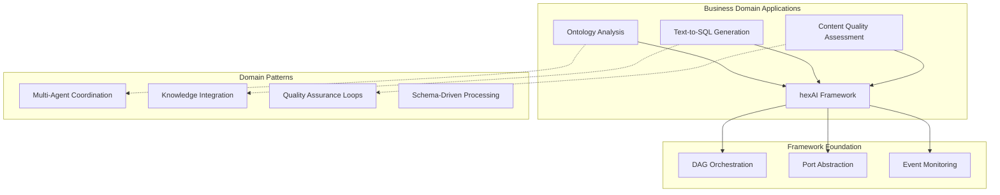

# 🎯 Pipeline Applications

> **Business-ready AI workflow applications built on the hexAI framework, demonstrating real-world patterns and architectural approaches.**

## 🌟 Vision & Purpose

The Pipelines package transforms the hexAI framework's technical capabilities into **domain-specific business applications**. Each pipeline represents a complete solution pattern that organizations can adapt for their specific needs.

### Design Philosophy

- **🏢 Business-First**: Each pipeline solves real business problems, not just technical demonstrations
- **🔄 Pattern Reuse**: Common architectural patterns that apply across industries
- **📋 Template Approach**: Ready-to-adapt solutions with clear customization points
- **🔍 Domain Expertise**: Deep integration of business knowledge and AI capabilities
- **🚀 Production Ready**: Battle-tested patterns for enterprise deployment

---

## 🏗️ Architecture Overview

### Business Application Layer



### Module Organization

```
pipelines/
├── base.py              # Pipeline foundation & discovery system
├── models.py            # Shared business domain models
├── shared_functions.py  # Common pipeline utilities
├── ontology/           # Business knowledge analysis
├── text2sql/           # Natural language to SQL
├── dummy/              # Framework capability demonstration
└── petsql/             # Specialized SQL generation variant
```

### Architectural Relationships

**Pipeline Catalog System**
- **Auto-Discovery**: Automatic detection of pipeline implementations
- **Unified Interface**: Consistent execution model across all pipelines
- **Schema Introspection**: Dynamic type discovery for UI generation
- **Validation Framework**: Pre-execution compatibility checking

**Domain Model Integration**
- **Shared Vocabularies**: Common business concepts across pipelines
- **Type Safety**: Pydantic models ensure data consistency
- **Business Rules**: Domain-specific validation and processing logic

---

## 🎭 Pipeline Architectures

### 🏛️ Ontology Analysis Pipeline

**Business Purpose**: Transform raw business ontologies into actionable insights for decision-making

**Architectural Pattern**: Knowledge Graph Analysis
```
Context Loading → Ontology Processing → Relationship Analysis → Insight Generation
```

**Domain Integration**:
- **Business Ontologies**: Enterprise knowledge structures
- **Relationship Mapping**: Entity connection discovery
- **Validation Rules**: Business logic consistency checking
- **Insight Extraction**: Actionable business intelligence

**Use Cases**:
- Enterprise data governance
- Business process optimization
- Knowledge management systems
- Compliance and audit preparation


## 🤖 Multi-Agent Orchestration Framework

### 1. **Sequential Agent Chain Pattern**

**Use Case**: Linear workflows where each agent builds on previous agent's work

**Architecture**: Progressive Information Enhancement
```
Research Agent → Analysis Agent → Decision Agent → Implementation Agent
```

**YAML Configuration**:
```yaml
name: sequential_multiagent_pipeline
description: Sequential chain of specialized agents for complex task decomposition

nodes:
  # Stage 1: Research Agent
  - type: agent
    id: research_agent
    params:
      initial_prompt_template: |
        You are a Research Agent. Your goal: {{goal}}

        Research the topic thoroughly:
        1. Identify key information sources
        2. Gather relevant data points
        3. Flag any knowledge gaps

        Output format:
        {
          "research_findings": "detailed findings",
          "data_sources": ["source1", "source2"],
          "confidence": "high|medium|low",
          "knowledge_gaps": ["gap1", "gap2"]
        }

      max_steps: 4
      available_tools: ["web_search", "database_lookup", "document_analysis"]

      output_schema:
        research_findings: str
        data_sources: list
        confidence: str
        knowledge_gaps: list
    depends_on: []

  # Stage 2: Analysis Agent (depends on research)
  - type: agent
    id: analysis_agent
    params:
      initial_prompt_template: |
        You are an Analysis Agent. Analyze the research findings:

        Research Results: {{research_agent.research_findings}}
        Data Sources: {{research_agent.data_sources}}
        Knowledge Gaps: {{research_agent.knowledge_gaps}}

        Your task:
        1. Synthesize the research findings
        2. Identify patterns and insights
        3. Generate hypotheses
        4. Suggest next steps

        Output format:
        {
          "analysis_summary": "comprehensive analysis",
          "key_insights": ["insight1", "insight2"],
          "recommendations": ["rec1", "rec2"],
          "confidence_score": 0.85
        }

      max_steps: 3
      available_tools: ["statistical_analysis", "pattern_recognition"]

      output_schema:
        analysis_summary: str
        key_insights: list
        recommendations: list
        confidence_score: float
    depends_on: [research_agent]

  # Stage 3: Decision Agent (depends on analysis)
  - type: agent
    id: decision_agent
    params:
      initial_prompt_template: |
        You are a Decision Making Agent. Make final recommendations:

        Research: {{research_agent.research_findings}}
        Analysis: {{analysis_agent.analysis_summary}}
        Recommendations: {{analysis_agent.recommendations}}

        Create implementation plan and prioritize actions.

        Output format:
        {
          "final_decision": "chosen strategy",
          "implementation_plan": ["step1", "step2", "step3"],
          "priority_ranking": [1, 2, 3],
          "risk_assessment": "low|medium|high"
        }

      max_steps: 2
      available_tools: ["decision_framework", "risk_assessment"]

      output_schema:
        final_decision: str
        implementation_plan: list
        priority_ranking: list
        risk_assessment: str
    depends_on: [analysis_agent]
```

### 2. **Parallel Coordination Pattern**

**Use Case**: Complex problems requiring multiple specialist perspectives

**Architecture**: Specialist Analysis with Coordinator Synthesis
```
Technical Specialist ──┐
                       ├── Coordination Agent → Final Decision
Business Specialist ───┘
```

**YAML Configuration**:
```yaml
name: parallel_multiagent_pipeline
description: Parallel specialist agents with coordinator synthesis

nodes:
  # Parallel Specialist Agents (Wave 1)
  - type: agent
    id: technical_specialist
    params:
      initial_prompt_template: |
        You are a Technical Specialist Agent.

        Task: {{task_description}}
        Focus: Technical feasibility, implementation details, architecture

        Analyze from technical perspective:
        1. Technical requirements and constraints
        2. Implementation complexity and timeline
        3. Resource requirements
        4. Technical risks and mitigation strategies

        Share findings in team memory for coordinator.

        Output format:
        {
          "technical_assessment": "detailed technical analysis",
          "feasibility_score": 0.8,
          "implementation_timeline": "6 months",
          "required_resources": ["dev team", "infrastructure"],
          "technical_risks": ["risk1", "risk2"]
        }

      max_steps: 5
      available_tools: ["tech_database", "architecture_analyzer", "cost_estimator"]

      output_schema:
        technical_assessment: str
        feasibility_score: float
        implementation_timeline: str
        required_resources: list
        technical_risks: list
    depends_on: []

  - type: agent
    id: business_specialist
    params:
      initial_prompt_template: |
        You are a Business Specialist Agent.

        Task: {{task_description}}
        Focus: Business value, market fit, ROI analysis

        Analyze from business perspective:
        1. Market opportunity and competitive advantage
        2. Revenue potential and business impact
        3. Customer value proposition
        4. Business risks and market dynamics

        Share findings in team memory for coordinator.

        Output format:
        {
          "business_assessment": "comprehensive business analysis",
          "market_opportunity": "large|medium|small",
          "revenue_potential": "$1M annually",
          "customer_impact": "high|medium|low",
          "business_risks": ["risk1", "risk2"]
        }

      max_steps: 5
      available_tools: ["market_research", "financial_calculator", "competitor_analysis"]

      output_schema:
        business_assessment: str
        market_opportunity: str
        revenue_potential: str
        customer_impact: str
        business_risks: list
    depends_on: []

  # Coordination Agent (Wave 2 - depends on all specialists)
  - type: agent
    id: coordination_agent
    params:
      initial_prompt_template: |
        You are the Coordination Agent. Synthesize all specialist findings:

        Technical Analysis: {{technical_specialist.technical_assessment}}
        Technical Feasibility: {{technical_specialist.feasibility_score}}
        Business Analysis: {{business_specialist.business_assessment}}
        Market Opportunity: {{business_specialist.market_opportunity}}

        Your mission:
        1. Identify synergies and conflicts between perspectives
        2. Create unified strategy balancing technical and business concerns
        3. Balance competing priorities and trade-offs
        4. Generate consensus recommendations

        Output format:
        {
          "unified_strategy": "comprehensive balanced strategy",
          "synergies": ["synergy1", "synergy2"],
          "trade_offs": ["tradeoff1", "tradeoff2"],
          "consensus_plan": "agreed upon implementation plan",
          "next_steps": ["step1", "step2", "step3"],
          "overall_recommendation": "proceed|modify|reject"
        }

      max_steps: 6
      available_tools: ["synthesis_framework", "conflict_resolution", "prioritization"]

      output_schema:
        unified_strategy: str
        synergies: list
        trade_offs: list
        consensus_plan: str
        next_steps: list
        overall_recommendation: str
    depends_on: [technical_specialist, business_specialist]
```

### 3. **Hierarchical Loop-Based Pattern**

**Use Case**: Iterative refinement and complex multi-round negotiations

**Architecture**: Supervisor-Managed Iterative Improvement
```
Supervisor Agent ──→ Loop Controller ──→ Worker Agents ──→ Validator ──→ Loop Decision
```

**YAML Configuration**:
```yaml
name: hierarchical_multiagent_pipeline
description: Hierarchical agents with loops for iterative improvement

nodes:
  # Supervisor Agent (orchestrates the process)
  - type: agent
    id: supervisor_agent
    params:
      initial_prompt_template: |
        You are the Supervisor Agent managing a team of specialist agents.

        Goal: {{primary_goal}}

        Your responsibilities:
        1. Define specific tasks for each specialist agent
        2. Set quality criteria and success metrics
        3. Coordinate iterations and feedback loops
        4. Make final go/no-go decisions

        Output format:
        {
          "task_assignments": {
            "analyst": "specific detailed task for analyst",
            "strategist": "specific detailed task for strategist"
          },
          "quality_criteria": ["criteria1", "criteria2", "criteria3"],
          "success_metrics": ["metric1", "metric2"],
          "should_continue": true
        }

      max_steps: 3

      output_schema:
        task_assignments: dict
        quality_criteria: list
        success_metrics: list
        should_continue: bool
    depends_on: []

  # Loop Controller
  - type: loop
    id: agent_iteration_loop
    params:
      max_iterations: 3
      success_condition: |
        lambda data: (
          data.get('validation_result', {}).get('quality_score', 0) >= 8 and
          data.get('validation_result', {}).get('meets_criteria', False)
        )
      iteration_key: "agent_iteration"
    depends_on: [supervisor_agent]

  # Analyst Agent (in the loop)
  - type: agent
    id: analyst_agent
    params:
      initial_prompt_template: |
        You are an Analyst Agent in iteration {{agent_iteration}}.

        Task Assignment: {{supervisor_agent.task_assignments.analyst}}
        Quality Criteria: {{supervisor_agent.quality_criteria}}
        Success Metrics: {{supervisor_agent.success_metrics}}

        Previous iterations context:
        - Previous analysis: {{analyst_agent_history}}
        - Validator feedback: {{validation_feedback}}
        - Areas for improvement: {{improvement_areas}}

        Improve your analysis based on previous feedback and iterations.

        Output format:
        {
          "analysis_report": "comprehensive analysis incorporating feedback",
          "key_findings": ["finding1", "finding2"],
          "confidence_level": 0.9,
          "iteration_improvements": "what was improved this iteration"
        }

      max_steps: 4
      available_tools: ["deep_analysis", "data_mining", "trend_analysis"]

      output_schema:
        analysis_report: str
        key_findings: list
        confidence_level: float
        iteration_improvements: str
    depends_on: [agent_iteration_loop]

  # Strategist Agent (parallel with analyst in the loop)
  - type: agent
    id: strategist_agent
    params:
      initial_prompt_template: |
        You are a Strategist Agent in iteration {{agent_iteration}}.

        Task Assignment: {{supervisor_agent.task_assignments.strategist}}
        Quality Criteria: {{supervisor_agent.quality_criteria}}
        Analyst Findings: {{analyst_agent.key_findings}}

        Previous iterations context:
        - Previous strategy: {{strategist_agent_history}}
        - Validator feedback: {{validation_feedback}}

        Create strategic recommendations incorporating analyst findings.

        Output format:
        {
          "strategic_plan": "detailed strategic recommendations",
          "implementation_roadmap": ["phase1", "phase2", "phase3"],
          "risk_mitigation": ["mitigation1", "mitigation2"],
          "success_probability": 0.85
        }

      max_steps: 4
      available_tools: ["strategy_framework", "scenario_planning", "risk_modeling"]

      output_schema:
        strategic_plan: str
        implementation_roadmap: list
        risk_mitigation: list
        success_probability: float
    depends_on: [analyst_agent]

  # Validator Agent (evaluates quality)
  - type: agent
    id: validator_agent
    params:
      initial_prompt_template: |
        You are a Validator Agent for iteration {{agent_iteration}}.

        Evaluate the work quality against supervisor criteria:

        Analysis Report: {{analyst_agent.analysis_report}}
        Strategic Plan: {{strategist_agent.strategic_plan}}
        Quality Criteria: {{supervisor_agent.quality_criteria}}
        Success Metrics: {{supervisor_agent.success_metrics}}

        Score from 1-10 and provide specific feedback for improvement.

        Output format:
        {
          "quality_score": 8,
          "meets_criteria": true,
          "analysis_feedback": "specific feedback for analyst",
          "strategy_feedback": "specific feedback for strategist",
          "overall_assessment": "comprehensive evaluation",
          "improvement_areas": ["area1", "area2"],
          "should_iterate": false
        }

      max_steps: 2

      output_schema:
        quality_score: int
        meets_criteria: bool
        analysis_feedback: str
        strategy_feedback: str
        overall_assessment: str
        improvement_areas: list
        should_iterate: bool
    depends_on: [strategist_agent]
```

---

## 🛠️ Command Line Interface (CLI)

### 🔧 Pipeline Operations

```bash
# Navigate to fastapi_app directory
cd fastapi_app

# List all available pipelines with descriptions
python -m pipelines.cli list

# Test all pipelines for configuration and schema validation
python -m pipelines.cli test

# Test specific pipeline
python -m pipelines.cli test dummy_pipeline

# Visualize pipeline DAG structure with enhanced I/O information
python -m pipelines.cli viz dummy_pipeline
python -m pipelines.cli viz text2sql_pipeline --show-types
python -m pipelines.cli viz ontology_pipeline --output=diagram.png

# Execute pipeline with JSON input
python -m pipelines.cli run text2sql_pipeline '{"question": "show all users", "database_name": "test_db"}'
python -m pipelines.cli run dummy_pipeline '{"text": "analyze this content", "priority": 8}'
python -m pipelines.cli run ontology_pipeline '{}'
```


```bash
# Development quality assurance pipeline
python -m pipelines.cli dev format              # Format code (black + isort)
python -m pipelines.cli dev lint                # Run linting (flake8 + bandit)
python -m pipelines.cli dev type-check          # Type checking (mypy)
python -m pipelines.cli dev test                # Run all tests
python -m pipelines.cli dev test-cov            # Run tests with coverage report
python -m pipelines.cli dev clean               # Clean cache and build artifacts
python -m pipelines.cli dev check-all           # Run complete quality assurance
python -m pipelines.cli dev setup               # Setup development environment

# Pipeline-specific development
python -m pipelines.cli dev create my_pipeline  # Create new pipeline template
python -m pipelines.cli dev validate my_pipeline # Validate pipeline configuration
python -m pipelines.cli dev test-pipeline my_pipeline # Test specific pipeline
```

### 📊 Pipeline Analysis & Monitoring

```bash
# Schema analysis and introspection
python -m src.cli schema dummy_pipeline          # Show pipeline input/output schemas
python -m src.cli schema text2sql_pipeline --details # Detailed schema information
python -m src.cli schema all                     # All pipeline schemas

# Performance and execution analysis
python -m src.cli profile dummy_pipeline '{"text": "test", "priority": 5}'
python -m src.cli benchmark text2sql_pipeline --iterations=10
python -m src.cli trace ontology_pipeline --verbose

# Health and status checks
python -m src.cli health                         # Check system health
python -m src.cli status                         # Pipeline system status
python -m src.cli dependencies                  # Check dependencies
```

### 🔍 Debugging & Troubleshooting

```bash
# Debug pipeline execution with detailed tracing
python -m src.cli debug dummy_pipeline '{"text": "debug test"}' --trace-level=DEBUG

# Validate pipeline configurations
python -m src.cli validate dummy_pipeline        # Validate single pipeline
python -m src.cli validate --all                # Validate all pipelines

# Check for common issues
python -m src.cli doctor                         # System diagnostic
python -m src.cli doctor dummy_pipeline          # Pipeline-specific diagnostic

# Export pipeline information for analysis
python -m src.cli export dummy_pipeline --format=json > pipeline_info.json
python -m src.cli export --all --format=yaml > all_pipelines.yaml
```

### 🌐 Production & Deployment Commands

```bash
# Production readiness checks
python -m src.cli production-check              # Check production readiness
python -m src.cli production-test               # Run production test suite
python -m src.cli production-benchmark          # Performance benchmarking

# Environment-specific operations
export PIPELINE_ENV=production
python -m src.cli run --env=production text2sql_pipeline '{"question": "revenue report"}'

# Batch processing operations
python -m src.cli batch process_requests.json --output=results.json
python -m src.cli batch --pipeline=text2sql_pipeline --input-dir=./queries/

# Monitoring and metrics
python -m src.cli metrics --live                # Live metrics dashboard
python -m src.cli metrics --export=prometheus   # Export metrics for Prometheus
python -m src.cli metrics --pipeline=dummy_pipeline # Pipeline-specific metrics
```

### 📋 Example CLI Workflows

**Development Workflow**:
```bash
# Daily development routine
python -m src.cli dev check-all                 # Quality checks
python -m src.cli test                          # Test all pipelines
python -m src.cli viz new_pipeline              # Visualize new work

# Pre-commit workflow
python -m src.cli dev format                    # Format code
python -m src.cli dev lint                      # Check linting
python -m src.cli test new_pipeline             # Test changes
python -m src.cli production-check              # Production readiness
```

**Production Deployment**:
```bash
# Production deployment pipeline
python -m src.cli production-test               # Full production test suite
python -m src.cli benchmark --all               # Performance validation
python -m src.cli health                        # System health check
python -m src.cli metrics --export=monitoring   # Setup monitoring
```

**Troubleshooting Workflow**:
```bash
# When pipeline fails
python -m src.cli doctor failing_pipeline       # Diagnostic
python -m src.cli debug failing_pipeline --trace # Debug execution
python -m src.cli validate failing_pipeline     # Configuration check
python -m src.cli dependencies                  # Dependency check
```

---

## 🧩 Business Domain Models

### Ontology Domain (`models.py`)

**Core Business Concepts**:
- **Ontology**: Enterprise knowledge structure definition
- **OntologyNode**: Business concept or entity with role-based access
- **OntologyRelation**: Business relationship definition with metadata

**Business Value**:
- **Governance**: Role-based access to business concepts
- **Traceability**: Relationship tracking for compliance
- **Evolution**: Version-controlled business knowledge
- **Integration**: Cross-system concept mapping

### SQL Domain (`models.py`)

**Query Intelligence**:
- **QueryIntent**: Parsed business intent from natural language
- **SQLQuery**: Generated SQL with business context and confidence
- **TableReference**: Database structure with business metadata

**Business Benefits**:
- **Intent Preservation**: Maintain business context in technical translation
- **Quality Metrics**: Confidence scoring for business users
- **Audit Trail**: Query provenance and reasoning
- **Optimization**: Performance-aware generation

---

## 🔄 Common Architectural Patterns

### 1. **Knowledge Integration Pattern**

**When to Use**: Pipelines requiring external knowledge sources

**YAML Template**:
```yaml
# Pattern: Load → Integrate → Process → Validate
name: knowledge_integration_pipeline
description: Integrate multiple knowledge sources for intelligent processing

nodes:
  - type: function
    id: load_business_context
    params:
      fn: load_ontology_context
      source: "ontology"
    depends_on: []

  - type: function
    id: integrate_schema_knowledge
    params:
      fn: load_database_schema
      source: "database"
    depends_on: []

  - type: llm
    id: knowledge_synthesis
    params:
      prompt_template: |
        Business Context: {{load_business_context.entities}}
        Technical Schema: {{integrate_schema_knowledge.tables}}
        User Query: {{user_query}}

        Generate insights combining both business and technical perspectives.

        Output format:
        {
          "synthesized_insights": "combined business and technical analysis",
          "business_relevance": "how this relates to business goals",
          "technical_feasibility": "technical implementation considerations",
          "recommendations": ["rec1", "rec2", "rec3"]
        }
      output_schema:
        synthesized_insights: str
        business_relevance: str
        technical_feasibility: str
        recommendations: list
    depends_on: [load_business_context, integrate_schema_knowledge]
```

### 2. **Quality Assurance Loop Pattern**

**When to Use**: Workflows requiring iterative refinement

**YAML Template**:
```yaml
# Pattern: Generate → Validate → Improve → Repeat
name: quality_assurance_pipeline
description: Iterative quality improvement with feedback loops

nodes:
  - type: loop
    id: quality_controller
    params:
      max_iterations: 3
      success_condition: "lambda data: data.get('quality_score', 0) >= 8"
      iteration_key: "quality_iteration"
    depends_on: []

  - type: agent
    id: content_generator
    params:
      initial_prompt_template: |
        You are a Content Generator in iteration {{quality_iteration}}.

        Original Request: {{user_request}}
        Previous Feedback: {{validation_feedback}}
        Quality Target: 8/10 or higher

        Create or improve content based on feedback from previous iterations.

        Output format:
        {
          "generated_content": "improved content based on feedback",
          "improvements_made": "what was enhanced this iteration",
          "confidence": 0.85
        }
      max_steps: 3
      output_schema:
        generated_content: str
        improvements_made: str
        confidence: float
    depends_on: [quality_controller]

  - type: llm
    id: quality_validator
    params:
      prompt_template: |
        You are a Quality Validator for iteration {{quality_iteration}}.

        Content to Evaluate: {{content_generator.generated_content}}
        Previous Improvements: {{content_generator.improvements_made}}

        Rate the quality from 1-10 and provide specific feedback.
        Consider: clarity, completeness, accuracy, usefulness

        Output format:
        {
          "quality_score": 8,
          "feedback": "specific areas for improvement",
          "strengths": ["strength1", "strength2"],
          "areas_for_improvement": ["area1", "area2"],
          "meets_standards": true
        }
      output_schema:
        quality_score: int
        feedback: str
        strengths: list
        areas_for_improvement: list
        meets_standards: bool
    depends_on: [content_generator]
```

### 3. **Multi-Source Intelligence Pattern**

**When to Use**: Decisions requiring multiple information sources

**YAML Template**:
```yaml
# Pattern: Parallel Collection → Synthesis → Decision
name: multi_source_intelligence_pipeline
description: Parallel information gathering with intelligent synthesis

nodes:
  # Parallel information gathering (Wave 1)
  - type: function
    id: schema_analyzer
    params:
      fn: analyze_database_schema
      source: "database"
      analysis_depth: "comprehensive"
    depends_on: []

  - type: function
    id: ontology_analyzer
    params:
      fn: analyze_business_ontology
      source: "business_knowledge"
      include_relationships: true
    depends_on: []

  - type: function
    id: example_analyzer
    params:
      fn: analyze_historical_queries
      source: "query_history"
      similarity_threshold: 0.7
    depends_on: []

  # Intelligent synthesis (Wave 2)
  - type: agent
    id: intelligence_synthesizer
    params:
      initial_prompt_template: |
        You are an Intelligence Synthesizer. Combine insights from multiple sources:

        Database Schema Analysis: {{schema_analyzer.schema_insights}}
        Business Ontology Analysis: {{ontology_analyzer.business_concepts}}
        Historical Query Analysis: {{example_analyzer.similar_patterns}}

        User Request: {{user_query}}

        Synthesize all information to provide comprehensive recommendations.

        Output format:
        {
          "synthesis_summary": "combined insights from all sources",
          "technical_recommendations": ["tech_rec1", "tech_rec2"],
          "business_recommendations": ["biz_rec1", "biz_rec2"],
          "confidence_assessment": 0.9,
          "implementation_priority": ["high", "medium", "low"]
        }
      max_steps: 4
      available_tools: ["cross_reference", "pattern_matcher", "confidence_calculator"]
      output_schema:
        synthesis_summary: str
        technical_recommendations: list
        business_recommendations: list
        confidence_assessment: float
        implementation_priority: list
    depends_on: [schema_analyzer, ontology_analyzer, example_analyzer]
```

---

## 🚀 Environment Setup & Configuration

### Development Environment

```bash
# Development environment setup
export PIPELINE_ENV=development
export LOG_LEVEL=DEBUG
export ENABLE_MOCK_ADAPTERS=true
export PIPELINE_CONFIG_DIR=./configs/dev/

# Enable development features
export ENABLE_HOT_RELOAD=true
export ENABLE_DEBUG_TRACES=true
export CACHE_DISABLED=true

# Start development server with hot reload
python -m src.cli dev serve --reload --debug
```

### Production Environment

```bash
# Production environment configuration
export PIPELINE_ENV=production
export LOG_LEVEL=INFO
export ENABLE_METRICS=true
export PIPELINE_CONFIG_DIR=./configs/prod/

# External service configuration
export OPENAI_API_KEY=your_openai_key
export DATABASE_URL=postgresql://prod_db_url
export REDIS_URL=redis://prod_redis_url
export ONTOLOGY_SERVICE_URL=https://ontology.company.com

# Production performance settings
export MAX_CONCURRENT_PIPELINES=20
export PIPELINE_TIMEOUT_SECONDS=300
export MEMORY_LIMIT_MB=2048

# Start production server
python -m src.cli production serve --workers=4
```

### Container Deployment

```dockerfile
# Multi-stage production container
FROM python:3.12-slim as builder

# Install dependencies
COPY requirements.txt .
RUN pip install --no-cache-dir -r requirements.txt

FROM python:3.12-slim as runtime

# Copy installed packages
COPY --from=builder /usr/local/lib/python3.12/site-packages /usr/local/lib/python3.12/site-packages

# Copy application
COPY pipelines/ /app/pipelines/
COPY configs/ /app/configs/

# Set environment
ENV PIPELINE_ENV=production
ENV PYTHONPATH=/app
ENV PIPELINE_CONFIG_DIR=/app/configs/prod/

# Health check
HEALTHCHECK --interval=30s --timeout=10s --start-period=5s --retries=3 \
  CMD python -m src.cli health || exit 1

# Run pipeline server
ENTRYPOINT ["python", "-m", "src.cli", "production", "serve"]
```

### Kubernetes Deployment

```yaml
# Production Kubernetes deployment
apiVersion: apps/v1
kind: Deployment
metadata:
  name: pipeline-orchestrator
  labels:
    app: pipeline-orchestrator
spec:
  replicas: 3
  strategy:
    type: RollingUpdate
    rollingUpdate:
      maxSurge: 1
      maxUnavailable: 0
  selector:
    matchLabels:
      app: pipeline-orchestrator
  template:
    metadata:
      labels:
        app: pipeline-orchestrator
    spec:
      containers:
      - name: pipeline-service
        image: pipeline-orchestrator:latest
        ports:
        - containerPort: 8000
          name: http
        env:
        - name: PIPELINE_ENV
          value: "production"
        - name: MAX_CONCURRENT_PIPELINES
          value: "20"
        - name: DATABASE_URL
          valueFrom:
            secretKeyRef:
              name: pipeline-secrets
              key: database-url
        - name: OPENAI_API_KEY
          valueFrom:
            secretKeyRef:
              name: pipeline-secrets
              key: openai-api-key
        resources:
          requests:
            memory: "1Gi"
            cpu: "500m"
          limits:
            memory: "2Gi"
            cpu: "1000m"
        livenessProbe:
          httpGet:
            path: /health
            port: 8000
          initialDelaySeconds: 30
          periodSeconds: 10
        readinessProbe:
          httpGet:
            path: /ready
            port: 8000
          initialDelaySeconds: 5
          periodSeconds: 5

---
apiVersion: v1
kind: Service
metadata:
  name: pipeline-service
spec:
  selector:
    app: pipeline-orchestrator
  ports:
  - protocol: TCP
    port: 80
    targetPort: 8000
  type: LoadBalancer
```

### Monitoring & Observability Setup

```bash
# Start monitoring stack
docker-compose -f docker-compose.monitoring.yml up -d

# Configure pipeline monitoring
export ENABLE_METRICS=true
export PROMETHEUS_ENDPOINT=http://prometheus:9090
export GRAFANA_ENDPOINT=http://grafana:3000
export JAEGER_ENDPOINT=http://jaeger:14268

# Start with full observability
python -m src.cli production serve \
  --enable-metrics \
  --enable-tracing \
  --metrics-port=9090 \
  --trace-endpoint=http://jaeger:14268
```

---

## 🎯 Business Value Patterns

### 1. **Self-Service Analytics**
- **Natural Language Queries**: Business users query data without SQL knowledge
- **Contextual Intelligence**: Ontology-driven query interpretation
- **Quality Assurance**: Confidence scoring and validation

### 2. **Knowledge Management**
- **Ontology Analysis**: Automated business rule discovery
- **Relationship Mapping**: Entity connection insights
- **Governance Support**: Compliance and audit automation

### 3. **Content Intelligence**
- **Quality Assessment**: Automated content evaluation
- **Enhancement Suggestions**: AI-powered improvement recommendations
- **Process Optimization**: Workflow efficiency analysis

### 4. **Decision Support**
- **Multi-Agent Analysis**: Parallel expert perspectives
- **Evidence Synthesis**: Comprehensive information integration
- **Risk Assessment**: Automated decision quality evaluation

---

## 🎖️ Enterprise Benefits

### **🔄 Operational Efficiency**
- Automate complex business processes
- Reduce manual knowledge work
- Accelerate decision-making cycles

### **📊 Business Intelligence**
- Democratize data access through natural language
- Integrate multiple knowledge sources
- Provide contextual business insights

### **🛡️ Risk Management**
- Ensure consistent business rule application
- Maintain audit trails for compliance
- Quality assurance through validation loops

### **🚀 Scalable Innovation**
- Template-based solution development
- Reusable business logic components
- Framework for AI integration across the enterprise

---

The Pipelines package transforms the hexAI framework's technical capabilities into **business-ready solutions** that organizations can immediately deploy and adapt. Each pipeline represents a proven architectural pattern for integrating AI capabilities with enterprise knowledge systems, delivering measurable business value through **intelligent workflow automation**.
