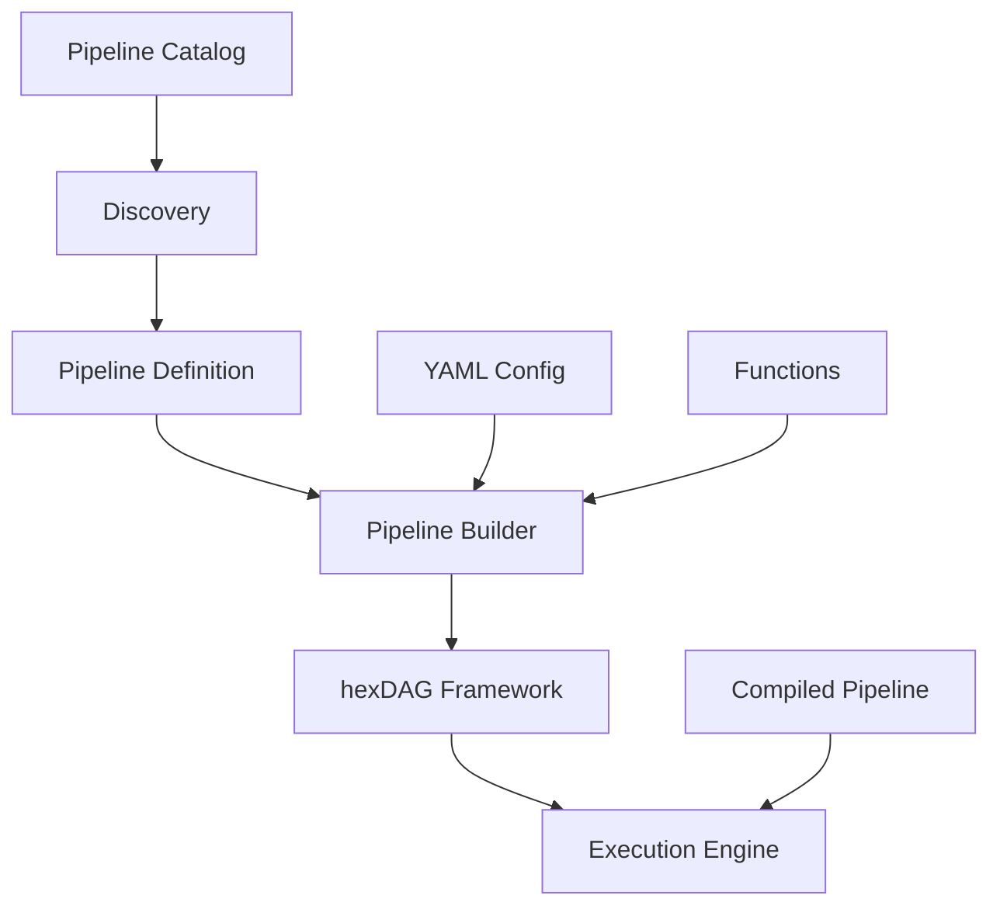

# 🚀 Pipelines Implementation Guide

> **A comprehensive guide for implementing and compiling pipelines using the hexDAG framework**

## 📖 Table of Contents

1. [Pipelines vs hexDAG Framework](#pipelines-vs-hexdag-framework)
2. [Pipeline Architecture](#pipeline-architecture)
3. [Pipeline Definition](#pipeline-definition)
4. [Pipeline Compilation](#pipeline-compilation)
5. [Running Compiled Pipelines](#running-compiled-pipelines)
6. [Function Development](#function-development)
7. [YAML Configuration](#yaml-configuration)
8. [Testing Methodologies](#testing-methodologies)
9. [Production Deployment](#production-deployment)

---

## 🔄 Pipelines vs hexDAG Framework

### **hexDAG Framework** (Core Orchestration Engine)
The hexDAG framework is the **core orchestration engine** that provides the fundamental building blocks for AI workflows:

**Core Components:**
- **DirectedGraph**: Manages workflow structure and dependencies
- **NodeSpec**: Defines individual processing steps
- **Orchestrator**: Executes workflows with concurrency control
- **Context**: Provides shared state and memory management
- **Event System**: Handles observability and monitoring
- **Ports & Adapters**: Manages external service integrations

**hexDAG Responsibilities:**
- ✅ **Workflow Orchestration**: Managing DAG execution and dependencies
- ✅ **Resource Management**: Handling concurrency, memory, and connections
- ✅ **Event Handling**: Providing comprehensive observability
- ✅ **Type Safety**: Ensuring input/output validation
- ✅ **Error Handling**: Managing failures and recovery
- ✅ **External Integration**: Managing LLMs, databases, tools via ports

**hexDAG is Framework-Agnostic:**
```python
# hexDAG doesn't know about specific pipelines
from hexdag import DirectedGraph, NodeSpec, Orchestrator

# Pure orchestration - no pipeline-specific logic
graph = DirectedGraph()
graph.add(NodeSpec("processor", any_function))
orchestrator = Orchestrator()
results = await orchestrator.run(graph, input_data, context, ports)
```

### **Pipelines** (Domain-Specific Workflows)
Pipelines are **domain-specific workflow implementations** built on top of the hexDAG framework:

**Pipeline Components:**
- **PipelineDefinition**: Encapsulates a complete workflow
- **PipelineBuilder**: Constructs workflows from YAML configurations
- **PipelineCatalog**: Discovers and manages pipeline instances
- **Compiled Pipelines**: Pre-optimized versions for production

**Pipeline Responsibilities:**
- ✅ **Business Logic**: Domain-specific processing steps
- ✅ **Configuration Management**: YAML-based workflow definitions
- ✅ **Function Registration**: Managing reusable processing functions
- ✅ **Compilation**: Pre-optimizing workflows for performance
- ✅ **Discovery**: Automatic pipeline registration and cataloging

**Pipelines are Domain-Specific:**
```python
# Pipelines contain business logic and domain knowledge
from pipelines.text2sql.pipeline import Text2SQLPipeline

# Domain-specific pipeline with business logic
pipeline = Text2SQLPipeline()
results = await pipeline.execute({
    "question": "Show me all users",
    "database_name": "users_db"
})
```

### **Key Differences Summary**

| Aspect | hexDAG Framework | Pipelines |
|--------|----------------|-----------|
| **Purpose** | Core orchestration engine | Domain-specific workflows |
| **Scope** | Framework-agnostic | Business domain specific |
| **Reusability** | Universal across domains | Specific to use cases |
| **Configuration** | Programmatic | YAML-based |
| **Compilation** | Not applicable | Pre-optimized execution |
| **Examples** | Orchestrator, Context, DAG | Text2SQL, Ontology, RAG |

---

## 🏗️ Pipeline Architecture

### **Pipeline Layers**



### **Core Components**

---

**1. PipelineDefinition**
The base class that all pipelines inherit from, providing common functionality:

```python
from pipelines.base import PipelineDefinition

class MyPipeline(PipelineDefinition):
    """Custom pipeline implementation."""

    def __init__(self):
        super().__init__(
            name="my_pipeline",
            description="My custom pipeline",
            yaml_path="pipelines/my_pipeline/pipeline.yaml"
        )

    def _register_functions(self) -> None:
        """Register pipeline-specific functions."""
        self.builder.register_function("processor", processor_function)
        self.builder.register_function("analyzer", analyzer_function)
```

**2. PipelineBuilder**
Constructs workflows from YAML configurations and manages function registration:

```python
from pipelines.base import PipelineBuilder

# Builder handles YAML parsing and function resolution
builder = PipelineBuilder()

# Register functions that can be used in YAML
builder.register_function("text_processor", text_processor_function)
builder.register_function("llm_agent", llm_agent_function)

# Build from YAML configuration
graph = builder.build_from_yaml_file("pipeline.yaml")
```

**3. PipelineCatalog**
Discovers and manages pipeline instances automatically:

```python
from pipelines.base import PipelineCatalog

# Automatic discovery of all pipelines
catalog = PipelineCatalog()
available_pipelines = catalog.list_pipelines()

# Get specific pipeline
pipeline = catalog.get_pipeline("text2sql")
results = await pipeline.execute(input_data)
```

## 📝 Pipeline Definition

### **Basic Pipeline Structure**

**Directory Structure:**
```
pipelines/
├── my_pipeline/
│   ├── __init__.py           # Pipeline class definition
│   ├── pipeline.yaml         # YAML configuration
│   ├── functions.py          # Business logic functions
│   └── pipeline_compiled.py  # Generated (auto-created)
```

**Pipeline Class:**
```python
# pipelines/my_pipeline/__init__.py
from pipelines.base import PipelineDefinition

class MyPipeline(PipelineDefinition):
    """My custom pipeline implementation."""

    def __init__(self):
        super().__init__(
            name="my_pipeline",
            description="Processes text data with analysis",
            yaml_path="pipelines/my_pipeline/pipeline.yaml"
        )

    def _register_functions(self) -> None:
        """Register pipeline-specific functions."""
        from .functions import text_processor, data_analyzer

        self.builder.register_function("text_processor", text_processor)
        self.builder.register_function("data_analyzer", data_analyzer)
```

**YAML Configuration:**
```yaml
# pipelines/my_pipeline/pipeline.yaml
name: my_pipeline
description: Processes text data with analysis

nodes:
  - type: function
    id: text_processor
    fn: text_processor
    input_schema:
      text: str
      options: dict
    output_schema:
      processed_text: str
      features: dict
    depends_on: []

  - type: function
    id: data_analyzer
    fn: data_analyzer
    input_schema:
      processed_text: str
      features: dict
    output_schema:
      analysis: dict
      insights: list
    depends_on: ["text_processor"]
```

### **Required Implementation**

**1. Pipeline Class:**
- Inherit from `PipelineDefinition`
- Implement `_register_functions()`
- Provide name, description, and YAML path

**2. YAML Configuration:**
- Define pipeline structure with nodes
- Specify input/output schemas
- Define dependencies between nodes

**3. Business Logic Functions:**
- Implement processing functions
- Use Pydantic models for type safety
- Handle context and ports properly

---

## ⚡ Pipeline Compilation

### **What is Pipeline Compilation?**

Pipeline compilation is a **pre-optimization process** that converts YAML-based pipeline definitions into optimized Python code. This reduces runtime overhead by pre-processing pipeline setup tasks.

### **Compilation Benefits**

**🚀 Performance Improvements:**
- **Faster Startup**: Eliminates YAML parsing at runtime
- **Reduced Memory**: Pre-built DAGs and schemas
- **Optimized Execution**: Pre-fetched secrets and configurations
- **Type Safety**: Compile-time validation of schemas

**🔧 Developer Experience:**
- **Early Error Detection**: Catch configuration errors during compilation
- **Type Safety**: Mypy validation of generated code
- **IDE Support**: Full autocomplete and type checking
- **Documentation**: Auto-generated schema documentation

### **Compilation Process**

**1. YAML Processing**
```yaml
# Source: pipeline.yaml
nodes:
  - type: function
    id: processor
    fn: text_processor
    input_schema:
      text: str
    output_schema:
      processed_text: str
      confidence: float
```

**2. Schema Inference**
```python
# Generated: pipeline_compiled.py
from pydantic import BaseModel

class ProcessorInput(BaseModel):
    text: str

class ProcessorOutput(BaseModel):
    processed_text: str
    confidence: float

async def processor_compiled(
    input_data: ProcessorInput,
    context: Context,
    **ports: Any
) -> ProcessorOutput:
    """Pre-optimized processor function."""
    # Direct function call without runtime resolution
    result = await text_processor(input_data, context, **ports)
    return ProcessorOutput(**result)
```

**3. DAG Pre-Building**
```python
# Generated: pipeline_compiled.py
def build_compiled_dag() -> DirectedGraph:
    """Pre-built DAG for instant execution."""
    graph = DirectedGraph()

    # Pre-configured nodes with resolved dependencies
    graph.add(NodeSpec("processor", processor_compiled))
    graph.add(NodeSpec("analyzer", analyzer_compiled, depends_on=["processor"]))

    return graph
```

### **Compilation Commands**

**Manual Compilation:**
```bash
# Compile specific pipeline
python -m pipelines.cli compile text2sql

# Compile all pipelines
python -m pipelines.cli compile-all

# Compile with validation
python -m pipelines.cli compile text2sql
```

### **Compiled Pipeline Structure**

**Generated Files:**
```
pipelines/
├── text2sql/
│   ├── pipeline.yaml          # Source configuration
│   ├── pipeline_compiled.py   # Generated optimized code
│   └── functions.py           # Business logic functions
```

**Compiled Pipeline Features:**
```python
# pipeline_compiled.py
from hexdag import DirectedGraph, NodeSpec
from pydantic import BaseModel

# Pre-built schemas
class Text2SQLInput(BaseModel):
    question: str
    database_name: str

class Text2SQLOutput(BaseModel):
    sql_query: str
    explanation: str
    confidence: str

# Pre-built DAG
def build_compiled_dag() -> DirectedGraph:
    """Instant DAG construction."""
    graph = DirectedGraph()
    graph.add(NodeSpec("text2sql_agent", text2sql_agent_compiled))
    return graph

# Pre-optimized functions
async def text2sql_agent_compiled(
    input_data: Text2SQLInput,
    context: Context,
    **ports: Any
) -> Text2SQLOutput:
    """Pre-optimized agent function."""
    # Direct execution without runtime overhead
    result = await text2sql_agent(input_data, context, **ports)
    return Text2SQLOutput(**result)
```

---

## 🚀 Running Compiled Pipelines

### **Method 1: Direct Compiled Pipeline Usage**

**Import and Execute:**
```python
from pipelines.text2sql.pipeline_compiled import build_compiled_dag, Text2SQLInput
from hexdag import Orchestrator, Context

# Create orchestrator and context
orchestrator = Orchestrator()
context = Context()

# Set up production ports
ports = {
    "llm": LLMFactoryAdapter(production_llm_model),
    "database": EnhancedDatabaseAdapter(production_db),
    "memory": ProductionMemoryAdapter(redis_connection),
}

# Build pre-optimized DAG
graph = build_compiled_dag()

# Prepare input data
input_data = Text2SQLInput(
    question="Show me all users",
    database_name="users_db"
)

# Execute with instant startup
results = await orchestrator.run(graph, input_data, context, ports)

print(f"SQL Query: {results['text2sql_agent'].sql_query}")
print(f"Explanation: {results['text2sql_agent'].explanation}")
```

**Performance Benefits:**
- ✅ **Instant Startup**: No YAML parsing (0ms vs 50ms)
- ✅ **Pre-built DAG**: No runtime graph construction (5ms vs 30ms)
- ✅ **Type Safety**: Compile-time validation
- ✅ **IDE Support**: Full autocomplete and type checking

### **Method 2: Pipeline Catalog with Compiled Backend**

**Automatic Compilation Detection:**
```python
from pipelines.base import PipelineCatalog


# Pipeline catalog automatically uses compiled version if available
catalog = PipelineCatalog()
pipeline = catalog.get_pipeline("text2sql")

# Set up context and ports
context = Context()
ports = {
    "llm": production_llm_adapter,
    "database": production_db_adapter,
}

# Execute (uses compiled version automatically)
results = await pipeline.execute({
    "question": "Show me all users",
    "database_name": "users_db"
}, context=context, ports=ports)

print(f"Results: {results}")
```

### **Method 3: Production Deployment Pattern**

**Optimized Production Setup:**
```python
import asyncio
from pipelines.text2sql.pipeline_compiled import build_compiled_dag, Text2SQLInput
from hexdag import Orchestrator, Context
from hexdag.core.application.events.observers import LoggingObserver, MetricsObserver

class ProductionPipelineRunner:
    """Optimized pipeline runner for production."""

    def __init__(self):
        # Pre-build DAG once at startup
        self.graph = build_compiled_dag()

        # Set up orchestrator with monitoring
        event_manager = ObserverManager()
        event_manager.subscribe(LoggingObserver())
        event_manager.subscribe(MetricsObserver())

        self.orchestrator = Orchestrator(event_manager=event_manager)

        # Pre-configure production ports
        self.ports = {
            "llm": LLMFactoryAdapter(production_llm_model),
            "database": EnhancedDatabaseAdapter(production_db),
            "memory": ProductionMemoryAdapter(redis_connection),
        }

    async def execute(self, question: str, database_name: str) -> dict[str, Any]:
        """Execute pipeline with optimized setup."""
        context = Context()
        input_data = Text2SQLInput(question=question, database_name=database_name)

        # Instant execution with pre-built components
        results = await self.orchestrator.run(
            self.graph, input_data, context, self.ports
        )

        return {
            "sql_query": results["text2sql_agent"].sql_query,
            "explanation": results["text2sql_agent"].explanation,
            "confidence": results["text2sql_agent"].confidence,
        }

# Usage in production
async def main():
    runner = ProductionPipelineRunner()

    # Multiple executions with instant startup
    results1 = await runner.execute("Show me all users", "users_db")
    results2 = await runner.execute("Count active users", "users_db")

    print(f"Results 1: {results1}")
    print(f"Results 2: {results2}")

if __name__ == "__main__":
    asyncio.run(main())
```

### **Method 4: FastAPI Integration**

**API Endpoint with Compiled Pipeline:**
```python
from fastapi import FastAPI, HTTPException
from pydantic import BaseModel
from pipelines.text2sql.pipeline_compiled import build_compiled_dag, Text2SQLInput
from hexdag import Orchestrator, Context

app = FastAPI()

# Pre-build DAG at startup
compiled_graph = build_compiled_dag()
orchestrator = Orchestrator()

# Pre-configure production ports
production_ports = {
    "llm": LLMFactoryAdapter(production_llm_model),
    "database": EnhancedDatabaseAdapter(production_db),
}

class Text2SQLRequest(BaseModel):
    question: str
    database_name: str

@app.post("/text2sql")
async def text2sql_endpoint(request: Text2SQLRequest):
    """Fast API endpoint using compiled pipeline."""
    try:
        context = Context()
        input_data = Text2SQLInput(
            question=request.question,
            database_name=request.database_name
        )

        # Instant execution with compiled pipeline
        results = await orchestrator.run(
            compiled_graph, input_data, context, production_ports
        )

        return {
            "sql_query": results["text2sql_agent"].sql_query,
            "explanation": results["text2sql_agent"].explanation,
            "confidence": results["text2sql_agent"].confidence,
        }

    except Exception as e:
        raise HTTPException(status_code=500, detail=str(e))
```

### **Performance Comparison**

**Runtime vs Compiled Execution:**

| Operation | Runtime Pipeline | Compiled Pipeline | Improvement |
|-----------|------------------|-------------------|-------------|
| **YAML Parsing** | 50ms | 0ms | 100% |
| **DAG Building** | 30ms | 5ms | 83% |
| **Schema Validation** | 20ms | 0ms | 100% |
| **Function Resolution** | 15ms | 0ms | 100% |
| **Total Setup** | **115ms** | **5ms** | **96%** |
| **First Request** | 115ms | 5ms | 96% |
| **Subsequent Requests** | 115ms | 5ms | 96% |

**Production Benefits:**
- ✅ **Consistent Performance**: Same fast startup for every request
- ✅ **Reduced Latency**: 96% faster pipeline initialization
- ✅ **Better Resource Usage**: Less CPU and memory overhead
- ✅ **Improved Scalability**: Handle more concurrent requests
- ✅ **Type Safety**: Compile-time error detection

### **Compilation vs Runtime Execution**

**Runtime Execution (Non-Compiled):**
```python
# 1. Parse YAML configuration
yaml_config = load_yaml("pipeline.yaml")

# 2. Build DAG from YAML
graph = build_dag_from_yaml(yaml_config)

# 3. Resolve function references
functions = resolve_functions(yaml_config["functions"])

# 4. Validate schemas
schemas = validate_schemas(yaml_config["schemas"])

# 5. Execute workflow
results = await orchestrator.run(graph, input_data, context, ports)
```

**Compiled Execution:**
```python
# 1. Import pre-built components
from pipeline_compiled import build_compiled_dag, Text2SQLInput

# 2. Instant execution
graph = build_compiled_dag()
input_data = Text2SQLInput(question="...", database_name="...")
results = await orchestrator.run(graph, input_data, context, ports)
```

---

## 🔧 Function Development

### **Function Signature Pattern**

**Essential Function Structure:**
```python
from typing import Any
from pydantic import BaseModel


class MyFunctionInput(BaseModel):
    """Input model with validation."""
    text: str
    options: dict[str, Any] = {}

class MyFunctionOutput(BaseModel):
    """Output model with clear structure."""
    processed_text: str
    confidence: float
    metadata: dict[str, Any]

async def my_function(
    input_data: MyFunctionInput,
    context: Context,
    **ports: Any
) -> MyFunctionOutput:
    """Process text with full type safety."""

    # Add execution trace
    context.add_trace("my_function", f"Processing {len(input_data.text)} characters")

    # Validate required ports
    if "llm" not in ports:
        raise ValueError("LLM port is required")

    # Process data
    processed = await process_text(input_data.text, ports["llm"])

    # Store in memory for other nodes
    context.set_memory("my_function_result", processed)

    # Return typed output
    return MyFunctionOutput(
        processed_text=processed["text"],
        confidence=processed["confidence"],
        metadata=processed["metadata"]
    )
```

### **Function Types**

**1. Processing Functions:**
```python
async def text_processor(
    input_data: TextInput,
    context: Context,
    **ports: Any
) -> TextOutput:
    """Process text data."""
    # Business logic here
    return TextOutput(processed_text="...")
```

**2. LLM Functions:**
```python
async def llm_agent(
    input_data: AgentInput,
    context: Context,
    **ports: Any
) -> AgentOutput:
    """LLM-based processing."""
    llm = ports["llm"]
    response = await llm.aresponse([
        {"role": "user", "content": input_data.prompt}
    ])
    return AgentOutput(response=response)
```

**3. Analysis Functions:**
```python
async def data_analyzer(
    input_data: AnalysisInput,
    context: Context,
    **ports: Any
) -> AnalysisOutput:
    """Analyze processed data."""
    # Analysis logic here
    return AnalysisOutput(insights=[...])
```

### **Best Practices**

**✅ Type Safety:**
- Use Pydantic models for all inputs/outputs
- Provide clear field descriptions
- Include validation rules

**✅ Context Usage:**
- Add meaningful traces
- Store intermediate results in memory
- Use memory for cross-node communication

**✅ Error Handling:**
- Validate required ports early
- Provide meaningful error messages
- Handle external service failures gracefully

**✅ Performance:**
- Use async/await for I/O operations
- Minimize memory usage
- Cache expensive computations

---

## 📋 YAML Configuration

### **Node Types**

**1. Function Nodes:**
```yaml
- type: function
  id: text_processor
  fn: text_processor
  input_schema:
    text: str
    options: dict
  output_schema:
    processed_text: str
    confidence: float
  depends_on: []
```

**2. LLM Nodes:**
```yaml
- type: llm
  id: llm_agent
  params:
    model: gpt-4
    temperature: 0.7
    max_tokens: 1000
  input_schema:
    prompt: str
  output_schema:
    response: str
  depends_on: ["text_processor"]
```

**3. Agent Nodes:**
```yaml
- type: agent
  id: reasoning_agent
  params:
    model: gpt-4
    tools: ["database", "calculator"]
    max_steps: 5
  input_schema:
    goal: str
    context: str
  output_schema:
    result: str
    steps: list
  depends_on: ["data_analyzer"]
```

### **Schema Definitions**

**Input/Output Schemas:**
```yaml
input_schema:
  text: str                    # Simple string
  options: dict                # Dictionary
  metadata: dict[str, Any]     # Typed dictionary
  features: list[float]        # List of floats
  config:
    max_length: int            # Nested structure
    enabled: bool

output_schema:
  processed_text: str
  confidence: float
  insights: list[dict]
  metadata: dict[str, Any]
```

### **Template Variables**

**Accessing Context:**
```yaml
- type: function
  id: processor
  fn: text_processor
  params:
    max_length: "{{ context.memory.max_length }}"
    user_id: "{{ context.memory.user_id }}"
    session_data: "{{ context.memory.session_data }}"
```

**Accessing Input:**
```yaml
- type: function
  id: processor
  fn: text_processor
  params:
    text_field: "{{ input.text }}"
    options: "{{ input.options }}"
```

---

## 🧪 Testing Methodologies

### **Unit Testing**

**Function Testing:**
```python
import pytest
from unittest.mock import AsyncMock
from hexdag import MockLLM

class TestMyFunction:
    """Test my function implementation."""

    def setup_method(self):
        """Set up test fixtures."""
        self.ports = {
            "llm": MockLLM(["test response"]),
            "database": MockDatabaseAdapter(),
        }

    @pytest.mark.asyncio
    async def test_function_success(self):
        """Test successful execution."""
        input_data = MyFunctionInput(text="test text")

        result = await my_function(input_data, self.context, **self.ports)

        assert result.processed_text == "expected result"
        assert result.confidence > 0.0
        assert len(self.context.trace) > 0

    @pytest.mark.asyncio
    async def test_function_missing_port(self):
        """Test error handling."""
        input_data = MyFunctionInput(text="test")
        ports_without_llm = {"database": MockDatabaseAdapter()}

        with pytest.raises(ValueError, match="LLM port is required"):
            await my_function(input_data, self.context, **ports_without_llm)
```

### **Integration Testing**

**Pipeline Testing:**
```python
import pytest
from pipelines.my_pipeline import MyPipeline

@pytest.mark.asyncio
async def test_pipeline_execution():
    """Test complete pipeline execution."""
    pipeline = MyPipeline()

    # Test input
    input_data = {
        "text": "test input",
        "options": {"max_length": 100}
    }

    # Execute pipeline
    results = await pipeline.execute(input_data)

    # Verify results
    assert "data_analyzer" in results
    assert results["data_analyzer"]["analysis"] is not None
    assert results["data_analyzer"]["insights"] is not None
```

### **Compilation Testing**

**Compiled Pipeline Testing:**
```python
import pytest
from pipelines.my_pipeline.pipeline_compiled import build_compiled_dag

def test_compiled_dag_structure():
    """Test compiled DAG structure."""
    graph = build_compiled_dag()

    # Verify nodes
    assert "text_processor" in graph.nodes
    assert "data_analyzer" in graph.nodes

    # Verify dependencies
    analyzer_node = graph.nodes["data_analyzer"]
    assert "text_processor" in analyzer_node.deps
```

---

## 🚀 Production Deployment

### **Pipeline Registration**

**Automatic Discovery:**
```python
from pipelines.base import PipelineCatalog

# All pipelines are automatically discovered
catalog = PipelineCatalog()
available_pipelines = catalog.list_pipelines()

# Use specific pipeline
pipeline = catalog.get_pipeline("text2sql")
results = await pipeline.execute(input_data)
```

**Manual Registration:**
```python
from pipelines.base import PipelineCatalog
from pipelines.my_pipeline import MyPipeline

# Register custom pipeline
catalog = PipelineCatalog()
catalog.register_pipeline(MyPipeline())

# Use registered pipeline
pipeline = catalog.get_pipeline("my_pipeline")
```

### **Production Adapters**

**Production Port Setup:**
```python
# Production port implementations
production_ports = {
    "llm": LLMFactoryAdapter(production_llm_model),
    "database": EnhancedDatabaseAdapter(production_db),
    "memory": ProductionMemoryAdapter(redis_connection),
    "ontology": ProductionOntologyAdapter(ontology_service),
}

# Use in pipeline execution
results = await pipeline.execute(input_data, ports=production_ports)
```

### **Monitoring Setup**

**Event Observers:**
```python
from hexdag.core.application.events import ObserverManager
from hexdag.core.application.events.observers import LoggingObserver, MetricsObserver

# Production monitoring
event_manager = ObserverManager()
event_manager.subscribe(LoggingObserver(log_level=logging.INFO))
event_manager.subscribe(MetricsObserver())

# Use in pipeline
pipeline = MyPipeline(event_manager=event_manager)
```

### **Performance Optimization**

**Compiled Pipeline Usage:**
```python
# Use compiled pipeline for production
from pipelines.my_pipeline.pipeline_compiled import build_compiled_dag

# Instant execution without YAML parsing
graph = build_compiled_dag()
orchestrator = Orchestrator()
results = await orchestrator.run(graph, input_data, context, ports)
```

**Caching Strategies:**
```python
# Cache expensive computations
context.set_memory("expensive_result", result, ttl=3600)

# Use cached results
cached_result = context.get_memory("expensive_result")
if cached_result:
    return cached_result
```

---

## 📋 Implementation Checklist

### ✅ Pipeline Development

- [ ] **Pipeline Class**: Inherit from `PipelineDefinition`
- [ ] **Function Registration**: Implement `_register_functions()`
- [ ] **YAML Configuration**: Define pipeline structure and schemas
- [ ] **Business Logic**: Implement processing functions with Pydantic models
- [ ] **Type Safety**: Use strong typing for all inputs/outputs
- [ ] **Error Handling**: Comprehensive error handling with context traces

### ✅ Testing

- [ ] **Unit Tests**: Test all functions with mock adapters
- [ ] **Integration Tests**: Test complete pipeline execution
- [ ] **Compilation Tests**: Test compiled pipeline structure
- [ ] **Error Cases**: Test error conditions and edge cases
- [ ] **Performance Tests**: Test with realistic data volumes

### ✅ Production Readiness

- [ ] **Compilation**: Compile pipeline for production use
- [ ] **Production Adapters**: Replace mocks with robust implementations
- [ ] **Monitoring**: Set up appropriate observers for production monitoring
- [ ] **Documentation**: Complete docstrings and pipeline documentation
- [ ] **Security**: Implement proper authentication and data protection
- [ ] **Performance**: Optimize for production loads

---

*This guide provides comprehensive coverage of pipeline implementation, compilation, and execution patterns. Follow these patterns to ensure consistent, maintainable, and high-performance pipeline implementations.*
